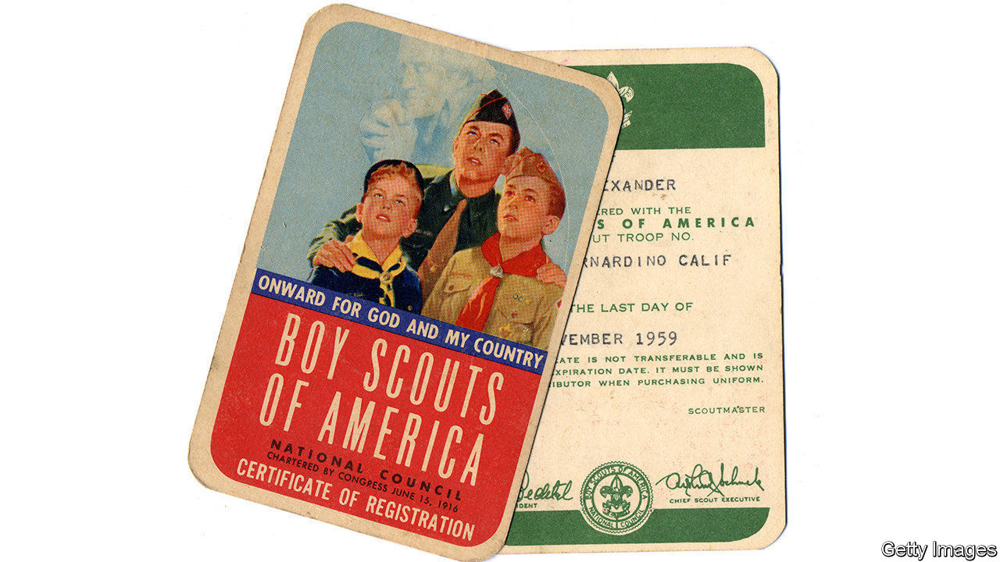

## Scout’s (dis)honour

# The Boy Scouts of America files for bankruptcy amid child-abuse lawsuits

> Some victims see it as a get-out-of-jail-free card for the organisation

> Feb 20th 2020NEW YORK

RALPH MORSE was 11 years old when the abuse began in the 1960s. John Brown, his scoutmaster, a supposedly upstanding man in his small upstate New York town, molested him regularly. While looking up at the constellations to earn merit badges, Mr Morse remembers, “he’d come up behind you in the dark, pressing himself up against you in a field. You’re standing in pitch black with this humongous man taking hold of you. And what do you do? What do you say to stop?”

Mr Morse kept the torment to himself, but is convinced that scout leaders suspected. The emotional scars were long-lasting. The former honours student dropped out of school, became an alcoholic and lost a marriage. Mr Brown was eventually arrested two decades later for abusing another boy.

Last year Mr Morse filed a lawsuit against the Boy Scouts of America (BSA) under New York’s new Child Victims Act. This law changed the statute of limitations for prosecuting and filing civil suits against abusers and their affiliated institutions. It also included a one-year window during which victims can seek damages, no matter when the abuse occurred. More than a dozen states passed similar laws. Schools, hospitals, the Catholic church and other religious groups have all been sued under the new bills. The BSA has received about 275 suits, including accusations dating from the 1940s, and expects more. Its potential liability is huge. It spent more than $150m on settlements and legal fees in 2017-19 alone. It filed for bankruptcy on February 18th.

More than 130m people have taken part in BSA youth programmes, including several presidents (Gerald Ford was an Eagle Scout). Boys were told that their Boy Scout manual was, next to the Bible, the most important book they would ever own. But membership has been falling, from 6.5m in 1972 to just 2.2m today. After years of resisting, the 110-year-old BSA now welcomes girls, as well as transgender and gay scouts. That decision pushed the Church of Jesus Christ of Latter-day Saints to end its relationship with the organisation on December 31st, removing 400,000 Mormon scouts and much-needed revenue.

The Boy Scouts are not disappearing. Nineteen Catholic dioceses have filed for bankruptcy and are still standing. But like them the BSA, which owns thousands of acres of land, may have to sell property.

The current leaders seem sincere in wanting to help. In an open letter to victims Jim Turley, the national chairman, apologised, saying “We believe you, we believe in compensating you.” Last week the Scouts announced a partnership with 1in6, a non-profit that helps victims of sexual abuse.

But the organisation has known about abuse going back nearly a century, even creating an internal secret file called “P” (for perversion), to track leaders and volunteers accused of child sexual abuse. In 1935 the then head of the BSA told the New York Times that almost 1,000 men had been removed from Scouting because they “sometimes give way to temptation”.

Chapter 11 will allow the BSA to put money for victims into a shared pot so that everyone receives compensation, according to Marie Reilly, a law professor at Pennsylvania State University. Still, some of the abuse survivors are upset about the bankruptcy filing. A lawsuit was their chance to speak. “I’ve been silent for 50 years,” says Mr Morse. “The bankruptcy is just their get-out-of-jail-free card.”■