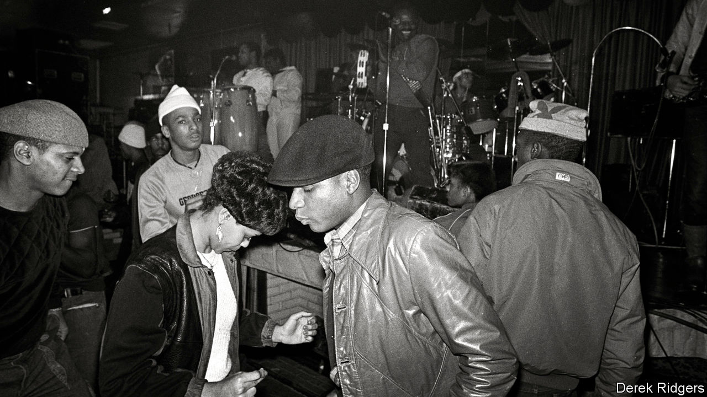

## A no Go-Go area

# Washington DC’s declining black population fights to preserve its musical heritage

> Protesters want to stop gentrifiers “muting” the capital

> Feb 20th 2020

PEOPLE OFTEN slow down to bop as they pass Donald Campbell’s mobile-phone shop in Shaw, a neighbourhood in Washington, DC. Until 7pm every day speakers outside blast Go-Go, a drum-based fusion of funk, R&B and soul that is indigenous to the city. In an area that was once dotted with Go-Go clubs, several of them owned by Mr Campbell, this is one of the last public places the music is played regularly. It is also the scene of a row that has forced a reckoning on how gentrification is eroding the culture of a once black-majority city.

Last spring residents of a glossy new apartment block, mostly inhabited by young, white newcomers to the area, complained about the racket. T-Mobile, which owns the shop, asked Mr Campbell to turn it off, which he did. That unleashed a torrent of anger from African-Americans across Washington. There were large street protests at which Go-Go bands played, a #DontMuteDC social-media campaign and an online petition. After a few days of this John Legere, T-Mobile’s boss, tweeted that “the music should NOT stop in D.C.” Mr Campbell turned it back on.

DontMuteDC has since morphed into a wider protest movement against gentrification, with Go-Go its symbol. Created in the 1970s by Chuck Brown, whose “Bustin’ Loose” was for years the Washington Nationals’ home-run celebration song, Go-Go was the last flourish of a black-majority city’s vibrant musical culture. Shaw was at its centre. By the 1980s, Go-Go bands played every night in the neighbourhood and beyond.

Go-Go’s decline began the following decade when, in an effort to curb violence, the city forced clubs to close earlier and to stop serving alcohol. Around the same time blacks began moving out to the Maryland suburbs. Gentrification has accelerated that process. By 2015 the proportion of black Washingtonians had dropped below 50% for the first time since the 1950s.

These changes have particularly harmed Go-Go because it was created to be experienced live. Its characteristics include call-and-response, which turns the audience into part of the performance, and the use of percussive solos instead of pauses between songs—which is how Go-Go got its name. That makes the music unsuitable for radio or three-minute hits. Without live venues, a new generation had mostly given it a miss.

That, says Mr Campbell, has changed since last year’s protests. He is developing an internet streaming service for his huge collection of live recordings. A Go-Go museum is in the works and this week DC Council declared Go-Go the city’s “official music”. Though it is not clear quite what that will entail, it seems likely to involve tourists. The efforts to preserve Go-Go may end up gentrifying a form of music that was created to be anything but.

## URL

https://www.economist.com/united-states/2020/02/20/washington-dcs-declining-black-population-fights-to-preserve-its-musical-heritage
