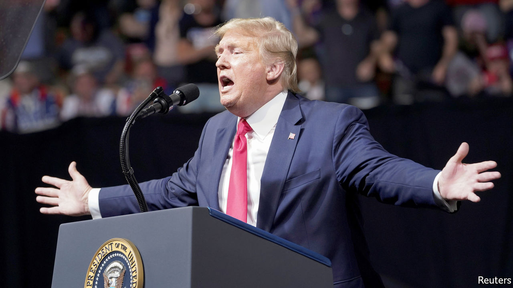
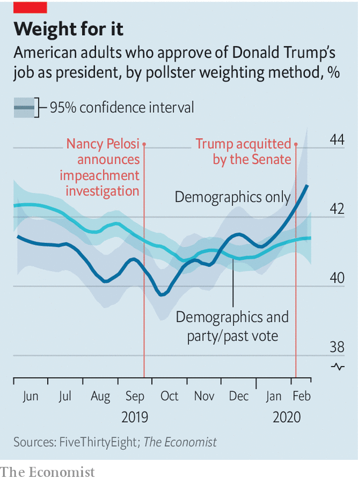

## A bogus bump

# Why Donald Trump’s high approval ratings may be misleading

> A statistical wrinkle makes the president appear more popular

> Feb 22nd 2020WASHINGTON, DC

ON ANY GIVEN day since he took office, Donald Trump has had a lower job-approval rating than almost every other modern president at the same point in their tenure. But over the past two weeks the polls have finally been giving Mr Trump some good news. According to an average of public polling data calculated by FiveThirtyEight, a data-journalism website, he is more popular than he has been since March 2017, two months after he took office. The BBC called it Mr Trump’s “best week” yet in office. Political betting markets increased his chances of re-election by roughly ten percentage points.

These positive appraisals have overlooked a crucial fact about the methods of conducting opinion polls in America. Because the people who take part in surveys are often not representative of the population as a whole, pollsters use a statistical procedure called “weighting”, which adjusts the findings to meet certain demographic targets. The technique helps firms ensure that their surveys have enough young people in them, for example, and that they achieve a good balance of minorities and working-class whites.

But even after correcting for demographic biases, pollsters’ data can still be unrepresentative. They may have the right shares of Latino voters and boomers, but nevertheless have too many Republicans or Democrats. This concern is pronounced when an event causes especially good, or bad, news for a political party. At such times surveys can suddenly be swamped with partisans who are eager to voice their love, or hate, for the president.

In the wake of Mr Trump’s acquittal in the Senate, pollsters suspect that such a bias could be affecting polls. Courtney Kennedy, the director for survey research at the Pew Research Centre, says that there is a “strong possibility” that the recent uptick in Mr Trump’s ratings has a wave of optimistic Republicans as its source. She says that outlets can control this problem by adjusting their data to have the correct shares of Democratic- and Republican-leaning voters, but the idea is relatively new and few pollsters have data good enough to perform such corrections.

The Economist’s analysis of polls taken during Mr Trump’s impeachment proceedings affirms Ms Kennedy’s suspicion. In polls that weight their data to represent America’s partisan balance or the results of the 2016 election, the share of adults who approve of Mr Trump’s job as president has risen by half a percentage point since impeachment proceedings began in earnest last October. But in polls that do not, Mr Trump’s ratings have increased by over three percentage points.

Data from YouGov, which conducts online polls with The Economist and adjusts its numbers for partisan bias, confirm that Republicans have become more likely to take part in their surveys over the past four months. In early September, before Nancy Pelosi announced impeachment proceedings, YouGov had to weight the attitudes of Republicans about 10% higher than the average respondent in order to achieve a sample that accurately reflected the results of the 2016 election. This higher-than-average weight implied that Republicans were less likely than Democrats to take their surveys. But by the first week of February, the firm’s weight for the average Republican was the same as for the average respondent, suggesting that they had become much more likely to fill out their surveys.

Hence pollsters who do not adjust for partisan bias have picked up a recent—and mostly phantom—swing in Mr Trump’s favour. Yet Ms Kennedy is quick to say that weighting is not a magic wand for ensuring high-quality results. A recent Pew report found that online surveys, in particular, can also be unduly influenced by so-called bogus participants who could be causing even more errors in pollsters’ measurements by submitting nonsensical, and disproportionately positive, responses. “Although it is not a large effect,” says Ms Kennedy, “it’s systematic”, and could be enough to nudge even a collection of different polls in one direction. Such are the challenges pollsters face if they want to be sure that movements in public opinion—like the recent shift towards Mr Trump—are in fact real.■

Dig deeper:Sign up and listen to Checks and Balance, our new [newsletter](https://www.economist.com//checksandbalance/) and [podcast](https://www.economist.com//podcasts/2020/04/24/checks-and-balance-our-weekly-podcast-on-american-politics) on American politics

## URL

https://www.economist.com/united-states/2020/02/22/why-donald-trumps-high-approval-ratings-may-be-misleading
