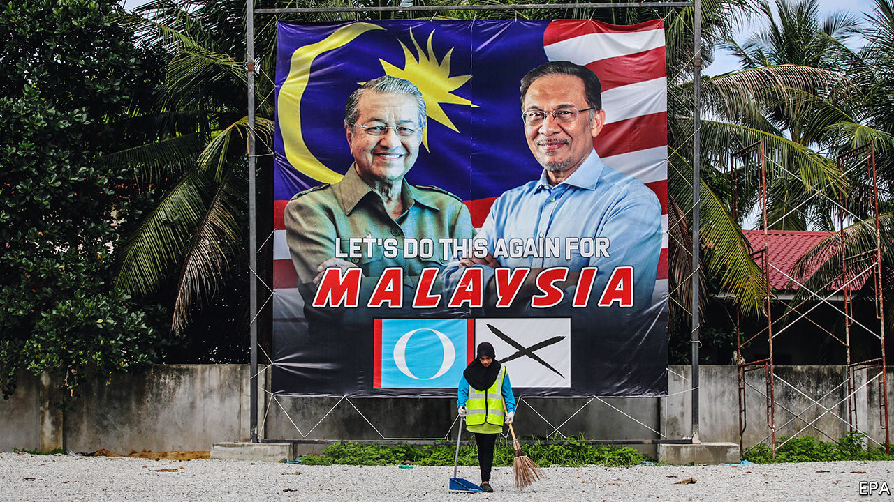

## The old men and the seats

# A botched power grab leaves Malaysia without a government

> The 20-year feud between Mahathir Mohamad and Anwar Ibrahim is roiling politics again

> Feb 27th 2020KUALA LUMPUR

THE PICTURES showed Mahathir Mohamad, the prime minister, working calmly at his desk. “Just another day in the office”, read the accompanying caption, tweeted on February 25th. Yet outside the doors of his office there was pandemonium. The day before, Dr Mahathir had resigned as prime minister and as leader of Bersatu, one of the parties in the governing coalition. The king, however, had promptly reappointed the 94-year-old as a caretaker while he and all Malaysia tried to work out whether any of the various contenders to form a new government could command a majority in parliament.

The drama began with a failed attempt at a parliamentary coup. Bersatu announced that it would leave the ruling coalition, Pakatan Harapan, as did 11 malcontents from another of the alliance’s components, Parti Keadilan Rakyat (PKR). These rebels had planned to form a government with the support of the opposition, but were wrongfooted when Dr Mahathir—whose backing the ringleaders seem to have expected—instead resigned.

The chaos stems from a simmering dispute over how long Dr Mahathir should stay on as prime minister and who should succeed him. He is a towering but controversial figure, having served as prime minister from 1981 to 2003 as the head of the United Malays National Organisation (UMNO), the ruling party from independence in 1957 until 2018. Horrified by corruption within more recent UMNO governments, Dr Mahathir left the party and set up Bersatu. But he only became Pakatan Harapan’s candidate for prime minister at elections in 2018 because Anwar Ibrahim, the leader of PKR, a much bigger party, was in jail after a prosecution that PKR insisted was politically motivated. After winning the election, Dr Mahathir secured a pardon for Mr Anwar and promised to hand power to him soon. But soon gradually turned into two years, prompting much grumbling from Mr Anwar’s camp.

What is more, rumours began to circulate that, whenever Dr Mahathir did step down, he was hoping to be succeeded not by Mr Anwar, but by Azmin Ali, another senior figure in PKR. It is Mr Azmin who leads the faction that broke away from PKR this week. But the extent of Dr Mahathir’s involvement in that rupture, if any, remains a mystery. “Did he have a change of heart, or did he get cold feet?” asks a mystified political adviser.

At the heart of this soap opera are both personal and political divisions. Dr Mahathir and Mr Anwar have a fraught history. Dr Mahathir sacked Mr Anwar as his deputy in 1998, after the two clashed over how best to respond to the Asian financial crisis. Mr Anwar was beaten up in jail and later convicted on trumped-up charges of sodomy (a crime in Malaysia) and corruption. He became a figurehead for those campaigning for reform and led opposition to UMNO in between stints in prison.

That experience led Mr Anwar to change his ideological stance as well as his party. About 69% of Malaysia’s 32m people are bumiputras: Malays and other indigenous groups. A further 24% are ethnic Chinese and 7% are Indian. Bumiputras have tended to support UMNO because it champions and defends policies to boost them economically. Bersatu does too. Much of the rest of the population resents the privileges accorded to Malays. The Democratic Action Party (DAP), another component of Pakatan Harapan, represents Chinese interests. PKR, although led by Mr Anwar, a Malay, has members from all of Malaysia’s biggest ethnic groups and makes noises about multiculturalism and meritocracy.

The ideological tensions among the parties in Pakatan Harapan worsened as Malay voters turned away from the government. That is probably a function of the struggling economy, which grew by only 3.6% year-on-year in the last quarter of 2019, its slowest pace in a decade. Shortly after the coalition won power, 63% of Malays thought the country was “going in the right direction”, according to the Merdeka Center, a pollster. Within a year that had plummeted to 24%. The coalition has lost five by-elections to opposition candidates. Claims from UMNO and the other big opposition party, PAS, that Pakatan Harapan was neglecting Malay voters clearly resonated with the electorate. That, in turn, seems to have alarmed Bersatu and the defecting members of PKR.

Dr Mahathir is presenting himself as a unifying figure again, who could rise above all this infighting. “If I am allowed, I will try to form an administration that doesn’t side with any party. Only national interests will be prioritised,” he said this week in a televised address. But it is doubtful that he can reassemble his fractured government, since Mr Anwar has now laid claim to the job of prime minister. The remaining parties in Pakatan Harapan seem inclined to side with Mr Anwar, since they fear that their influence will diminish under a broader coalition led by Dr Mahathir. In theory, the opposition could try to form a government, with UMNO and PAS as its mainstays. But they are far short of the necessary 112 seats in the 222-member parliament and would probably prefer a snap election anyway.

That leaves Mr Anwar scrabbling to clinch enough support from mercenary parties from Sabah and Sarawak, states in Malaysia’s bit of Borneo. He might also entice some migrants from Bersatu or win back a few PKR rebels. If he fails to do so, however, the consequences are likely to be fatal for his 20-year-old ambition to become prime minister. Voters, already put off by the endless bickering within Pakatan Harapan, have presumably been even less impressed with the frantic horse-trading of the past few days. ■