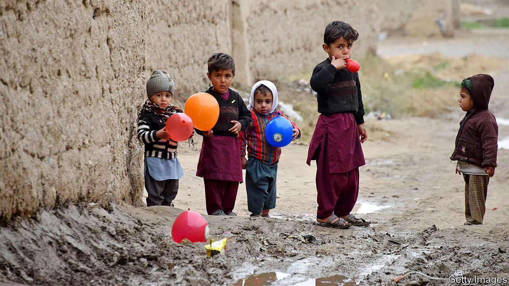

## Can it be?

# America and the Taliban prepare to sign a peace deal

> But ending Afghanistan’s long civil war will not be easy

> Feb 27th 2020KABUL

AFGHANISTAN AND optimism do not tend to go hand in hand, so the mood of quiet anticipation around the country in recent days has been striking. Afghans hope that America and the insurgents of the Taliban, who have been fighting one another for more than 18 years, will sign a peace deal on February 29th. That, in turn, hinges on whether the week-long “reduction in violence” that the two sides have promised is maintained until then. Even if the agreement is indeed signed as planned, however, peace remains a long way off.

The partial truce began on February 22nd, the product of more than 18 months of negotiations between the Taliban and America in Qatar. The two sides did not make public exactly how peaceful they expected one another to be, and America and its allies in NATO have not revealed their count of violent incidents. Afghan news reports say the Taliban are expected to spare towns and cities, as well as military bases and highways. The Taliban leadership told its fighters to “remain defensively alert” but “strictly refrain from entering enemy territory”. Afghan and American forces, for their part, said they would shoot only in self-defence, although they also vowed to continue fighting the Afghan wing of Islamic State.

Both sides seem to be sticking to these terms. According to the Afghanistan Analysts Network, a research group, a typical February in recent years has seen an average of 57 breaches of the peace every day. Afghan journalists reckon that since the truce began, clashes have fallen by more than 90%, to three or four a day. Although some Afghan soldiers and civilians have been killed, there have been far fewer deaths than usual, and no recriminations from either side. General Scott Miller, the commander of NATO forces, spoke on February 25th of a “downward trend in violence” which was “great for Afghanistan”.

The logic of the reduction in violence is twofold. First, the lull is a trust-building measure, to show the Taliban are serious about peace even if they are not prepared to agree to a complete ceasefire. Second, the calm is intended to demonstrate that the militants can control their fighters—a subject in some doubt, since the bigger conflict subsumes all manner of local disputes and tribal rivalries.

As The Economist went to press, it seemed likely that the truce would hold, and that the signing of the peace agreement would go ahead as planned in Doha, the capital of Qatar. The outlines of the deal remain as they were in September, when President Donald Trump abruptly called off talks in anger at continued Taliban attacks. America will quickly reduce its troops in Afghanistan from about 12,000 to about 8,600. In exchange, the Taliban will promise not to give shelter to foreign terrorists groups such as al-Qaeda, and to begin negotiations with civilian politicians and other community leaders about how Afghanistan should be run. During those negotiations, America will trim its garrison further. The ultimate goal is some sort of power-sharing agreement between Afghan politicians and the Taliban, an end to all hostilities and a withdrawal of all, or almost all, American troops.

American officials deny that Mr Trump is running for the door. The troop withdrawal will be “conditions-based”, insists Mark Esper, the secretary of defence. But exactly what those conditions are—and what happens if they are breached—has not been disclosed. The Taliban, too, have tried to persuade sceptics of their sincerity. Sirajuddin Haqqani, their fearsome deputy leader, best known for ordering indiscriminate car-bombings, used the opinion pages of the New York Times to declare his desire for an end to violence and the creation of an inclusive government.

Forging a political agreement among the Taliban, the government and Afghanistan’s many warlords and powerbrokers will be extremely hard, however. Symptomatic of the difficulties is a fierce row about who should be president. After a five-month count, the election commission recently declared that Ashraf Ghani had been re-elected in a vote that took place in September. His main rival, Abdullah Abdullah, disputes the results and says he is forming his own government.

“It is time to focus not on electoral politics, but on taking steps toward a lasting peace,” America’s State Department declared in a statement on February 25th. Mr Ghani has agreed to postpone his inauguration, American officials said, presumably to allow time to iron out the dispute.

Bigger arguments loom. “What kind of political system will there be and who will be grabbing the most part of the government, or the authority,” says Abdul Hakim Mujahid, a Taliban official turned peace-campaigner. “This will be the field of competition.” On one side are Afghans who want the Taliban to accept the current democratic constitution, with its protections for women and minorities. But some Taliban hardliners view the status quo as the product of American occupation, and want to reimpose the Islamic “emirate” the Taliban ran in the 1990s.

Whatever happens next, Afghans welcome the current respite. In some war-battered districts it has been celebrated with spontaneous sports matches and dancing. Mobile-phone service has also been restored in territory where it is frequently cut by militants. “We are thirsty for peace,” says Muhammad Ehsan, a politician from Kandahar. “It’s a priority for us.” The country is holding its breath. ■

## URL

https://www.economist.com/asia/2020/02/27/america-and-the-taliban-prepare-to-sign-a-peace-deal
