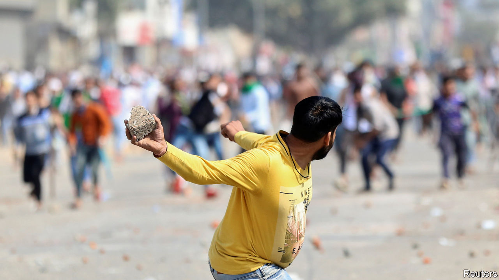

## A tale of two neighbourhoods

# Donald Trump and Narendra Modi hug as Delhi burns

> Neither America’s president nor India’s prime minister had much to say about a bout of sectarian rioting

> Feb 27th 2020DELHI

THE CONTRAST could not have been starker. At one end of the city, Donald Trump and Narendra Modi, America’s president and India’s prime minister, were celebrating a new “strategic partnership”. With the shared passion of politicians eager to shift voters’ attention, the two leaders exchanged hugs and compliments. The other side of India’s sprawling capital was feeling a different kind of warmth: it was on fire. Slum districts in the north-east of the city had erupted in riots that left at least 34 dead, dozens injured and many properties torched.

Most of the victims were Muslims, a largely impoverished group that makes up 14% of India’s population (and 13% of Delhi’s). Ironically, in a flattering speech, Mr Trump had praised India for its commitment to freedoms and its tradition of religious tolerance. Yet it is the policies of Mr Modi’s own Hindu-nationalist government that created the current polarised atmosphere. A particular thorn has been its insistence on pursuing a national head count which, combined with new citizenship rules that discriminate according to religion, has raised fears that millions of Muslims may be stripped of their rights. Inflammatory rhetoric from Mr Modi’s party makes things worse. During local elections in the capital in February, one of its candidates led crowds in chants of “Shoot the traitors!” in reference to groups protesting the citizenship law.

The trigger for the riots appears to have been a rally by another local politician, who declared that if a sit-in by Muslim women protesting against the citizenship rules was not lifted by the time Mr Trump left India, his supporters would no longer remain peaceful. Soon after, mobs went on the rampage in Muslim neighbourhoods, often with police looking mutely on or, say many witnesses, aiding the attackers. Both sides soon resorted to shooting; most of the fatalities, which included two policemen, were caused by gunfire.

The police, which in Delhi are controlled by the central government, only deployed in strength on February 26th. On the orders of a court, they also began registering complaints of incitement. Mr Modi’s national-security adviser toured affected districts, giving his “word of honour” that residents could feel safe. The prime minister himself, after three days of silence, belatedly tweeted a plea for calm.■