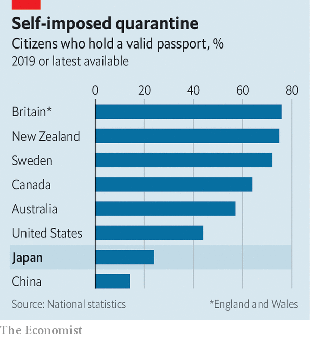

## The endangered tourist

# Fewer and fewer Japanese want to see the world

> Only 24% of them even have a passport—the lowest proportion among rich countries

> Feb 27th 2020TOKYO

NO FEWER THAN 191 countries admit Japanese visitors without a visa. That is twice as many as wave through Kuwaitis, for example, and five times the number that let in Nepalese without hesitation. By that measure, Japan’s chrysanthemum-decorated passport is the most welcomed in the world. Yet only 24% of Japanese possess one—about half the proportion of Americans who have a passport (see chart). Why do so few Japanese take advantage of their freedom to wander the globe?

On paper, Japanese are venturing abroad more often. They went on roughly 20m overseas trips in 2019, up from 19m in 2018. But that figure is inflated by people travelling for work and by frequent flyers. The share of people who hold a passport has been slowly falling, from 27% in 2005. Morishita Masami, who chaired a government committee to promote outbound travel, estimates that at least two-thirds of Japanese are lukewarm about the idea of leaving the country. Several factors deter them: miserly annual leave, concerns about safety, the inferiority of foreign food and, most of all, a crippling fear of the embarrassment of not being understood. Sluggish wage growth and a weak yen have made travel less affordable. Even pensioners, who have plenty of free time and disposable income, are travelling less.

In the 1980s and 1990s Japanese were keen to explore the world. Students backpacked for weeks with their copies of Chikyu no arukikata (“How to walk the Earth”), a popular travel guide. A strong yen made foreign jaunts affordable. But interest has been dwindling since the late 1990s. They are “just one of many” leisure options, Ms Morishita explains.

The number of Japanese studying abroad has also fallen, from 82,945 at its peak in 2004 to 55,969 in 2016. The shrinking population of young people is partly to blame. Also, “It costs about ¥4m ($36,000) a year to study abroad,” notes Nakamura Tetsu of Tamagawa University, a prohibitive sum for most. Meanwhile, Japan’s labour crunch makes foreign study less useful. “You don’t need an education abroad to get a good job,” says Suematsu Kazuko of Tohoku University. A survey in 2019 found that 53% of Japanese students are not interested in studying abroad, the highest ratio among the seven countries covered.