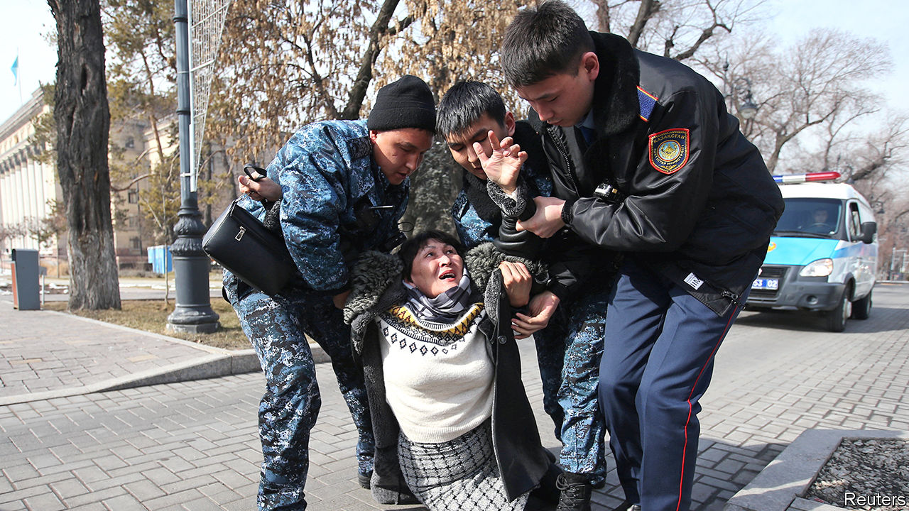

## Party-pooper

# Kazakhstan’s president says democracy is on its way

> But the riot police seem to have arrived first

> Feb 27th 2020ALMATY

THE PRESIDENT of Kazakhstan, Kassym-Jomart Tokayev, likes to bang on about political reform. The oil-rich Central Asian country’s rubber-stamp parliament needs an opposition, he says, and its citizens need greater freedom to form political parties and hold peaceful protests. But when Zhanbolat Mamay, a 31-year-old documentary-maker, took Mr Tokayev at his word and tried to set up a new force called the Democratic Party, he found himself behind bars after complaining about harassment of his supporters. When the party called off its founding congress and called for a public protest instead, a further 70 members were detained. The handful who made it to the protest site, including Mr Mamay’s wife, were arrested on the spot.

It was a busy weekend for the police, who detained scores more demonstrators at separate protests organised by Democratic Choice of Kazakhstan, a banned movement led by a rich Kazakh, Mukhtar Ablyazov, who lives in France. In Almaty the detainees included Erik Zhumabayev, a disabled man who attended a demonstration in his wheelchair. A prominent activist, Dulat Agadil, died in custody in Nur-Sultan, the capital, a few days later. That brought more protesters onto the streets, leading to more arrests.

The detentions followed the government’s publication of a bill ostensibly intended to loosen restrictions on free assembly, but which critics say would actually impose new ones. Some 5,000 people were arrested at pro-democracy rallies last year. The demonstrations began after Nursultan Nazarbayev, Kazakhstan’s strongman of 30 years, abruptly resigned, handing power to Mr Tokayev with little pretence of a democratic transition. Mr Nazarbayev, who still pulls the political strings, has never shown any tolerance of dissent. Mr Tokayev likes to paint himself as a reformer, poised to overhaul the old order. The latest clampdown sends “a clear message” that liberalisation is not on the cards, says Mr Mamay, who was released after two days’ detention. He plans to try again to form his new party, but no doubt hopes not to have to do so from a cell.

## URL

https://www.economist.com/asia/2020/02/27/kazakhstans-president-says-democracy-is-on-its-way
