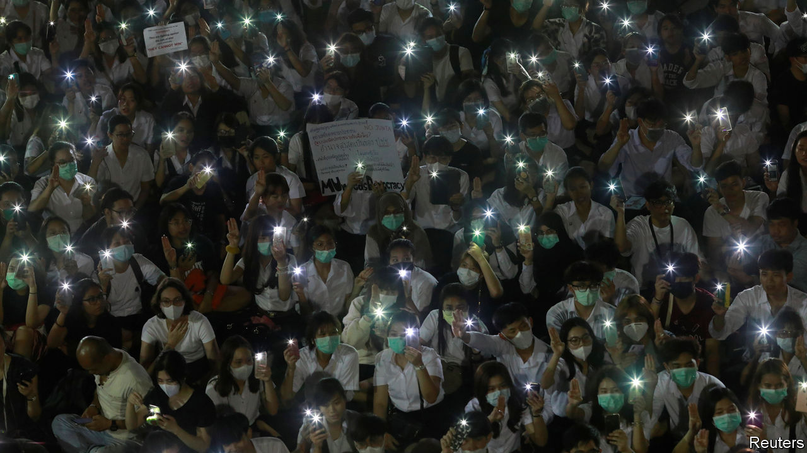

## Too forward

# Thailand’s courts ban the country’s third-biggest political party

> Future Forward had presented itself as a way out of the schism that defines Thai politics

> Feb 27th 2020BANGKOK

AS THEY WAITED inside headquarters to hear whether Future Forward would be dissolved, supporters of the plucky opposition party queued to buy its merchandise. For those already in possession of an orange T-shirt or cap, there were bags and umbrellas, as well as mugs reading “Keep calm and love democracy”. Purchases raised money for the party. But it was precisely Future Forward’s funding methods that led the constitutional court to dissolve it later in the afternoon of February 21st.

At issue was Future Forward’s acceptance of a loan of 191m baht ($6.1m) from Thanathorn Juangroongruangkit, a car-parts billionaire who leads the party, ahead of last year’s parliamentary election. Electoral law caps contributions from individuals at 10m baht, but Future Forward argued that a loan was a distinct category, not covered by this rule. The court disagreed, and judged the loan illegal. It disbanded the party and banned Mr Thanathorn and other party executives from politics for a decade. It stressed that they may not launch new parties.

The decision resolves just one of more than two dozen cases working their way through the legal system involving Future Forward, its leader or other members of the party. In November the constitutional court stripped Mr Thanathorn of his parliamentary seat. It ruled that he had violated election laws which bar those with shares in media firms from running for parliament. To reach that verdict, it ignored evidence that the firm in question was defunct and that Mr Thanathorn had anyway sold his shares. Even when the firm was in business, it had produced only glossy magazines—presumably not the sort of outlet legislators had in mind when they banned media moguls from dabbling in politics.

The legal onslaught against Future Forward began after its surprisingly strong showing in the election, at which a military junta that had seized control of the country in 2014 supposedly handed power back to civilians. Founded only in 2018, the party came third overall and drew particular support from young people. Its platform of taming the army, decentralising government and tackling business monopolies had wide appeal. Mr Thanathorn subsequently sought the position of prime minister. But Prayuth Chan-ocha, the junta-leader-turned-prime-minister, remained in office with the support of pro-army parties. The army had worked hard to ensure that the election would be held under conditions that favoured its supporters. Even so, it only just managed to scrape together a parliamentary majority.

In the short term, Mr Prayuth’s position has been strengthened by Future Forward’s demise. Nine of its 65 now-homeless MPs are joining Bhumjaithai, a party in the governing coalition. But the banning also demonstrates the hollowness of Mr Prayuth’s claim to have restored democracy. Indeed, students at several universities held candlelit vigils or mock funerals for democracy in the wake of the decision.

Although the constitutional court has dissolved eight political parties since 2006, until now the targets had been allies of Thaksin Shinawatra, a telecoms tycoon whose government was ousted in a coup that year, sparking a feud between pro-Thaksin “red shirts” and pro-army, monarchist “yellow shirts” that has dominated Thai politics ever since. Future Forward was neither clearly red nor yellow. Indeed, its colour, orange, spoke of a third way that could appeal to partisans of both tendencies. By banning it, the current regime has proved once and for all that it does not simply want to restore order and break the political logjam, as often claimed, but to run the country without opposition. ■

## URL

https://www.economist.com/asia/2020/02/27/thailands-courts-ban-the-countrys-third-biggest-political-party
