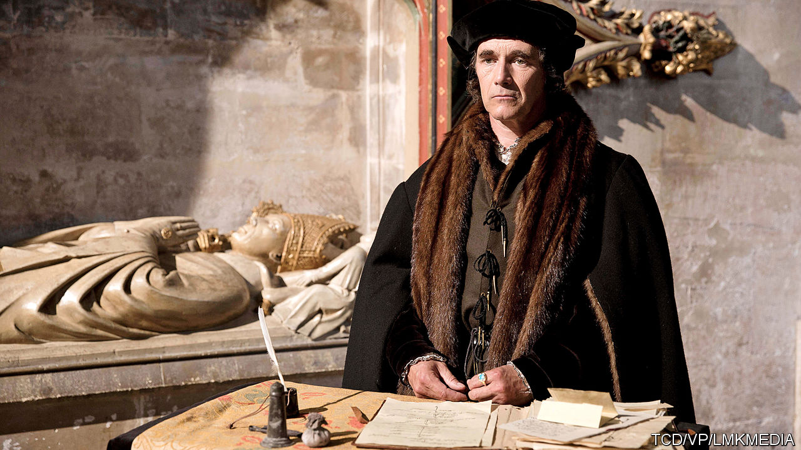

## The bedchamber and the axe

# Thomas Cromwell, special adviser

> Hilary Mantel’s hero is an avatar for contemporary anxieties about government

> Feb 27th 2020

The Mirror & the Light. By Hilary Mantel. Henry Holt; 784 pages; $30. Fourth Estate; £25.

AFTER MORE than ten years, three books and 2,000 pages, as well as two stage plays and a television series (starring Mark Rylance, pictured above), Hilary Mantel’s monumental novelisation of the life of Thomas Cromwell, Henry VIII’s chief minister for much of the 1530s, has reached its conclusion. In hundreds of thousands of minds, he has firmly displaced his distant relative Oliver as the best-known Cromwell in British history.

At the opening of “The Mirror & the Light”, the final instalment in Ms Mantel’s trilogy, Cromwell has reached the apogee of his powers, having just witnessed the dispatch on the scaffold of his frenemy Anne Boleyn, the king’s second wife, along with a claque of hoity-toity courtiers who had disdained him as the jumped-up son of a blacksmith. The book ends with Cromwell himself kneeling before the axe. In between he labours unceasingly in the king’s service, brokers an ill-starred fourth marriage to Anne of Cleves, dissolves monasteries and sows discord between foreign adversaries, all the while trying to mollify Henry’s would-be successors, lest his head be first on a spike when the king dies.

The stunning success of the novels is in large part the result of Ms Mantel’s skill in fashioning a voice and persona that, while never anachronistic, make Cromwell seem eerily contemporary. But then, the politics of his rise and fall are liable to resonate in almost any era: if his rival, Sir Thomas More, was a man for all seasons, Cromwell is a character for the ages.

Had Ms Mantel been writing in the early 1950s, Cromwell’s career might have been seen primarily as a parable of freedom of conscience and Stalinist repression. More refuses to acknowledge the king’s supremacy over the Church of England, and is beheaded. Religious dissidents are flambéed at the stake. In “Bring Up the Bodies”, the second book in the series (published in 2012), Cromwell contorts his victims’ words to damn them like a remorseless secret-police interrogator. “Construction can be put on silence,” he tells one. “It will be.”

In the 1960s or 1970s his story might above all have seemed to be about meritocracy, a tale of the up-and-coming sort seizing control from a complacent noble caste. In the 21st century, it is both those things and more. Brexiteers have sought to draw parallels between their cause and Henry’s break from the papacy, which features in the novels. More fundamentally, Ms Mantel’s saga has chimed with modern neuroses about the nature of government.

Geoffrey Elton, one of the leading historians of Ms Mantel’s period, argued that Cromwell’s time in office marked the transition between the medieval model of government based in the king’s household, and a professional bureaucracy with its own institutional apparatus. The Cromwell of the novels straddles both arrangements. He suavely manages the monarch—“One must anticipate his desires,” he explains in “Bring Up the Bodies”—while attacking his awesome workload with Stakhanovite zeal. He personifies two related features of modern politics: the return of courts and courtiers, and a veneration of professionalism that is in part a response to those informal networks.

Since the 1990s, in both Britain and America, the influence of advisers to prime ministers and presidents has expanded at the expense of cabinets, legislatures and civil servants. Bill Clinton entrusted his (failed) health-care reforms to his wife, and developed policy in all-day spitballs with his staff. The situation was fictionalised, even celebrated, in “The West Wing”, a television series that first aired in 1999 and revolved around the personal and political dilemmas of a glamorous, wisecracking coterie of presidential aides.

The Iraq war made such arrangements seem less congenial. The “sofa government” practised by Tony Blair was criticised by the subsequent Butler inquiry into pre-war intelligence. The public grew fascinated, and sometimes repelled, by the power of unelected figures such as Karl Rove and Alastair Campbell. The current administrations on both sides of the Atlantic have only made the 21st-century court more salient. President Donald Trump’s White House is a family affair; his impeachment was in part the result of cronies and freelancers bypassing formal channels. Dominic Cummings, Boris Johnson’s eminence grise, flaunts his informality on the sleeve of his hoodie.

Ms Mantel’s Cromwell is much more decorous than Mr Cummings. Over the course of “The Mirror & the Light” he becomes a baron and then an earl; always conscious of his humble roots, he is fastidious about being addressed correctly. But the basic conditions of his employment are those of the modern courtier. He serves at the pleasure of the ruler, albeit in an age when the ruler’s displeasure could be considerably more bruising than a golden handshake. Yet at the same time he is an avatar for a contrasting type that is now romanticised by many anxious voters: the diligent technocrat.

This counter-trend can be traced to the financial crisis, when central bankers came to the fore in stabilising the global economy—a period that coincided with the writing and publication of “Wolf Hall” (2009), the first novel in the trilogy. More recently, assiduous public servants such as James Mattis, Mr Trump’s former defence secretary, and Dominic Grieve, doomed leader of the anti-Brexit Conservatives, have been lionised across ideological divides for their moderating roles and attention to detail.

In fact, much of the fictional Cromwell’s outlook chimes with that of defenders of the liberal order today. He is an internationalist who is comfortable in a number of languages; a believer in diplomacy rather than war, in sound finances and a proto-welfare state; a champion of rationality against the exploitative superstitions of the Catholic church. In the latest book—the longest of the three, bloated by somewhat belaboured dialogue in the first 300 pages—anger at his reforms sparks the Pilgrimage of Grace, an uprising that took place in the north of England in 1536. In Ms Mantel’s version of events, the rebels are nostalgic for an unchanging past of mythical fecundity, a sentiment that comes laden with the anti-metropolitan rhetoric of the Brexit campaign:

One of the author’s achievements is to show competence as a heroic virtue, and good administration to be as worthy of glory as feats of arms (across the trilogy, business meetings are by far the most common type of scene). Early in “Wolf Hall”, she affords Cromwell a blazon—a catalogue of flattering attributes of a sort that, in his own time, would have been used to extol a great beauty or flower of chivalry: “He is at home in courtroom or waterfront, bishop’s palace or inn yard. He can draft a contract, train a falcon, draw a map, stop a street fight, furnish a house and fix a jury…He works all hours, first up and last to bed.”

What marks Ms Mantel’s hero out—and makes his story something of a wish-fulfilment fantasy for modern readers who admire his ends if not his means—is his sheer effectiveness. Almost until the last, he gets things done, whether that is making or breaking royal marriages according to the king’s whim, or replenishing the country’s coffers by expropriating the assets of the church. Ms Mantel’s genius is to make his 16th-century instincts, such as a willingness to decapitate anyone standing in his path, seem as plausible as his more familiar qualities. A courtier, a bureaucrat and a politician, her Cromwell synthesises contrasting approaches to government nearly 500 years after his demise. No wonder he has found a place in the sun. ■