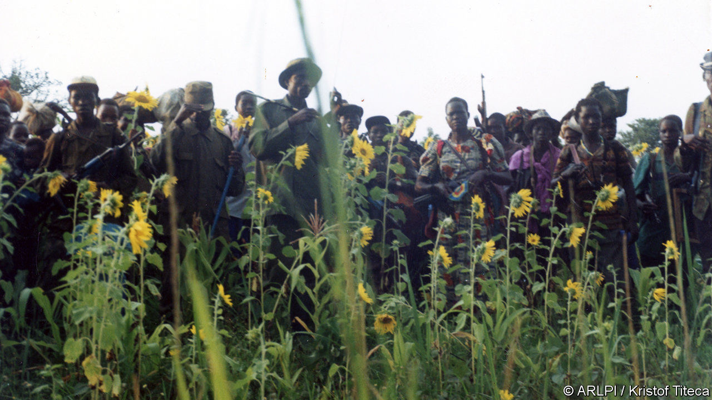
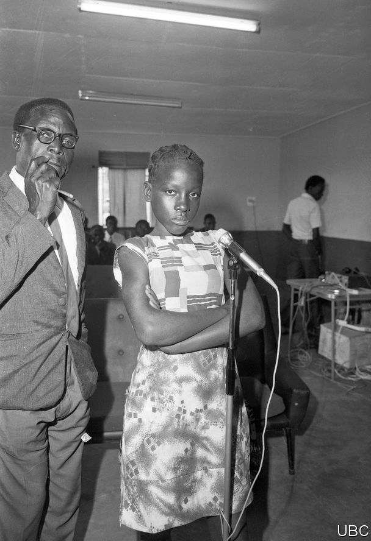
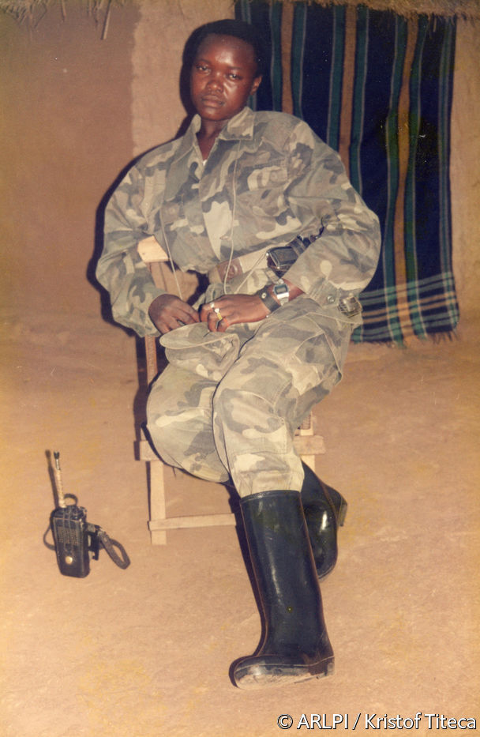

## Out of shot

# Two exhibitions explore dark moments in Uganda’s past

> Violence haunts the pictures of Idi Amin’s era and the Lord’s Resistance Army

> Feb 29th 2020ARUA

WHEN SARAH BANANUKA’S father and three of her brothers were killed, she was advised not to mourn. These were the early days of Idi Amin’s military dictatorship in the 1970s. Her father had been a local politician under the previous Ugandan regime; soldiers hunted him down like “a loose lion”, she says. To weep publicly would make her a target, too. “There was anarchy in the country,” she recalls.

Little of that terror is visible in “The Unseen Archive of Idi Amin”, a photographic exhibition mounted last year in the Uganda Museum in Kampala and now touring the country. The images, unearthed in an old filing cabinet at the state broadcaster, capture Amin as he hobnobs with dignitaries and dances with crowds. The sense of violence lurking just out of shot is shared in “Rebel Lives”, a very different exhibition recently on view in Antwerp and New York, which gathers pictures taken by members of the insurgent Lord’s Resistance Army (LRA). Both projects shed light on traumatic episodes in Ugandan history; both are haunted by what they do not show.

Photographing Amin was dangerous work. A caption could anger him, even if the image was innocuous. State photographers became “fearful, paranoid, nervous men”, write Derek Peterson of the University of Michigan and Richard Vokes of the University of Western Australia, two of the co-curators of the exhibition, in a forthcoming book. The risks intensified after 1976, when Israeli commandos stormed the national airport at Entebbe and rescued hostages from a hijacked plane. Pictures of the raid were reprinted in a South African magazine; the man who sold them was killed by Amin’s thugs. From then on, negatives were locked away. The cameras still followed him, like theatrical props, but few of the pictures were ever printed.

Unflattering photos were destroyed, as were most scenes of violence. So the curators give special prominence to images of the regime’s victims, seen in life rather than death. One poignant series captures a military tribunal established to prosecute “economic crimes” such as smuggling and overcharging. The suspects are by turns bewildered or resigned. A teenage girl scowls defiantly at the camera (see previous page). Many of those prosecuted were shot.

But what are viewers to make of the despot playing an accordion or dipping his toes in a lake? At a recent showing in West Nile, Amin’s home region, his son insisted that he had stamped out corruption and “gave Ugandans self-esteem”. Young people sometimes praise him as a leader who stood up to British colonisers and Asian tycoons. Ms Bananuka worries that his “dark side” is missing. “People are seeing Amin dancing,” she says, as though he were merely “a jolly man”.

The pictures in “Rebel Lives” (such as the one above) are equally unsettling. They were taken by LRA fighters during its 20-year insurgency in northern Uganda (where peace returned in 2006, though remnants battle on elsewhere). Accounts of the rebellion tend to focus on its leader, Joseph Kony, and the many atrocities he oversaw, depicting the group as a bizarre cult. But the conflict was complex in its origins and intimate in its effects. Many rebels were abducted as children, making them both victims and perpetrators of violence. The photographs, collected by Kristof Titeca of the University of Antwerp, give a glimpse of the war from their perspective.

Many were taken by Okello Moses Rubangangeyo, who was kidnapped from school by the LRA and rose through its ranks before escaping. In the dry season, he says, the rebels would pitch camp and learn tactics by watching action movies—Rambo, Arnold Schwarzenegger, Chuck Norris. Some of the pictures are knowing pastiches of their heroes: camouflaged warriors with grenade-launchers and schoolboy eyes. The fighters would smuggle the film out to be developed, then drop the photos on the trail to scare pursuers.

But Mr Rubangangeyo also took pictures as mementoes, or “just to feel happy”, mimicking ordinary life in extreme circumstances. On special days, such as Christmas, the rebels would sling a sheet between two trees and pose in their bush studio, just as their families did at home. In the exhibition and an accompanying book, these visual souvenirs are presented alongside interviews with their subjects, who are now rebuilding their lives. Some have sat for new photos, taken by the Congolese photographer Georges Senga, which echo the pose and composition of the originals. Faces age and soften; old comrades give way to wives, husbands and children.

Mr Rubangangeyo smiles as he looks through these images; they are a chronicle of the only youth he ever had. Still, notes of coercion and loss run through the collection. In one picture, a woman stands stiffly next to a uniformed commander, his hand draped over her shoulder. Today she is seen in a banana garden, alone. “With the name they gave me, I won’t get another man,” she explains in a caption. “That name is: ‘She’s a rebel, she’s from the bush’.” As these exhibitions show, there are silences in history. But there is rarely an escape. ■