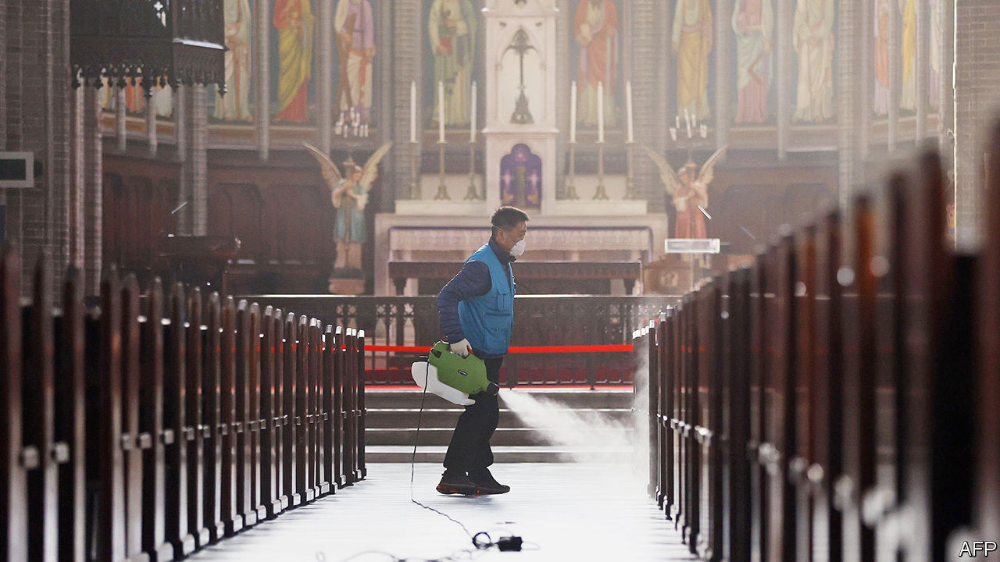
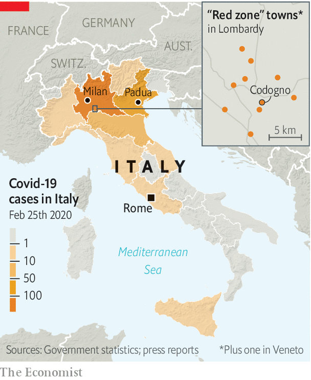
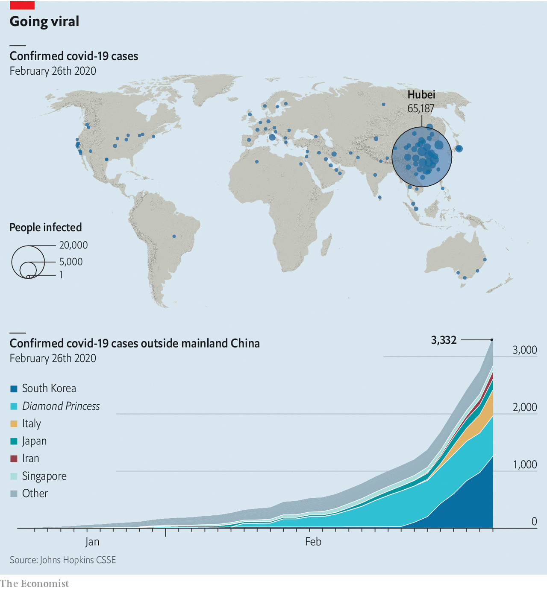
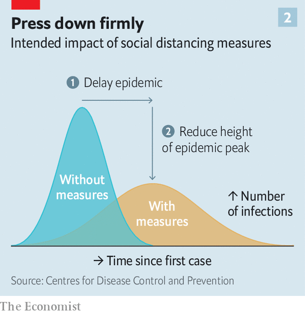
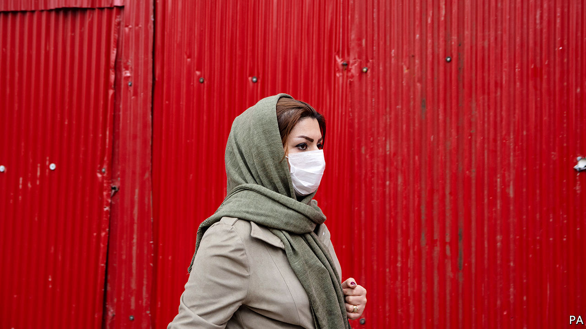
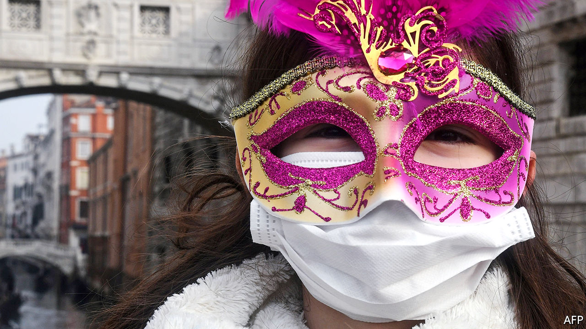
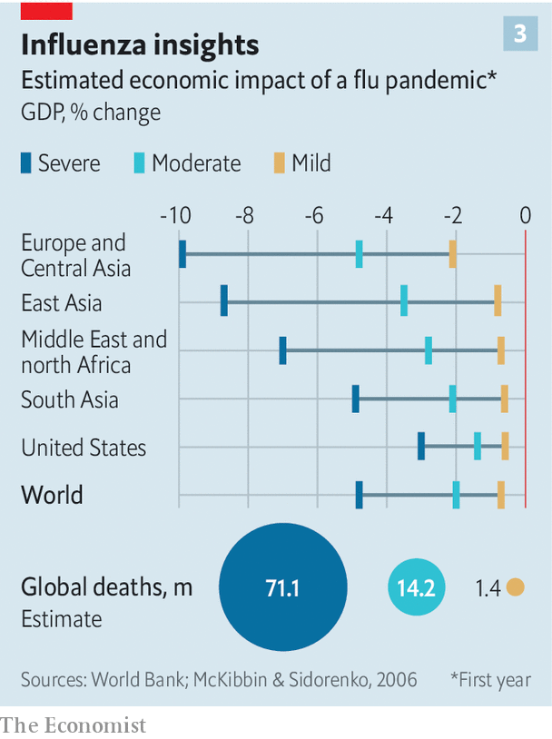

## The world gets ready

# Covid-19 is now in 50 countries, and things will get worse

> But there are proven ways to limit the damage

> Feb 29th 2020LONDON AND MILAN

IN THE EARLY scenes of Michelangelo Antonioni’s “The Eclipse”, eerily empty Italian streets provide a stark contrast to the frenzy of the stockmarket floor. This week saw that striking juxtaposition played out for real. Under a sky of unbroken light-grey cloud, isolated figures hurried through the spaces between Milan’s towering office blocks and across its broad traffic-free avenues. Meanwhile, inside a frantic Borsa Italiana, share prices were collapsing.

On February 21st the Italian authorities announced that a cluster of 16 cases of covid-19, the disease associated with the novel virus SARS-CoV-2, had been detected around Codogno, a small town in Lombardy 60km south-east of Milan. By the next day the number was up to 60, and five elderly people had died. On the 23rd “red zones” were set up around the infected areas (see map). Inside the zones there is a strict lockdown; outside 500 police officers and soldiers stop people from leaving. On the same day the government of Lombardy ordered the closure of any establishment where large numbers of people gather, including cinemas, schools and universities. Inter Milan has missed a home match; the legendary opera house, La Scala, is shuttered; sightseers are barred from the cathedral—though worshippers are not.

Iran, where the first covid-19 cases were reported two days before Italy’s, has also closed schools and cancelled football games. There too, though, worship continues, with what appear to have been dire consequences. The ceaseless flow of pilgrims to the mosques and shrines of Qom has continued despite the city being the site of the first cases. Ahmad Amirabadi Farahani, an MP from the city, said on February 24th that the death toll there had reached 50, though other officials deny this. Recent cases of covid-19 in Bahrain, Kuwait, Iraq, Lebanon and Pakistan are all thought to be linked to returnees from Iran.

The outbreaks in Italy and Iran, along with a large one in South Korea, have convinced many epidemiologists that attempts to keep the virus contained within China have run their course; it will now spread from second countries to third countries and on around the world. As of February 27th, cases had been reported in 50 countries (see chart). Studies suggest that the number of people who have left China carrying the disease is significantly higher than would be inferred from the cases so far reported to have cropped up elsewhere, strongly suggesting that the virus’s spread has been underestimated. Some public-health officials still talk in terms of the window for containment coming closer and closer to closing. In reality, it seems to have slammed shut.

That is the message the world’s financial markets have taken; the Borsa Italiana in Milan was far from alone in its miseries. Investors had previously acted as though the economic impacts of covid-19 would be limited to China and those whose supply chains wind through it. The spread of the disease to South Korea, Iran and Italy caused a massive sell-off on February 24th. The next day prices fell further when the Centres for Disease Control and Prevention warned Americans to prepare for the virus.

As of the morning of February 27th, stock markets had fallen by 8% in America, 7.4% in Europe and 6.2% in Asia over the past seven days. The industries, commodities and securities that are most sensitive to global growth, cross-border commerce and densely packed public spaces got whacked particularly hard, with the prices of oil and shares in airlines, cruise-ship owners, casinos and hotel companies all tumbling. Investors have taken refuge in assets that are perceived to be safe: yields on ten-year Treasury bonds reached an all-time low of 1.3%. The place least hit was China, where a huge sell-off took place some time ago. Investors, like some public-health officials, are starting to think that the epidemic there is, for now, under control (see [article](https://www.economist.com//finance-and-economics/2020/02/27/with-its-epidemic-slowing-china-tries-to-get-back-to-work)). But if economic models developed for other diseases hold good, the rich world stands a distinct chance of slipping into recession as the epidemic continues. That will bring China, and everyone else, a fresh set of problems.

How the virus will spread in the weeks and months to come is impossible to tell. Diseases can take peculiar routes, and dally in unlikely reservoirs, as they hitchhike around the world. Two cases in Lebanon lead to worries about the camps in which millions of people displaced from Syria are now crowded together and exposed to the winter weather. But regardless of exactly how the virus spreads, spread it will. The World Health Organisation (WHO) has not yet pronounced covid-19 a pandemic—which is to say, a large outbreak of disease affecting the whole world. But that is what it now is.

Part of the WHO’s reticence is that the P-word frightens people, paralyses decision making and suggests that there is no further possibility of containment. It is indeed scary—not least because, ever since news of the disease first emerged from Wuhan, the overwhelming focus of attention outside China has been the need for a pandemic to be avoided. That many thousands of deaths now seem likely, and millions possible, is a terrible thing. But covid-19 is the kind of disease with which, in principle, the world knows how to deal.

The course of an epidemic is shaped by a variable called the reproductive rate, or R. It represents, in effect, the number of further cases each new case will give rise to. If R is high, the number of newly infected people climbs quickly to a peak before, for want of new people to infect, starting to fall back again (see chart 2). If R is low the curve rises and falls more slowly, never reaching the same heights. With SARS-CoV-2 now spread around the world, the aim of public-health policy, whether at the city, national or global scale, is to flatten the curve, spreading the infections out over time.

This has two benefits. First, it is easier for health-care systems to deal with the disease if the people infected do not all turn up at the same time. Better treatment means fewer deaths; more time allows treatments to be improved. Second, the total number of infections throughout the course of the epidemic can be lower.

To flatten the curve you must slow the spread. The virus appears to be transmitted primarily through virus-filled droplets that infected people cough or sneeze into the air. This means transmission can be reduced through physical barriers, good hygiene and reducing various forms of mingle—a strategy known as “social distancing”. Such measures are already routinely used to control the spread of the influenza virus, which spreads in a similar way and is responsible for hundreds of thousands of deaths a year.

Influenza, like many other respiratory diseases, thrives in cold and humid air. If covid-19 behaves the same way, spreading less as the weather gets warmer and drier, flattening the curve will bring an extra benefit. As winter turns to spring then summer, the reproductive rate will drop of its own accord. Dragging out the early stage of the pandemic means fewer deaths before the summer hiatus provides time to stockpile treatments and develop new drugs and vaccines—efforts towards both of which are already under way.

Ben Cowling, an epidemiologist at the University of Hong Kong, says that the intensity of the measures countries employ to flatten the curve will depend on how deadly SARS-CoV-2 turns out to be. It is already clear that, for the majority of people who get sick, covid-19 is not too bad, especially among the young: a cough and a fever. In older people and those with chronic health problems such as heart disease or diabetes, the infection risks becoming severe and sometimes fatal. How often it will do so, though, is not known.

An epidemic’s fatality rate can only be definitively calculated after the fact: you take a population in which you know how many died and test a large random sample for antibodies against the pathogen in question—antibodies they will only have in their system if they were once infected. The Chinese authorities have just approved such tests, but they have yet to begin.

Estimates of the proportion of the infected made in the thick of things are, by contrast, liable to two different types of error. One affects the numerator—the number of the dead—and one the denominator—the number infected.

The first stems from the fact that there are always some people destined to die who have not died yet. People who die from covid-19 typically do so some three weeks after the onset of symptoms. If you divide the number of the dead at a given time by the number infected up until then you will miss those who will die in the next few weeks, and your answer will be misleadingly small.

The second sort of error, typically seen near the beginning of an epidemic, pushes in the other direction. People diagnosed early on tend to be very ill. It takes further investigation, and broader public awareness, to turn up all the people suffering only mild symptoms. Before that is done, an underestimate of the number infected leads to an overestimate of the fatality rate.

Analysis of data from more than 40,000 Chinese patients who had tested positive for the virus by February 11th found that, at the time, about 80% had mild symptoms, 14% had symptoms severe enough to warrant hospital care and oxygen, and 5% were critical, requiring intensive care that often included mechanical aids to breathing. Based on that data, the fatality rate in Hubei, the province in which Wuhan sits, was 2.9%. Outside Hubei it was 0.4%.

There are various reasons why the rate in Hubei would be expected to be genuinely higher than elsewhere. Its hospitals had no warning of the sudden influx of covid-19 patients and were thus overwhelmed, whereas hospitals in other cities had more time to prepare, laying in respirators and oxygen. Hubei’s doctors had to work out how to treat a brand-new disease, whereas those elsewhere have been able to learn from both their successes and failures.

But many experts think that a lot of the difference stems from the early-stage small-denominator problem. In other places there has been time and an incentive for less severe cases to be diagnosed, and so the fraction that has proved fatal is lower. At the moment, epidemiologists reckon the true rate for covid-19 is in the range of 0.5-1%. For SARS, a disease caused by another coronavirus which broke out in 2003, the rate in China was never fully ascertained; but worldwide, the WHO put it at about 10%. The rate for seasonal flu in America is typically around 0.1%.

The fatality rate is not an inherent property of the virus; it also depends on the care received. This puts poorer countries at particular risk. They tend to have weaker public-health systems in the first place, and thus can expect higher levels of serious disease and death—including, sometimes, among overstretched and inappropriately protected front-line health-care workers. That puts further strains on their health systems. And this will all be exacerbated by the pandemic’s economic effects, which models suggest will also be greater in poorer countries. Higher fatality rates causes larger hits to the workforce. Service industries in poorer countries are less digitised, meaning they require face-to-face contact, and therefore are more likely to be avoided when consumers take fright. And poor countries risk capital flight when financial markets are spooked by risk. They could lose their ability to borrow and spend just when they need it most.

Better health care reduces the fatality rate. Better public-health interventions reduce the total rate of infections. Epidemiologists start their curve-producing models off with a “basic reproductive rate”, Ro. This is the rate at which cases lead to new cases in a population that has never seen the disease before (and thus has no immunity) and is doing nothing to stop its spread. Estimates of Ro for covid-19 based on data for Wuhan put it at between 2 and 2.5, according to the WHO. Academics reckon that an Ro around this range could see between 25% and 70% of the world becoming infected.

How an epidemic actually unfolds, though, depends not on Ro but on R, the effective reproductive rate. If policymakers and public-health officials are doing their job and a trusting public pays attention, this should be less than Ro. The lower it gets, the flatter the curve; get R below one, and the curve starts to slope down. That will not wipe out the virus completely. But it will eventually see it limited to sporadic outbreaks, usually when the rare infected person mingles with lots of vulnerable people (such as those in nursing homes).

It is possible that the huge efforts made in China have reduced R nearly this far—hence the current optimism there. Outside Hubei, cities which pre-emptively imposed travel restrictions and bans on large gatherings have seen flatter epidemic curves; the measure that made the biggest difference was closing down public transport. There is now a risk, though, that as people start going back to work and school new infections will start to rise (see [article](https://www.economist.com//china/2020/02/27/the-coronavirus-is-causing-massive-disruption-to-education-in-china)). Bruce Aylward, who led a WHO-appointed group of experts sent to investigate the situation in China, says the authorities have used the time when transmission was severely suppressed to prepare and re-equip hospitals.

As the pandemic unfolds, the reproductive rate in different parts of the world will differ according both to the policies put in place and the public’s willingness to follow them. Few countries will be able to impose controls as strict as China’s. In South Korea the government has invoked the power to forcibly stop any public activities, such as mass protests; schools, airports and military bases are closed. Japan is urging companies to introduce staggered working hours and virtual meetings, limiting both crowding on public transport and mingling at work. Other developed countries are mostly not going that far, as yet. Something that is acceptable in one country might result in barely any compliance, or even mass protests in another.

There will also be scapegoating and fear. In Novi Sanzhary, in Ukraine, a busload of evacuees from Wuhan was attacked. To assuage fears, the country’s health minister joined the evacuees in quarantine, demonstrating that she could do her job remotely. Other politicians will be less noble. In a world where disinformation on social media is already a much used tool, covid-19 will provide new opportunities for spreading fear, uncertainty and doubt. Disrupting attempts to slow the spread of SARS-CoV-2 by such means could be an easy way to weaponise it.

In countries with stronger public-health systems, data scientists will busily model the course of the epidemic as it unfolds. Such modelling already informs public-health choices during flu season in many countries, suggesting when various measures might be prudent. They could in principle be adapted to covid-19. But for the time being such adapted models will be a lot less useful than the ones for flu, because much less is known about covid-19’s basic biology. For example, the question of whether infected people can transmit the disease before they show any symptoms is a matter of quite hot debate. If they can, then putting heavy stress on having infected people isolate themselves will be much less effective than it would otherwise be, because many infectious people will not know that they carry the virus.

There is also no explanation for the low number of children so far diagnosed with the disease. Do they not get it? Or do they get very mild, or different, symptoms? Either way, this will make the dynamics of covid-19 quite different from those of flu, where high rates of spread among children are a big factor, and closing schools can bring large gains.

However well people put up with whatever social distancing is asked of them, covid-19 will hurt the economy. Until recently, market analysts expected China to have a slow first quarter but world GDP to be little affected. When on February 22nd the IMF revised its global growth forecast for the year, it was merely shaved down from 3.3% to 3.2%. A full blown pandemic can be expected to have a much deeper impact.

Work would be lost both to disease and to social distancing. The financial system was not much hit by this week’s market falls. Although the riskier corners of the debt markets suffered some jitters, the borrowing costs for the biggest Western banks remained fairly stable. However, large poorly understood risks are likely to reduce investment. Consumers could stop spending, both through fear and because controls on mingling reduce opportunities for various types of fun.

Such effects can be out of proportion to their cause. When South Korea had a small outbreak of 186 cases of Middle East Respiratory Syndrome in 2015, the hit to the economy totalled $8.2bn, or about $44m per infection, points out Olga Jonas of Harvard University. Cities with large service sectors are particularly vulnerable; the economic impact of SARS was greatest in places like Hong Kong and Beijing.

Some hints of what may be to come can be gleaned from an economic model of an influenza pandemic created by Warwick McKibbin and Alexandra Sidorenko, both then at Australian National University, in 2006. Covid-19 is not flu: it seems to hit people in the prime of their working life less often, which is good, but to take longer to recover from, which isn’t. But the calculations in their model—which were being updated for covid-19 as The Economist went to press—give some sense of what may be to come (see chart 3).

In their “severe” scenario, a pandemic similar to the Spanish flu outbreak of 1918-19, global GDP dropped by nearly 5%. If that were to happen today, it would cause a slump similar in size to that of 2009. In their “mild” scenario—30% of people infected, losing on average ten days’ work each, and a fatality rate of 0.25%—the cost was just 0.8% of global GDP. That would mean losing about a quarter of the global growth previously forecast for this year.

Mr McKibbin says the moderate scenario in that paper looks closest to covid-19, which suggests a 2% hit to global growth. That corresponds to calculations by Oxford Economics, a consultancy, which put the possible costs of covid-19 at 1.3% of GDP. Such a burden would not be evenly spread. Oxford Economics sees America and Europe both being tipped into recession—particularly worrying for Europe, which has little room to cut interest rates in response, and where the country currently most exposed, Italy, is already a cause for economic concern. But poor countries would bear the biggest losses from a pandemic, relative to their economies’ size.

As the world climbs the epidemic curve, biomedical researchers and public-health experts will rush to understand covid-19 better. Their achievements are already impressive; there is realistic talk of evidence on new drugs within months and some sort of vaccine within a year. Techniques of social distancing are already being applied. But they will need help from populations that neither dismiss the risks nor panic. The patrons at the Tempio Caffè, just off Milan’s Piazza Cavour, had it about right: not too disturbed, getting informed. Only one of the ten breakfasting on cappuccino and brioche was wearing a mask, and she was Chinese.■