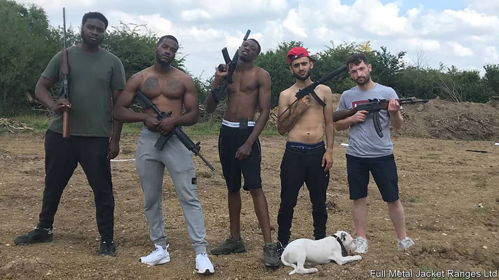

## Gun laws

# Britain’s shooting ranges could be in trouble

> A verdict raises questions about the future of a gentlemanly pursuit

> Feb 27th 2020

NAKED FROM the waist up, save for a red baseball cap, rapper Ard Adz (pictured) wields an alarming looking assault rifle. In a video uploaded to social media 14 months ago, he makes his way around a rudimentary obstacle course, firing at crude cut-outs. Such were the joys of Full Metal Jacket Ranges—a “premier outdoor shooting range” in Waltham Abbey, Essex—until it shut at the end of 2018, when Daniel Hammond, the operation’s boss, was called in front of Wood Green Crown Court, accused of a range of firearm offences.

Britain has some of the tightest gun laws in the world. Since the Dunblane massacre in 1996, most types of firearm have been illegal. Shotguns and small-bore rifles are permitted with a certificate. But one exemption remains. Section 11/4 of the Firearms Act permits air weapons and miniature rifles (of the sort Mr Adz was using) to persons “conducting or carrying on a miniature rifle range”. Certification is not needed. The exemption dates back to the discovery during the Boer War that the British were lousy shots: ranges were supposed to improve their aim.

The carve-out formed a key part of Mr Hammond’s defence. He was tried on a number of charges, including possessing a firearm without a licence. This was nonsensical, Mr Hammond argued, because as a shooting-range manager he should be exempt from the need for a licence. The jury agreed, and on February 26th decided Mr Hammond was not guilty of this charge. A verdict was due on two remaining charges as The Economist went to press.

The decision may end up damaging Britain’s gentlemanly shooting community, which is headed by the National Small Bore Rifle Association (NSRA) and the country’s very own National Rifle Association (NRA). Founded in the 19th century to improve public marksmanship, these governing bodies maintain close ties with the military, run their own ranges and affiliate with rifle clubs. They also police new ranges, issuing certificates to those who meet their specifications.

They did not think Mr Hammond’s outfit was up to scratch. Expert witnesses from the two organisations argued the exemption ought not to apply to Mr Hammond as the range he ran was “untidy” and failed to meet safety requirements. “Earth mounds that had been built weren’t high enough, and bullets were leaving the range,” argued the prosecution. “Bullets could potentially go on to the motorway, a café, a hotel and even a housing estate below.” But although the practice has been for range-owners to get certificates from these organisations, the law does not require it.

The defence believed the real issue was class. What went on was “no more and no less than what people are doing up and down the country,” argues Terence Boulter, Mr Hammond’s barrister, “though they might not be dressed like this, they might be wearing tweeds.” Mr Hammond sees the court case as an attempt to keep guns away from the working-class and ethnic minorities. Andrew Mercer, secretary general of the NRA, rejects that interpretation: “I’d find it hard to believe that the Crown Prosecution Service would spend money from the public purse on the basis of snobbery.”

Regardless of their motivation, the verdict is a problem for the shooting bodies, since it raises questions about the future of the exemption on which they rely. “We’ve never had any problem with this before,” said an NRSA representative during the case. “It could potentially be a bit of a muddle, couldn’t it?” The Law Commission, a quango, has argued for removing the exemption, and the judge in Mr Hammond’s case is expected to outline his view of inadequacies in the law as it stands. Mr Boulter says the exemption was something people didn’t want to talk about: “Why? Because it allows you to do what you want.”

That may not be true for much longer. Mr Hammond may have unwittingly provoked Britain’s gun lobby to shoot themselves in the foot. ■