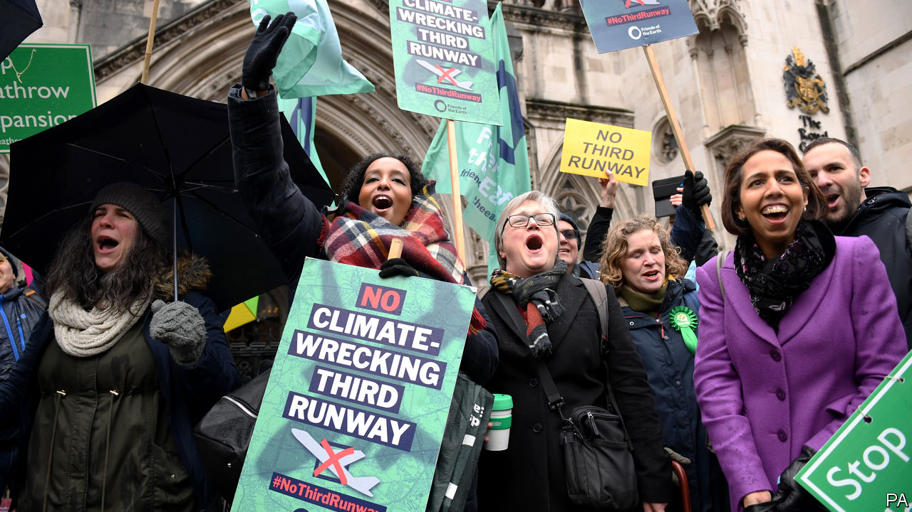

## It won’t fly

# The expansion of Heathrow airport is scotched on climate grounds

> The Court of Appeal sends the government back to the drawing board

> Feb 29th 2020

THE PARIS climate agreement, forged in 2016, has not made a huge difference to the world so far. But on February 27th it got its biggest break yet: the Court of Appeal in London found against the government and in favour of a coalition of groups that oppose the expansion of Heathrow Airport on grounds of climate, noise, air pollution and economic growth. The court said that the government should have taken the Paris agreement into account. The government is not going to appeal.

After a decade of lobbying by business, the government embraced the third-runway scheme in 2016. Chris Grayling, transport secretary at the time, said in a witness statement that the Paris agreement was “not relevant” to the scheme: the government had assessed it under a previous agreement. But that agreement was less stringent than the Paris one.

The decision does not put an end to airport expansion: it leaves room for the government to go back to the drawing board and come up with a plan that takes the Paris agreement into account. Businesses will argue passionately that airport expansion is essential to the growth that the government needs in order to finance its expensive schemes to build infrastructure elsewhere in the country. “Without expansion,” says Adam Marshall of the British Chambers of Commerce, “firms risk losing crucial regional connectivity and access to key markets across the world.” Insisting that it would fight the decision, Heathrow Airport invoked Johnsonian language: the runway “is essential to achieving the prime minister’s vision of Global Britain…Let’s get Heathrow done.”

But if there is to be airport expansion, there is a good chance now that it will not happen at Heathrow. Boris Johnson has long been a passionate opponent of the third runway, famously promising when he was mayor of London to “lie down in front of those bulldozers and stop the construction”. During the election campaign, he said that he would “find some way” to block it. He has also been under pressure to do something to show he is taking seriously COP26, the climate conference that Britain is due to host later this year. Giving up on Heathrow’s expansion would be a powerful gesture.

Mr Johnson is not, by and large, an enthusiast for judicial activism. But with this controversial judgment, the Court of Appeal may have done him a favour.

Sign up to our fortnightly climate-change newsletter [here](https://www.economist.com//theclimateissue/)

## URL

https://www.economist.com/britain/2020/02/29/the-expansion-of-heathrow-airport-is-scotched-on-climate-grounds
