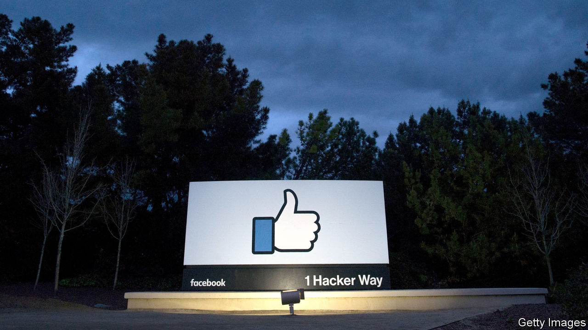

## A friendly portrait

# A journalist offers an inside look at Facebook’s rise

> Steven Levy’s new book about the social network is largely sympathetic

> Feb 27th 2020

Facebook: The Inside Story. By Steven Levy.Blue Rider Press, 583 pages.

“I  WOULD ALWAYS say to regulators,‘Look, bad things happen in human society, therefore bad things happen on Facebook’.” So said Chris Kelly, an ex-Facebooker once in charge of the social network’s privacy policies, to Steven Levy, a veteran technology journalist whose book about Facebook was published on February 25th. Mr Kelly was recounting conversations with officials in 2007, amid early rumblings about Facebook’s seamier side—specifically the ease with which children could find questionable content, such as a group named “I’m Curious About Incest”.

More than a decade on, Facebook claims 2.5bn people—a third of humanity—as users. The charge sheet against the company has grown as well. It has been accused of spreading fake news, facilitating paedophilia, and allowing countries to interfere in each other’s elections. Mr Levy’s book offers a ringside view of the growth of one of the world’s biggest companies, and of the backlash it has provoked. Other books, and even a Hollywood film, have chronicled the firm’s rise. But Mr Levy’s effort is fresh, up-to-date and insiderish. Thanks to the indulgence of the firm’s boss, Mark Zuckerberg, he had the run of its California headquarters and its denizens.

Such access can be a reporter’s blessing. It has long been apparent from the outside that Facebook grew so quickly that its employees had little time to grapple with all the implications, even those that would become central to the business. But it is still noteworthy to hear interviewees confirm as much to Mr Levy in their own words. Carolyn Everson, an advertising executive at Microsoft, was poached to head advertising sales at Facebook in 2011. Ms Everson assumed that her new employer knew what it was doing—after all, it was already raking in hundreds of millions of dollars. She was quickly disabused of that notion: “[Facebook] didn’t have everything figured out…everything was brand-new and [they were] still building.”

In 2008 Mr Zuckerberg hired Sheryl Sandberg, a Google executive, to be Facebook’s chief operating officer, handing off responsibility for everything not directly related to building Facebook’s product. (It would take him a decade, writes Mr Levy, to realise that such a division of labour was a mistake.) Facebook’s board upbraided both of them for not spotting a Russian misinformation campaign designed to influence America’s election in 2016. When subsequently asked by Mr Levy whether he thought she had “let him down”, Mr Zuckerberg offers only a pause, followed by a non-committal response.

The author’s access risks putting him in thrall to his subject. He is not afraid to chronicle Facebook’s failures. But his tone is occasionally fawning. He recounts how Mr Zuckerberg reacted to a question about the wisdom of Instagram’s founders selling their photo-sharing app to Facebook “as if he were a chess grandmaster, startled by a move from an inferior player who suddenly shifted the board to his disadvantage”. At times Mr Levy can seem too quick to accept the tech industry’s macho self-image, for instance in his description of an internal team charged with driving new users to Facebook as “a data-driven Dirty Dozen armed with spreadsheets instead of combat rifles”.

In recent years Facebook has hired legions of moderators to check up on its users, and fortified them with automated monitoring systems. But its chief defence against accusations of harm is one to which Mr Levy seems mostly sympathetic: that from the crooked timber of humanity, no straight thing was ever made, not even a social network. It is a belief that Mr Zuckerberg seems to hold sincerely. It is tactically useful, too, because while it contains more than a grain of truth, it also minimises the firm’s culpability.

In the end, Mr Levy sees Mr Zuckerberg as a Utopian genius undone by the world’s lamentable wickedness; a man who “set out to connect a world that was perhaps not ready to be connected”. Not everyone will be so generous.■