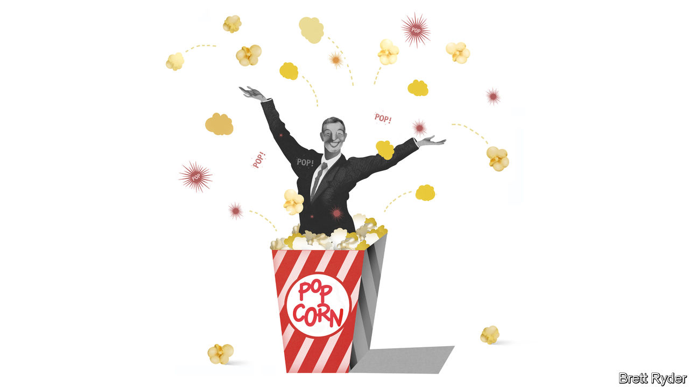

## Schumpeter

# Bob Iger, king of Disneyland

> Three lessons from one of Hollywood’s most successful bosses

> Feb 27th 2020

“I  DON’T KNOW if the word disrupter was the right word to use back then, but I’ve always been willing to take some chances.” That is how Bob Iger recently explained his approach to running Disney. In his 15-year tenure Mr Iger’s bets have turned the American entertainment company from a moderately profitable business threatened by digital upstarts like Netflix and Amazon into one of the world’s most formidable content-and-technology powerhouses. Profits quadrupled from $2.5bn in 2005 to $10.4bn in 2019. Disney’s market capitalisation rocketed from $48bn to over $230bn. This track record has made Mr Iger one of the most lionised (and best-paid) corporate bosses on Earth.

On February 25th Mr Iger once again displayed a fondness for disruption by announcing his departure from the corner office, effective immediately. He had toyed with the idea of retiring several times, only to change his mind. In 2016 his heir apparent was pushed out. Mr Iger has extended his own contract twice since then, and was expected to remain CEO for another couple of years. He will remain as executive chairman, focusing on the firm’s creative process, until the end of 2021 but has handed day-to-day running of the firm to Bob Chapek, a safe pair of hands who most recently ran Disney’s amusement parks.

The abrupt move sent the firm’s share price tumbling by 4%. To ease investors’ nervousness, Mr Chapek would be wise to heed three lessons from his predecessor. Other executives, in Tinseltown and elsewhere, should pay attention, too.

Mr Iger’s first insight was that quality products matter—or, in Hollywood lingo, content is king. Mr Iger had no truck with the notion, espoused by some pundits, that content would become commoditised as power shifted irreversibly from creators to distributors. This belief in content led Mr Iger to collect one beloved franchise after another, in a buying spree that verged on the foolhardy. Soon after taking over in 2005 he spent $7.4bn to buy Pixar, the animation studio famous for “Toy Story” movies. Three years later he bought Marvel Entertainment, with its stable of comic-book superheroes such as the Avengers, for $4bn. In 2012 he pipped Rupert Murdoch, boss of the Fox media empire, by acquiring Lucasfilm, home of “Star Wars”, for another $4bn or so. The three acquisitions alone have so far earned Disney revenues of $36bn. Last year alone Disney’s billion-dollar blockbusters included “The Lion King” (Walt Disney Pictures), “Frozen 2” (Walt Disney Animation Studios), “Toy Story 4” (Pixar) and “The Rise of Skywalker” (Lucasfilm). They helped Disney grab over a third of the American film market, and global box-office takings of over $10bn. His fourth purchase, of Mr Murdoch’s 20th Century Fox in 2019 for $71bn, is by far his most ambitious (and potentially most problematic).

The second thing to learn from Mr Iger’s reign is to trust acquired talent. At most firms in most industries, when a big company buys a small, nimble one, the buyer’s managers defend their turf and foist headquarters culture onto the acquisition. Mr Iger’s Disney instead let Pixar lift its middling in-house animation team. This hands-off approach and respect for the achievements of others helped persuade control freaks like George Lucas, the founder of Lucasfilm, and Isaac Perlmutter, the reclusive chairman of Marvel, to hand over their cherished possessions.

The third lesson is also the most important. A bit of paranoia can be productive. No boss succeeds without supreme self-confidence, and Mr Iger is no exception. However, he has shown time and again that he is willing to question his own judgment and to revise strategies as the business landscape evolves. When on a visit to Disneyland in Hong Kong around the time he took over as CEO Mr Iger noted that Chinese crowds preferred newer Pixar character’s to Mickey Mouse, he set reverence for Walt Disney aside and went about modernising the firm’s roster.

Nowhere was this clearer than in his embrace of digital streaming. Convinced that digital disruption was “not a speed bump” but an existential threat, he bet Disney’s future on a shift from its historic business-to-business model of distribution to the fast-growing direct-to-consumer model pioneered by Netflix. This shift was driven in part by the decline in the traditional approach of bunching content into pricey bundles for pay television, a trend that has hit Disney’s ESPN sports division hard. But it was a huge gamble. He needed to persuade his board, which had to accept putting existing profitable businesses at risk, and investors, who had to swallow big outlays today in exchange for uncertain digital dividends tomorrow.

On November 12th the firm launched Disney+, a streaming service, in America and a handful of other markets. By the end of the day it had 10m subscribers. Since then it has chalked up another 20m. Add a further 30m people who pay to watch Hulu, an older streaming service Mr Iger took control of in 2019, and more people fork over money to Disney every month than pay for cable TV from Comcast or AT&T.

Mr Iger leaves his successor a company in good shape, but also in the midst of two transformations: digital and, with 20th Century Fox to fold in, organisational. Both will soon test whether Mr Chapek has learned Mr Iger’s lessons. He certainly appears to share his mentor’s belief in the importance of brands and content, dating back to childhood visits to Walt Disney World. A big test of his respect for talented types with strong opinions will be convincing Kevin Mayer, the go-getting head of Disney’s direct-to-consumer business whom many expected to get the top job, to stay put. The even greater challenge of integrating a behemoth like 20th Century Fox, a bigger acquisition than Pixar, Marvel and Lucasfilm combined, will require a degree of adaptability that would have strained the old boss himself. As it is, Mr Iger has bowed out before his most epic plot has unspooled. ■

Correction (March 2nd, 2020): A previous version of this article said "Frozen 2" was produced by Pixar. In fact it was produced by Walt Disney Animation Studios.