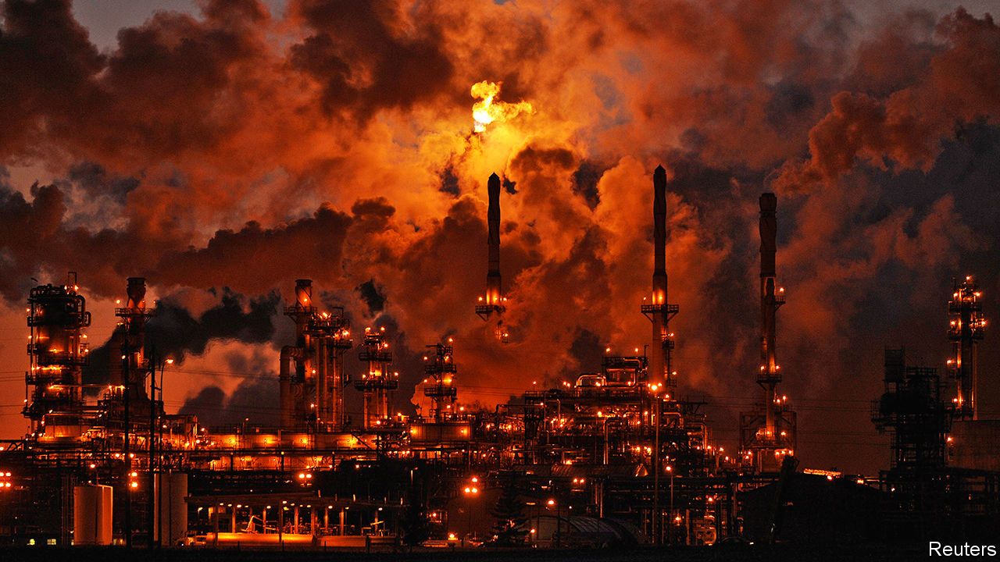

## The giant next door

# Canadian tar sands offer lessons for American shalemen

> The two countries’ oil industries are becoming more alike

> Feb 29th 2020NEW YORK

ALBERTA HAS lured many an oilman in recent years. Tapping new wells of thick Canadian bitumen and processing it into crude is expensive, but the break-even oil price for operating an existing one can be as low as $25. Large reserves and low depletion rates mean that companies can offer measured growth and attractive dividends. Instead of lubricating profits, however, Canada’s tar sands are bunged-up with protests against new pipelines. Most international oil firms have fled. The latest firm to retreat is Teck Resources. On February 23rd the Canadian company scrapped plans for a C$20bn ($15bn) oil-sands mine. Canada has not yet aligned “climate policy considerations” with “responsible energy sector development”, wrote Teck’s boss, Don Lindsay. Without regulatory approvals, an investment partner, new pipelines and a high oil price, Teck might as well have sought the Moon.

Things are looking rather different south of the border. Fracking a virgin shale bed is simpler—and cheaper—than mining a new tar pit. American crude production surged by 94% from 2011 to 2018, hitting Canada twice over: by pushing down the oil price and sucking away investment. Canadian oil output rose only two-thirds as fast. Chevron and ExxonMobil are among the global energy giants to pump capital into America’s vast Permian basin in Texas and New Mexico; the pair will present spending plans to investors in March.

But frackers, too, have headaches. Many have grown fast but spent faster. Returns tend to be meagre, as the quick decline in a well’s output has led firms to drill new ones. Low gas prices have hurt firms specialising in fracked gas most, though oilier producers have also struggled. An analysis of the top 39 public shale oil companies by Rystad, an energy-data firm, found that cashflow from operations exceeded capital spending at just one in four firms in the third quarter of 2019.

Now American companies may begin to behave more like Canadian ones, says Benny Wong of Morgan Stanley. Investors have urged frackers to grow more slowly and return more cash to shareholders. Top shale firms are listening. In November Pioneer Natural Resources raised its dividend and said it would pursue more modest growth. On February 18th Concho Resources and Devon Energy, two companies with assets in the Permian, told investors that capital spending would be lower this year. The companies raised their dividends by 60% and 22%, respectively.

Shale firms’ slowing growth may reflect geological and technical limits, too. Bob Brackett of Bernstein, a research firm, points out that productivity per square foot declined in all but one of America’s main shale basins last year. As the richest wells are depleted, remaining sites will require higher prices to be drilled profitably. American government forecasters expect domestic oil production to reach 14m barrels a day by 2022, then plateau. Others expect it to taper off sooner. Scott Sheffield, Pioneer’s boss, told investors last year that the OPEC cartel of oil-producing countries probably does not need to worry about further growth in American output.

America may turn more Canadian when it comes to regulations, too. Unlike Justin Trudeau, Canada’s prime minister, who has struggled to balance oil interests with environmental ones, President Donald Trump has simply ignored conservation and the climate. He has allowed drilling on federal lands and eased rules for planet-cooking methane emissions. But the shalemen’s political problems may mount. Low gas prices led to a surge of flaring last year, prompting a Texas regulator to propose curbing the practice, which would inconvenience firms. On February 24th the Supreme Court heard a suit to block a new shale-gas pipeline that would cut beneath the Appalachian Trail, America’s longest hiking path. Democratic presidential candidates including Bernie Sanders, the front-runner, want to ban fracking.

In Canada the premier of oil-rich Alberta argues that provinces should be freer to develop oil projects within their borders. It is not impossible to imagine a world in which oil states battle a more restrictive national government in America, too. ■

Sign up to our fortnightly climate-change newsletter [here](https://www.economist.com//theclimateissue/)

## URL

https://www.economist.com/business/2020/02/29/canadian-tar-sands-offer-lessons-for-american-shalemen
