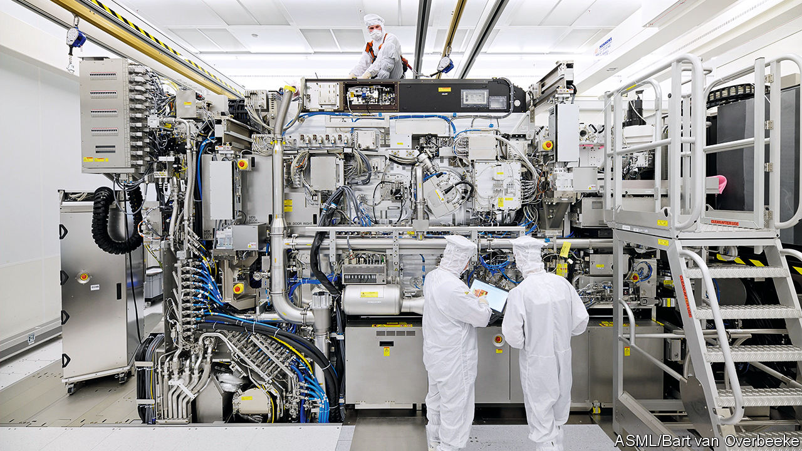
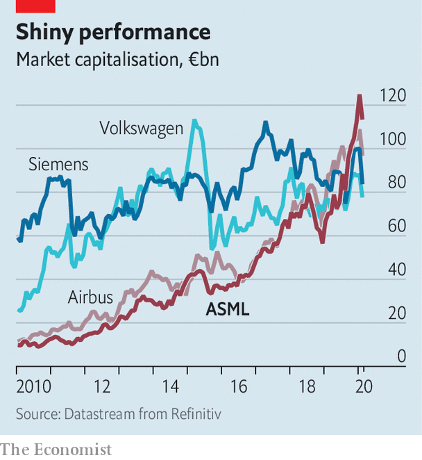
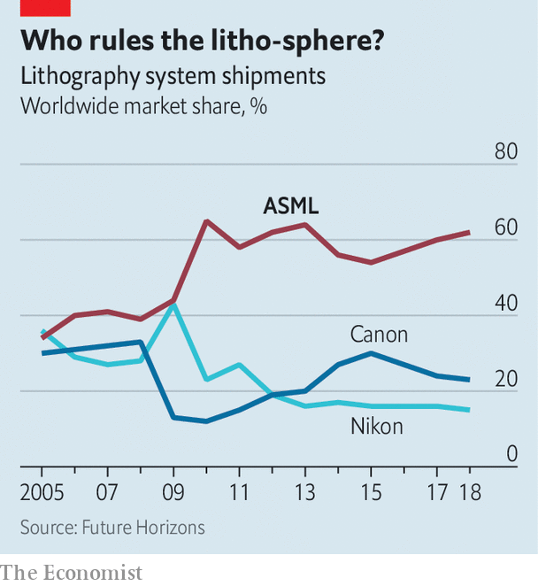

## Industrial light and magic

# How ASML became chipmaking’s biggest monopoly

> A low-key Dutch company has cornered a critical link in the global electronics supply chain

> Feb 29th 2020VELDHOVEN

ASK PEOPLE to pinpoint the centre of the digital economy and many will finger Silicon Valley, populated by Apple, Google, Facebook and too many sexy startups to count. Others may nod at the area around Seattle, where Amazon and Microsoft are based. Some could suggest Shenzhen, China’s technology hub. Few would point to a nondescript suburb of Eindhoven, the Netherlands’ fifth-biggest city. Yet on closer inspection, the case for Veldhoven looks compelling. It is home to ASML, the world’s sole manufacturer of the most advanced equipment critical to modern chipmaking. If chips make the world go round, ASML may be the closest the multi-trillion-dollar global tech industry has to a linchpin.

ASML is not the only maker of photolithographic machines, which use light to etch integrated circuits onto silicon wafers. It competes with Canon and Nikon of Japan. But the Dutch firm’s market share has nearly doubled, to 62%, since 2005. And it alone has harnessed “extreme ultraviolet” (EUV) light, with wavelengths of just 13.5 nanometres (billionths of a metre). Shorter wavelengths allow the etching of smaller components—vital for chipmakers striving to keep pace with Moore’s Law, which posits that the number of components that can be squeezed into a given area of silicon doubles roughly every two years. The world’s three leading chipmakers—Intel in America, Samsung in South Korea and the Taiwan Semiconductor Manufacturing Company (TSMC)—have become as reliant on ASML’s wares as the rest of the technology industry is on theirs.

The company’s performance reflects this increased dependence. Its revenues grew by 8% in 2019, to €11.8bn ($13.2bn), despite a slump in the highly cyclical semiconductor business. Although EUV devices accounted for only 26 of the 229 lithography machines the firm sold in 2019, they made up a third of sales by revenue. The firm expects this to rise to three-quarters by 2025, as other chipmakers upgrade from existing “deep ultraviolet” technology.

With neither Canon nor Nikon pursuing EUV technology, investors have concluded that ASML will enjoy its nanoscopic monopoly for a while. Since 2010 its market capitalisation has grown tenfold, to around €114bn (see chart). It has nearly doubled in the past year alone. ASML is worth more than Airbus, Siemens or Volkswagen. Its share price has suffered along with others as covid-19 rattles global markets, but its longer-term outlook appears as bright as the white-walled cleanrooms where its machines take shape. Its shares trade at a mouthwatering 32 times forward earnings, double or more those of its biggest customers.

Times were not always so good. The firm started life in 1984 as a joint venture between Philips, a Dutch electronics giant, and ASM International, which made semiconductor equipment. Early on it occupied a few wooden huts on Philips’s Eindhoven campus. Jos Benschop, ASML’s technology chief, is candid about its early troubles. Its first products were obsolete as soon as they were released, he says, and the firm struggled to find customers. It was kept alive by Philips, itself facing financial difficulties, and by subsidies from the Dutch government and the EU’s predecessor.

In 1995 it listed its shares in New York and Amsterdam. Shortly afterwards the firm bet that EUV lithography would be the future of chipmaking. Big chipmakers planned to be using its machines by around 2007. They were to be disappointed—repeatedly. So were ASML’s shareholders, as the company discovered that EUV light is frustratingly difficult to work with. Working out the kinks took much longer than expected, admits Mr Benschop. The firm’s first prototype machines were sent to IMEC, a research institute in Belgium, in 2006. Commercial clients did not start using the technology until 2018.

Earlier generations of kit employ lasers to produce light directly. But as wavelengths shrink, things get trickier. Inside a cutting-edge EUV machine 50,000 droplets of molten tin fall through a chamber at its base each second. A pair of lasers zap every drop, creating a plasma that in turn releases light of the desired wavelength. The mirrors guiding this light, made of sandwiched layers of silicon and molybdenum, are ground so precisely that, if scaled to the size of Germany, they would have no bumps bigger than a millimetre. Because EUV light is absorbed by almost anything, including air, the process must take place in a vacuum. To get into the production facilities, your correspondent had to don a special suit and leave his notebook behind, lest it shed unwanted fibres.

The machines, weighing 180 tonnes and the size of a double-decker bus, are themselves a testament to the electronics industry’s tangled supply chains. ASML has around 5,000 suppliers. Carl Zeiss, a German optics firm, fashions its lenses. VDL, a Dutch company, makes the robotic arms that feed wafers into the machine. The light source comes from Cymer, an American company bought by ASML in 2013. ASML is, in turn, one of hundreds of firms that supply the chipmakers themselves. But it is so vital that Intel, Samsung and TSMC have all chipped in to finance its research and development in return for stakes in the firm.

Appreciation of ASML’s dominant position has not been confined to customers or investors. Politicians share it, too. EUV lithography is on the Wassenaar list of “dual-use” technologies that have military as well as civilian applications. China is keen to foster advanced chipmaking firms of its own, an ambition that America is trying to thwart. In 2018 ASML received an order for an EUV machine from a Chinese customer, widely thought to be the Semiconductor Manufacturing International Corporation, China’s biggest chipmaker, whose factories are currently a couple of generations behind the state of the art. Under American pressure, the Dutch government has yet to grant ASML an export licence.

ASML would hate to surrender access to the Chinese market, which is bigger than most and as captive. Being kept out of China may, in the long run, endanger ASML’s dominance—if it leads a Chinese rival unable to secure ASML kit to build its own, and sell it to others. Last April ASML said that six employees, including some Chinese nationals, were involved in pilfering trade secrets from its American office in 2015. The firm disputes the suggestion that the theft was linked to the Chinese government.

Right now, though, China needs ASML more than ASML needs it. Of all the suppliers required for an advanced chip factory of the sort its authorities want built, “ASML’s technology is the most difficult to replicate”, says Pierre Ferragu, a technology analyst at New Street Research. Malcolm Penn of Future Horizons, another consultancy, thinks that it would take a Chinese rival a decade or more to catch up—and by then the cutting edge would have moved on again. The Dutch are already working on new EUV machines with better optics, which can process more silicon wafers per hour. These are due to ship in 2023—this time, ASML hopes, with no delays. ■