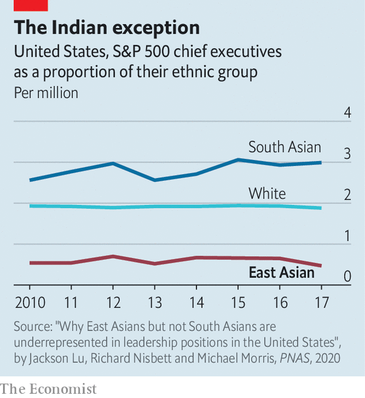

## The bamboo ceiling

# Indian v Chinese bosses in America Inc

> A provocative study examines Asians in American corner offices

> Feb 29th 2020NEW YORK

“A  CAREER BOOK about Asians? Aren’t they doing fine…?” So begins “Breaking the Bamboo Ceiling”, a tome by Jane Hyun published in 2005. Because Asian-Americans had higher incomes and education levels and committed fewer crimes than their average compatriot, they were seen as a model minority. Despite this, they rarely rose to the top of companies. A mix of individual, cultural and organisational barriers—the “bamboo ceiling” of the book’s title—seemed to halt their rise.

Fifteen years later Asians are still under-represented. Some 11% of associates at American law firms are Asian, but only 3% of partners are. In technology Asians make up over 30% of the workers but less than 15% of bosses. In 2017 Asians made up roughly 6% of the country’s population but only 3% (16) of the bosses of S&P 500 firms.

Some prominent Asians run big companies. Arvind Krishna is IBM’s new boss. Satya Nadella runs Microsoft and Sundar Pichai leads Alphabet. But few other Asians have joined their ranks—and, revealingly, these stars all have Indian roots. There are fewer South Asians in America than East Asians, but they still made up 13 of those 16 Asian S&P 500 CEOs.

Why are there so few Asians among America’s business elite? And if a bamboo ceiling is to blame, why do South Asians break through more easily? These questions are the focus of a study by Jackson Lu of MIT Sloan School of Management and colleagues, who surveyed hundreds of senior executives and business-school students. They found that while discrimination exists, it is not destiny. South Asians endure greater racism than East Asians but still outperform even whites (if success is weighed against share of population). Their research also rules out lack of ambition: a greater share of Asians than whites strive for high-status jobs.

That leaves culture. The researchers conclude that South Asians tend to be more assertive than East Asians in how they communicate at work, which fits Western notions of how a leader should behave. The same propensity for confident discourse featured in “The Argumentative Indian”, a book by Amartya Sen, a Nobel-prizewinning economist. The researchers attribute East Asians’ reticence to Confucian values of modesty and respect for hierarchy. Sometimes boldness and bombast are needed to break bamboo.■

## URL

https://www.economist.com/business/2020/02/29/indian-v-chinese-bosses-in-america-inc
