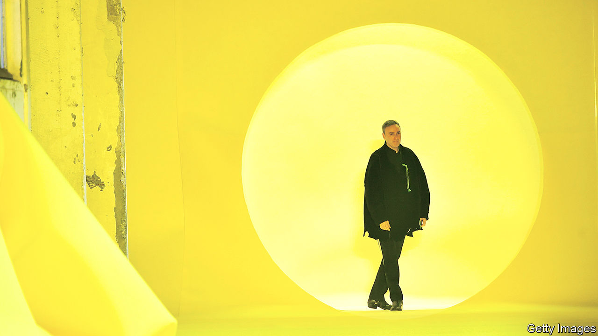

## Unbedevilling a fashion house

# Prada hires Raf Simons as co-creative director

> The Italian luxury group tries to revive its creative spark—and its financial fortunes

> Feb 27th 2020BERLIN

FOR YEARS after it listed its shares on the Hong Kong stock exchange in 2011, Prada’s business looked considerably blander than its iconoclastic blend of ugly chic, counterculture, politics and fashion. No longer. Its share price rose by a quarter in the three months to January, faster than at bigger luxury groups such as France’s LVMH or Kering. Investors liked the look of its new partnership with L’Oréal, a cosmetics giant, and of investments in online sales. But their enthusiasm was based chiefly on an expectation of more radical change: either a takeover by a bigger luxury conglomerate or an internal overhaul.

A buyer has yet to signal interest. But on February 23rd Prada announced that Raf Simons, a cerebral industry star from Belgium who used to be the creative head of Christian Dior, a French label owned by LVMH, and of Calvin Klein, an American brand, will join the company. He will work alongside Miuccia Prada, the granddaughter of the company’s founder, as co-creative director. The duo will unveil their first joint collection in September. Both emphasised their intention to double down on creativity—and prevent the suits from calling all the shots.

Both Ms Prada and her husband, Patrizio Bertelli, the group’s chief executive, have strong personalities. They also own 80% of Prada. For the arrangement to work, the trio “must get on very well”, says Luca Solca of Bernstein, a research firm. It helps that they have known each other since 2005, when Mr Simons worked for Jil Sander, a German label then part of the Prada empire.

A good rapport alone will not guarantee Prada’s revival. That, Mr Solca notes, requires undoing past mistakes. Some, like its drab online presence and recent uninventiveness, which Mr Simons is to tackle, are being reversed. Other errors, notably efforts to narrow its offering and to ape rivals like Hermès and Chanel, and their high prices, have yet to be.

With all luxury firms infected this week by the new coronavirus, which hurts their lucrative Chinese sales, it is hard to discern what investors make of Mr Simons’s arrival. Those holding out hope of an acquisition may at least comfort themselves that, at 4% of LVMH’s market value, Prada remains a tasty morsel—which a talented haute-couturier like Mr Simons makes tastier still.