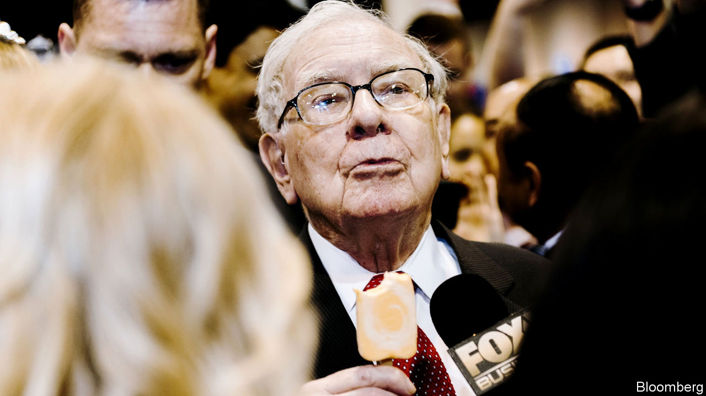
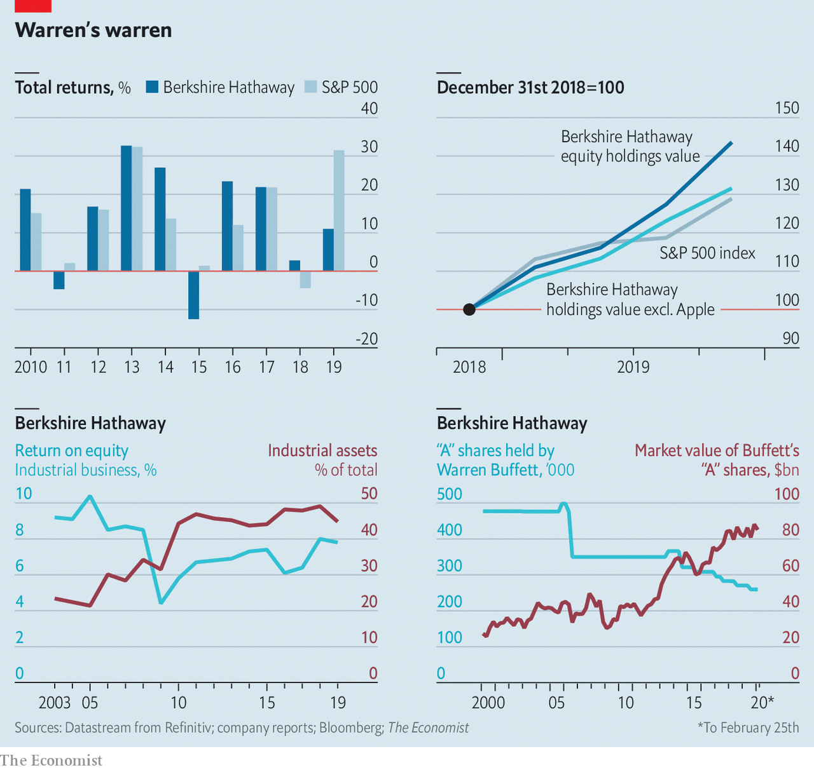

## How hath Berkshire done?

# Untangling Warren Buffett’s unique firm

> And its mediocre performance

> Feb 27th 2020NEW YORK

ON FEBRUARY 22nd Warren Buffett reported that the conglomerate he runs, Berkshire Hathaway, earned net income of $81.4bn in 2019. That makes Berkshire, America’s biggest non-tech firm by market value, more profitable than any other company anywhere bar Saudi Aramco, an oil giant. Yet after years of mostly level-pegging or outperforming the broader market, Berkshire’s shares did only one-third as well as the soaring S&P 500 index last year (see chart). What is going on?

Assessing the conglomerate’s true success is a complicated business, because the business of Berkshire is complicated. Worse, a change in accounting principles two years ago forced Berkshire to start booking changes in the value of its $248bn equity portfolio as earnings. Last year that resulted in $53.7bn of unrealised capital gains filtering through to the bottom line—and a return on equity of 19%. The year before hefty unrealised losses meant a return on equity of just 1%.

The surge in unrealised gains was driven by the performance of Berkshire’s holdings in giant public companies such as Apple and Bank of America, which Mr Buffett and his colleagues pick like any old asset manager. Last year these stakes did a bit better than the S&P 500 as a whole—chiefly thanks to an epic big-tech bull run, which supercharged the returns from Berkshire’s 5.7% stake in the iPhone-maker.

Mr Buffett prefers the “real world” to “accounting-land”, as he put it in his annual letter, referring to the new standards on treatment of unrealised gains and losses. But in recent years he has struggled to articulate a consistent way of measuring the firm. At points he has endorsed tracking book value and at other times “operating earnings”, a proxy for the cash generated by the businesses Berkshire owns outright (plus the dividends from minority stakes).

One way of getting your head round Berkshire is to split it into two parts: a volatile financial arm, which includes its equity portfolio and insurance activities, and a steadier industrial group, composed of unlisted firms such as BNSF, a railway, and Precision Castparts, a manufacturer. The second category are the sort of company the no-nonsense Nebraskan professes to understand, and has spent a decade buying up. Their weight in Berkshire’s portfolio has grown: the industrial arm now makes up roughly half of total assets, up from a third a decade ago. But Mr Buffett paid up to acquire these firms, leaving the industrial arm’s return on equity at about 8%. Not terrible—but nothing to write home about.■

## URL

https://www.economist.com/business/2020/02/27/untangling-warren-buffetts-unique-firm
