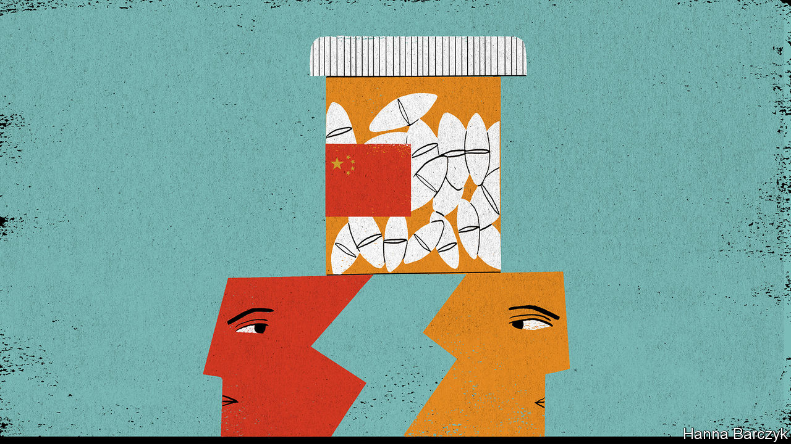

## Chaguan

# Covid-19 is teaching hard lessons about China-only supply chains

> At the very least, an emotional decoupling is under way

> Feb 29th 2020

UNTIL ABOUT the third week of January, only a few pharmaceutical executives, drug-safety inspectors and dogged China hawks cared that a large share of the world’s supply of antibiotics depends on a handful of Chinese factories. These include a cluster in Inner Mongolia, a northern province of windswept deserts, grasslands and unlovely industrial towns. Then came the covid-19 outbreak, and quarantine controls that locked down factories, ports and whole cities across China.

Chinese leaders insist that they are well on the way to conquering the virus, allowing them to reopen “leading enterprises and key links with important influence” in global supply chains. A victory over the novel coronavirus will once again demonstrate “the notable advantages of leadership by the Communist Party of China”, President Xi Jinping told 170,000 officials by video-conference on February 23rd. But even if all those boasts come true, foreign governments and business bosses will not quickly forget a frightening lesson: for some vital products, they depend on one country.

Where once only a few specialists worried about the market share enjoyed by the industrial chemists of Hohhot or Shijiazhuang, China’s dominance of the active pharmaceutical ingredient (API) sector is now the subject of hard questions in Washington’s corridors of power and the chancelleries of Europe. Ending the world’s dependence on Chinese APIs would not be a technical challenge. China has not been dominant for long. America’s last penicillin fermenter closed in 2004, as clusters of Chinese factories, many state-owned or subsidised, offered efficiencies that foreign rivals could not match. Rather, change would involve upending well-established political and economic theories, starting with the wisdom of allowing private companies to seek out the best-value goods, with little heed paid to their origin.

There is much speculation about whether covid-19 will accelerate trends in America and other Western countries to decouple from China. In truth, a rush to diversify in certain sectors is more likely, and even such a hedging of bets would build on trends that have been visible for some time.

The US-China Economic and Security Review Commission, a congressional body, held hearings in July 2019 on threats and opportunities created by China’s medical industries. The tone quickly veered towards the doomy. A senior Pentagon official, Christopher Priest, declared that “the national-security risks of increased Chinese dominance of the global API market cannot be overstated.” He invited the hearing to imagine China interrupting supplies of irreplaceable drugs, such as those that protect troops against anthrax. Another witness, Benjamin Shobert, a health-care strategist at Microsoft, noted that mutual dependency was once seen as a reason to believe that Sino-American relations were stable and safe. But in an age of rising distrust, if those same calculated dependencies were to become a source of fear, then “much of what has supported the modern era of globalisation is no longer valid.”

For implacable China hawks like Peter Navarro, who advises President Donald Trump on trade, the covid-19 crisis is a told-you-so moment. On February 23rd Mr Navarro told Fox Business, a television channel, that America had outsourced “far too much” of its supply chain for essential medicines. “We have got to get it back onshore,” he said. Mr Navarro, an economic nationalist and vocal tariff advocate, is little loved by America’s trade partners. Yet his talk of nations needing to control certain forms of production finds an echo in rich-world capitals.

Joerg Wuttke, the president of the European Union Chamber of Commerce in China, says China’s dominance in sectors like pharmaceuticals and pesticides is a topic of concern when he visits officials in Berlin, Brussels and elsewhere. It does not help that China has shown itself willing to use trade to bully other countries during political disputes, as when it denied the export of rare earths to Japan in 2012. He does not expect firms to leave China altogether, because it drives global growth in so many sectors. But Mr Wuttke expects the epidemic to intensify European discussions about industrial policy. “The globalisation of putting everything where production is the most efficient, that is over.”

James McGregor, a China veteran who heads the Chinese operations of APCO, an American consultancy, watched businesses putting ever more eggs in the China basket for a decade. Hit by rising labour costs, trade tensions and now the virus, companies have concluded that they need to diversify—though many are struggling to find countries with China’s infrastructure and adaptable labour force. Against that, some firms that are in China to sell to China are expanding production there, in part to avoid the uncertainty of tariffs. The most capable high-tech companies see China as “the market of the future” for such promising industries as autonomous vehicles, robotics and the internet of things. They may be rewarded for their faith. “We are going to see the Chinese government be extraordinarily nice to companies once this virus is over,” suggests Mr McGregor.

One visible impact of the virus may be to speed changes at the top of firms. Multinationals have increasingly appointed Chinese executives (often Western-educated) to run their China operations. The epidemic may accelerate departures among the foreigners who remain. Air pollution has already driven many away. Some old-timers feel less welcome in a China taking a nationalist, authoritarian turn. Now they are living alone after evacuating their families, or in temporary exile abroad scrambling to find children school places in home countries they barely know. “A lot of my contemporaries don’t need much of a push” to leave, says a long-time China hand. Even if covid-19 burns out soon, it has clarified how the world is growing warier of China. Few firms can afford to leave completely. But an emotional decoupling is under way. ■

Read more:[Covid-19 is now in 50 countries, and things will get worse](https://www.economist.com//briefing/2020/02/29/covid-19-is-now-in-50-countries-and-things-will-get-worse) (February 27th)[To curb covid-19, China is using its high-tech surveillance tools](https://www.economist.com//china/2020/02/29/to-curb-covid-19-china-is-using-its-high-tech-surveillance-tools) (February 27th)[As its covid-19 epidemic slows, China tries to get back to work](https://www.economist.com//finance-and-economics/2020/02/27/with-its-epidemic-slowing-china-tries-to-get-back-to-work) (February 27th)[How China’s coronavirus epidemic could hurt the world economy](https://www.economist.com//china/2020/02/29/to-curb-covid-19-china-is-using-its-high-tech-surveillance-tools) (February 13th)

## URL

https://www.economist.com/china/2020/02/29/covid-19-is-teaching-hard-lessons-about-china-only-supply-chains
