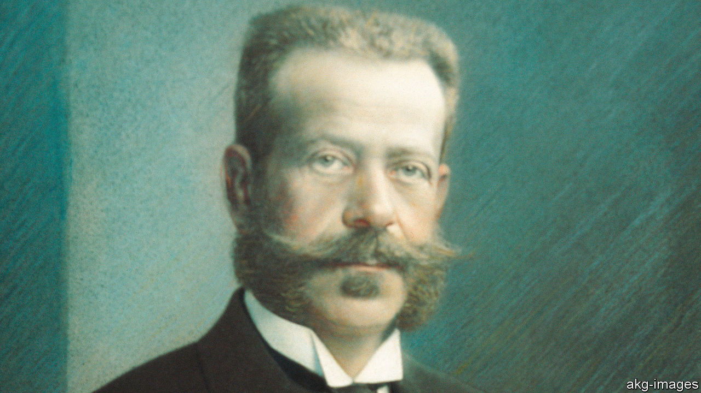

## Charitable confiscation

# A Rothschild heir sues Vienna

> The latest chapter in the history of Jews in Austria

> Feb 27th 2020VIENNA

AUSTRIA’S TRAGEDY is that only a tiny number of Vienna’s Jews returned after the second world war to the city, once the glittering home of Sigmund Freud, Gustav Mahler, Stefan Zweig and Arthur Schnitzler. Some 150,000 Jews lived in Vienna at the turn of the 20th century; today the city’s Jewish community is only around 7,000, many of them new immigrants from eastern Europe or Russia. The unofficial Jewish royal family, the Rothschilds, never returned to Vienna full-time.

One Rothschild descendant, Geoffrey Hoguet, travelled from his home in New York to Vienna this month on a family mission (Mr Hoguet is a distant cousin of the Rothschilds who own a stake in The Economist). He is taking the city of Vienna to court over the way the municipality has managed a charitable trust set up by his great-grandfather, Albert Freiherr von Rothschild, to honour the will of his childless brother Nathaniel. The first hearing took place on February 20th.

Mr Hoguet is dismayed by how the city of Vienna has dealt with the Nathaniel Freiherr von Rothschild’sche Stiftung für Nervenkranke, a foundation set up in 1907 to pay for hospitals for the treatment of the mentally ill, which was expropriated by the Nazis in 1938 and taken on by the newly independent second republic in 1956. The foundation was once fabulously rich, with an endowment estimated at €120m ($130m). Nathaniel’s gift is the biggest charitable donation ever made in Austria.

Mr Hoguet wants to re-establish a 12-member committee (of which the Rothschilds would nominate nine) to manage the foundation. By retaining control over the foundation, Vienna was “in effect perpetuating the Nazi Aryanisation programme”, says his court filing. Mr Hoguet also wants to nullify the sale in 2002 of the Maria Theresa Schlössl, a baroque palace that was one of the world’s earliest psychiatric hospitals—which, he claims, the city sold to itself at a “grossly undervalued” price. And he aims to nullify a clause added in 2017 stipulating that the foundation’s wealth would go to the city of Vienna if it were ever dissolved.

The city insists that it has always dealt responsibly with its Nazi history. Its lawyer told the court that the foundation’s wealth had dwindled to €8m by the time the Nazis annexed Austria. He claimed the city invested €500m-600m in the foundation over the years, so that it could run its hospitals. Yet the presiding judge, Ursula Kovar, reprimanded the city, calling “massively alarming” the clause it added making itself the sole beneficiary of the foundation’s wealth in case of its dissolution. On her recommendation, the two sides have now agreed to negotiate.

Mr Hoguet says he remains attached to Austria, and to the many friends he has made in the Alpine republic. He used to work for Creditanstalt, a big Austrian bank founded by his ancestor. Until recently his family still owned lots of land. Last year they parted with the last chunk, selling about 7,000 hectares (17,300 acres) of forest in Lower Austria.

The sale marked the end, after more than 200 years, of the physical presence of the Rothschilds in Austria. Yet Mr Hoguet’s ancestors would approve of his fight for their posthumous rights. Although he was an exile in America at the time of his death in 1955, his great uncle Louis, the last male Austrian Rothschild, chose to be buried at the Central Cemetery in Vienna. ■

## URL

https://www.economist.com/europe/2020/02/27/a-rothschild-heir-sues-vienna
