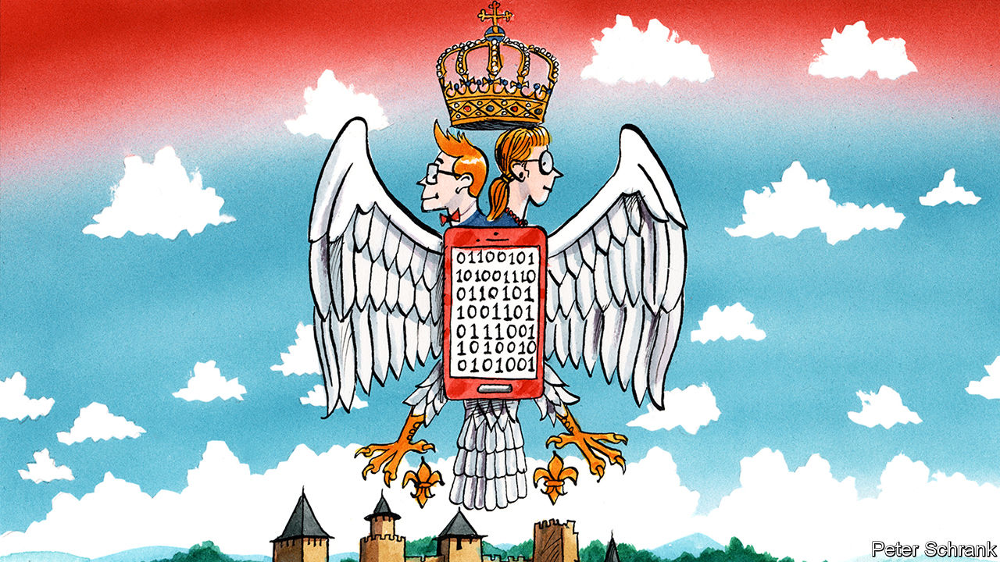

## Return of the geeks

# An unexpected tech boom in Serbia

> And there’s lithium too

> Feb 27th 2020BELGRADE

IT WAS MID-JANUARY and the Serbian capital was covered in toxic smog. Belgraders peered into their phones to check an app informing them about the air quality. It was “hazardous”, but if they were at a bus stop there was one thing to celebrate. Though they could barely see 200 yards, they could tell when their bus was arriving, as timings had just been added to Google Maps, years after most other European capitals. The digital revolution is at last arriving for Serbs. And as Europe goes green, more good news may be on the way. Serbia is sitting on one of the continent’s largest reserves of lithium, an essential ingredient for the batteries of electric cars.

Tech accounts for at least 6% of Serbia’s GDP. It employs some 45,000 people. Foreign firms have spent more than $500m on Serbian startups in the past six years, says Zoja Kukic of the Digital Serbia Initiative (DSI), which champions the sector’s interests. Last year’s exports are expected to have reached €1.4bn ($1.5bn), an increase of 55% on 2017. The real figure could be much higher, says Nebojsa Djurdjevic, head of the DSI. Foreign-exchange rules mean that payments are often sent to companies set up abroad, and no one can keep track of an estimated 10,000 freelancers who often operate alone.

Educated Serbs are leaving in droves—but not if they work in tech. It is one of the few sectors that draws skilled people back home. Many industry heads, including Dragan Tomic, who runs Microsoft’s Belgrade development centre, are diaspora Serbs who have returned with skills, contacts and capital. Mr Djurdjevic graduated in electronics in 1990. From his class of about 70, some 40 left. Ten are now back.

One part of Serbia’s government is still enmeshed in the wars of the past. It has only just agreed to reinstate long-severed rail and air connections to Kosovo, which it refuses to recognise. But another part has invested $79m in digital infrastructure, reforming regulatory frameworks and creating tax breaks to woo investment. Primary schools now teach coding. The country’s education system is churning out 5,000 graduates a year primed for tech jobs.

Blockchain and games development are already big parts of Serbia’s digital economy. Top Eleven, a football game produced by Nordeus, Serbia’s best-known tech company, has 219m registered users. But fintech, biotech and AI are increasingly important, though they still find it hard to attract investors at home.

While digital tech is Serbia’s current boom industry, lithium may be the next. Rio Tinto has invested $200m to explore a site near Loznica. Marnie Finlayson, its general manager for Serbia, says that the ore would be processed on the spot; it would be Europe’s biggest supplier. Unlike many other lithium mines, this one would be close to where it is needed. Fiat cars are Serbia’s second biggest export. Ms Finlayson says that by 2035 Rio Tinto expects 50% of cars to be electric. If Rio Tinto’s board gives the go-ahead, production would begin in 2025. With all the ancillary industries, she says that might add “a couple of percentage points to GDP”. ■

## URL

https://www.economist.com/europe/2020/02/27/an-unexpected-tech-boom-in-serbia
