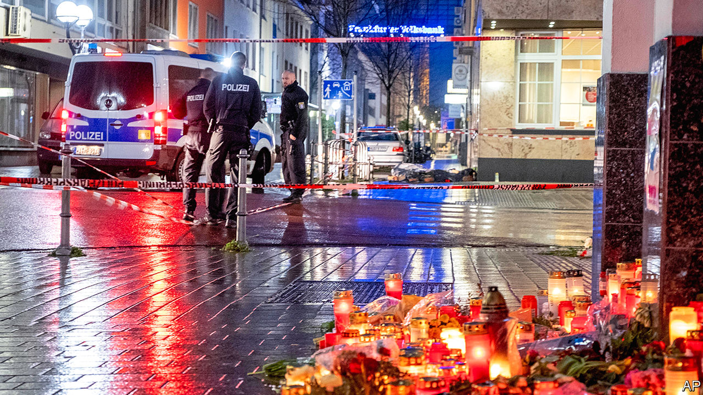
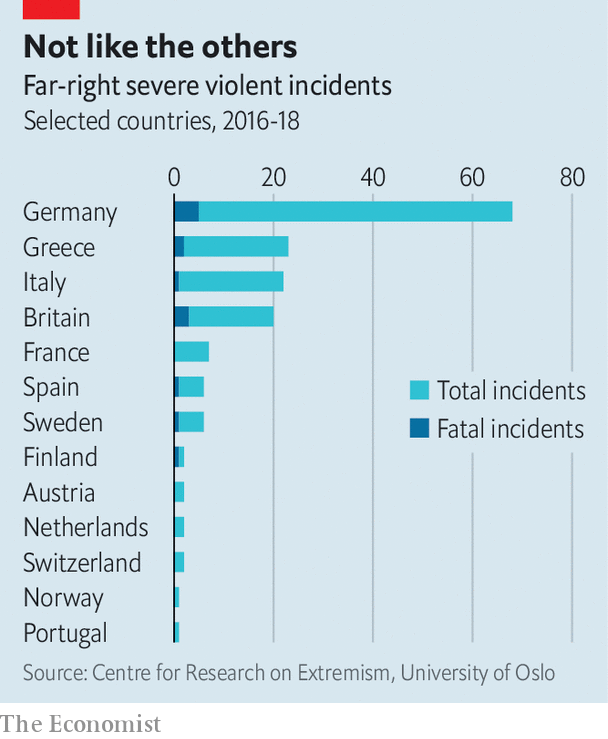

## The threat within

# Germany is belatedly waking up to the threat of far-right terrorism

> It has surged far more than elsewhere in Europe

> Feb 27th 2020

FIVE BULLET-HOLES still scar the window of Karamba Diaby’s office in Halle, a city in eastern Germany. No one knows who fired at the empty building, where Germany’s only black MP meets constituents and does routine political work. But Mr Diaby’s staff do not doubt that the attack, in mid-January, was racially motivated. A week after the incident Mr Diaby got an email warning him to expect the fate of Walter Lübcke, a pro-refugee politician murdered last June. The anonymous threat was signed off with a “Sieg Heil”.

Right-wing extremism in various guises has troubled parts of Germany for decades. The Amadeu Antonio Foundation, an outfit that monitors such activity, says it is responsible for 208 deaths since 1990. But a recent string of incidents has left nerves especially jangled. On Yom Kippur, three months before the attack on Mr Diaby’s office, Stephan Balliet, a young man armed with home-made 3D-printed weapons, tried to break into a synagogue in Halle to massacre worshippers; when that failed he killed two people at random instead. On February 19th in Hanau, near Frankfurt, 43-year-old Tobias Rathjen killed nine immigrants and ethnic-minority Germans during a shooting rampage, before killing himself and his mother. A few days earlier 12 men were arrested for planning attacks on mosques in the hope of igniting “civil war”. Local officials across Germany are physically and verbally intimidated. Many have quit.

Ministers have belatedly acknowledged that far-right terrorism is Germany’s gravest security threat. Officials count over 32,000 right-wing extremists in the country; over 1,000 are considered to be primed for violence. The Centre for Research on Extremism at the University of Oslo calculates that between 2016 and 2018 the number of severely violent far-right incidents in Germany, most of them targeting immigrants or non-whites, far outstripped those elsewhere in Europe (see chart). And that was before the recent surge.

Police and security officials have become much better at tackling organised right-wing threats since botching their response to the National Socialist Underground, a murderous neo-Nazi terrorist cell active in the early 2000s, says Daniel Koehler of the German Institute on Radicalisation and De-radicalisation Studies. Yet as the response evolves, so does the danger. Underground far-right networks remain a serious threat; the suspect in the Lübcke killing had a decades-long history in them. But the attackers in Halle and Hanau were both loners who were radicalised online, had no known connection to established far-right groups and were unknown to the German authorities.

Online groups can, to an extent, offer a sense of community that other extremists find in marches, concerts or martial-arts clubs. They can also nurture “communal delusions” says Miro Dittrich at Amadeu Antonio. These often straddle national boundaries. That helps explain why Mr Balliet, marinated in a toxic brew of online chatrooms, racist memes and the misogynistic subculture of “incel” (“involuntary celibacy”), broadcast his attack live on Twitch, an American video-streaming gaming website, and chose to deliver his anti-Semitic diatribes and obscure online references in English. He sought to inspire others abroad, just as he had been motivated by comparable attacks in El Paso and Christchurch. At a candlelit vigil after the Hanau attacks, protesters chanted Nazis raus! (“Nazis out!”), a common response to far-right atrocities in Germany. Yet the recent attacks look less like a specific national concern than local instances of an overlapping set of transnational phenomena.

That creates problems for the domestic intelligence services. Having long relied on American and British spooks to alert them to online transgressions, Germany’s underresourced security apparatus remains woefully ill-equipped to manage internet-based radicalisation, says Mr Koehler. There are plans to expand the powers of agencies, and to set up an early-warning system for right-wing radicals. A bill agreed by the cabinet shortly before the Hanau attack would oblige platforms like Facebook to report illegal content. But it is not clear that any of this would have pulled the Halle or Hanau perpetrators from their shadowy, global online underworld.

Protesters have found a more visible target in the Alternative for Germany (AfD), a far-right party that one Green has called “the political arm of hate”. The AfD vigorously rebuts any claim that it bears part of the blame for right-wing terror. Yet some of its officials, especially in eastern Germany, routinely deploy the sort of racist, quasi-apocalyptic imagery found in the darker reaches of the internet. Björn Höcke, leader of the AfD’s extremist Flügel (“Wing”) grouping and head of the party’s branch in Thuringia, uses language so incendiary that a court has ruled he may be described as “fascist” without fear of legal consequence. Right-wing terrorists “want to be the hero of a movement,” says Mr Dittrich, “and the AfD plays a role in normalising their ideas”. A poll found that 60% of Germans held it partly responsible for Hanau.

The AfD has also, says Mr Koehler, “dissolved social boundaries between extremist societies and the conservative right.” On one hand it pals around with radical groups like the Identitarian Movement and Pegida, an Islamophobic outfit whose bi-weekly event Mr Höcke recently addressed in Dresden. On the other, says Valentin Hacken, from Halle Gegen Rechts, a campaigning group, it drags mainstream conservatism in its direction. The Thuringian branch of the centre-right Christian Democrats recently voted with Mr Höcke to eject the state’s left-wing government, triggering a scandal that has upended German politics. All this, as Mr Diaby’s staff testify, opens the door to ideas and language that were once considered taboo.

For all that, the AfD is a legal party that holds seats in all 16 of Germany’s state parliaments, plus the Bundestag. Its ideas will have to be tackled in democratic debate rather than through policing and suppression. Extremists in countries like New Zealand have proved perfectly capable of finding motivation for killing sprees without the spur of far-right parties in parliament. Germany’s history gives the country a special responsibility to tackle right-wing extremism in all its forms. But that does not isolate it from threats that look increasingly international in character. ■

## URL

https://www.economist.com/europe/2020/02/27/germany-is-belatedly-waking-up-to-the-threat-of-far-right-terrorism
