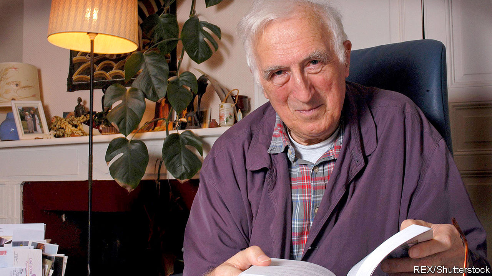

## Feet of clay

# Scandal topples the reputation of the founder of L’Arche

> Jean Vanier preyed on vulnerable women

> Feb 27th 2020

SINCE SAINTS are so rare in the modern world, they are elaborately treasured. When Jean Vanier died in May 2019 he drew praise and admiration from all sides, including Pope Francis, prominent American clergy—and The Economist. He had founded a network of small house-based communities, known as L’Arche (The Ark), in which people with disabilities and those without ate, lived, worked and prayed together. There are now 154 such communities around the world. Their humane approach to care has been widely copied.

Yet as much as Vanier’s concept, his personality inspired people. Here was a Canadian academic, with no training, who built up L’Arche after 1964 from one derelict house at Trosly-Breuil, in northern France, because he felt Jesus asked it of him. In his habits of asceticism, joyfulness and prayer he seemed a model of holiness for lay men and women. He wrote of how the simple goodness of his charges inspired him, too, to be a better man. But all this hid another life, which has now been exposed in a report by L’Arche International itself.

It now appears that for more than 30 years, from 1970 to 2005, Vanier had sexual relationships with at least six women that were “manipulative”, “coercive” or “non-consensual”. Some, it is said, were workers at L’Arche; some were nuns. His hold over them was emotional and psychological; the encounters were dressed up as mystical or spiritual experiences, as “Jesus and Mary”, and were “special”, not to be revealed. So powerful was his personality, as well as the regard of outsiders for him, that even after his death the women hesitated to speak out.

Now that they have, it is clear that Vanier followed the lead of Fr Thomas Philippe, the man who had encouraged him to come to Trosly-Breuil and found L’Arche in the first place. Philippe, his spiritual mentor, had long indulged in “deviant theories and practices”; again, it was L’Arche itself that exposed this, more than two decades after his death in 1993. Vanier, at L’Arche, joined in.

When Philippe’s perversions came to public attention in 2015, Vanier wrote to his followers about them. The revelations, he said, “hit me like a terrible storm”. He had been “totally in the dark”; he could “only weep” with the victims, and say “I do not understand.” Alas, he understood all too well.

## URL

https://www.economist.com/europe/2020/02/27/scandal-topples-the-reputation-of-the-founder-of-larche
