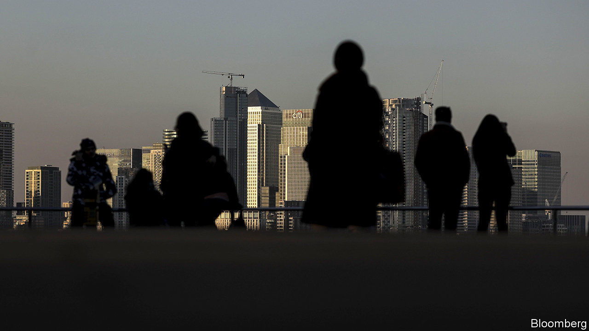
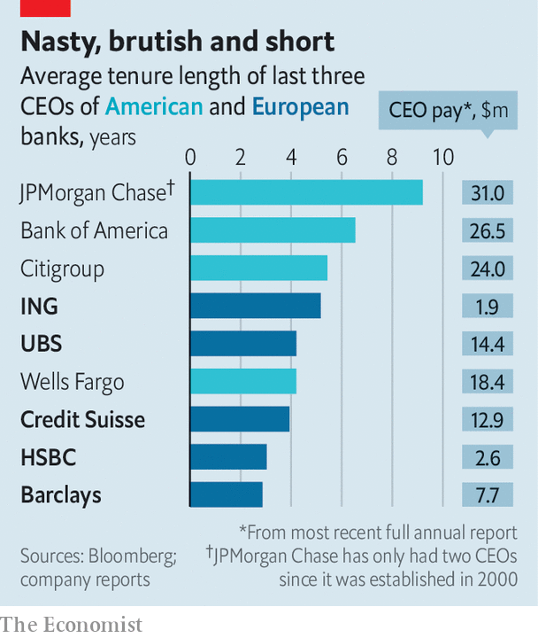

## Who wants to run a bank?

# Bank bosses in America stick around longer than those in Europe

> A slew of changes show how uncomfortable the hot seat can be

> Feb 27th 2020

IT IS ALL change at the top of Europe’s biggest banks. Many have either recently put in a new boss, or are desperately searching for one. Barclays is reportedly looking for a replacement for Jes Staley. Unicredit’s Jean Pierre Mustier declined to throw his hat in the ring to lead HSBC. Is it surprising? The ouster of Tidjane Thiam from Credit Suisse in February highlights how uncomfortable the hot seat can be. In Europe the tenure of bank bosses is short, the job is gruelling, and the average pay is far less than in America. Europe’s bankers may yearn to try their luck across the Atlantic. Sadly for them, their American counterparts know they have a nice gig. They cling on for dear life.■