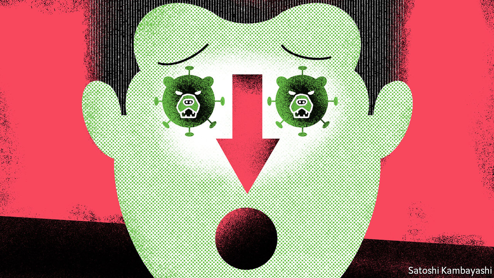
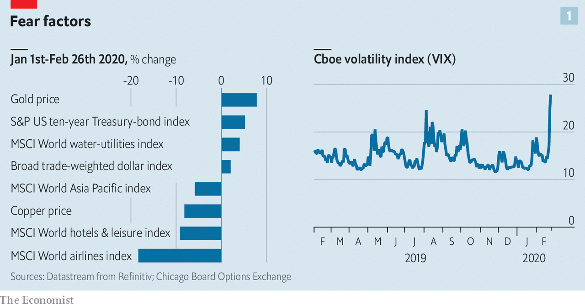
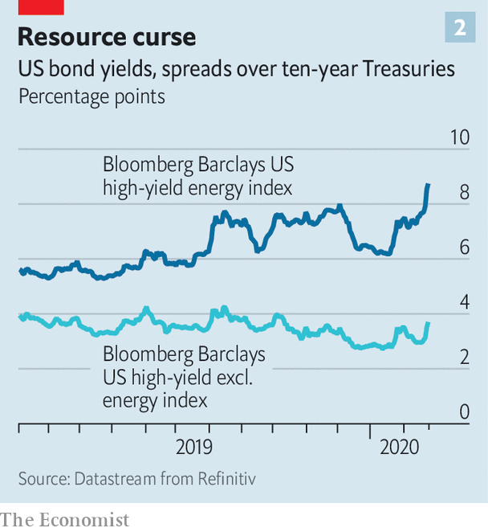

## Spread and stutter

# Markets wake up with a jolt to the implications of covid-19

> Could market turmoil add to the economic disruption?

> Feb 27th 2020

WHEN AMERICA, the hub of global capital, is this far into an economic expansion and a bull market, investors feel two conflicting impulses. They hope that the good times will last, so they are reluctant to pull their money out. They also worry that the party may suddenly end. This is the late-cycle mindset. It reacts to occasional growth scares—about trade wars or corporate debt or some other upset. But it tends not to take them seriously for long.

Covid-19 is a grave threat to the market’s poise. News from Italy of the biggest coronavirus outbreak outside Asia led to a 3.4% decline in the S&P 500 index of American stocks on February 24th, the biggest one-day fall for two years. The rout encompassed global stockmarkets, which were down sharply from highs reached earlier in February. As The Economist went to press, the markets remained nervy. In the face of such uncertainty, more days like Monday are to be expected.

Investors have, sensibly, tried to calculate which assets are most exposed to the shock. Copper, an economic bellwether, plunged. The worst-hit stocks were of firms that rely on far-flung supply chains, such as carmakers; or are directly affected by restrictions on travel, such as airlines; or are most exposed to a China-led global slowdown, such as oil firms. Investors scrambled for safe assets. Gold reached a seven-year high. The dollar rallied. The yield on ten-year Treasury bonds fell to an all-time low of 1.29% on February 27th.

But there is also an uneasy sense that the virus could trigger a bigger rupture in financial markets that have been going up by so much for so long that pockets of dangerous risk-taking are bound to exist. Two worries are top of mind: the opaque edifice of financial instruments that rely on low volatility, and the swollen credit markets.

Start with the first, volatility. Equity-market instability might feed on itself. The VIX, which measures the expected volatility implied by the price of options on the S&P 500 index, vaulted from around 15 to above 27 in a matter of days (see chart 1). Some investment strategies are particularly sensitive to it. For example when volatility is low, they allow for a bigger weighting of equities in portfolios. But when it rises and stays high, some investors are forced to unload some of their holdings—creating yet more volatility. Some exchange-traded funds whose value is linked to the VIX saw outflows. It is likely that at least some investors have been betting on continued near-dormant volatility. The resilience of such strategies could be tested.

A bigger worry is credit markets and in particular corporate debt, which has soared over the past decade. A sharp rise in borrowing costs would hurt firms that need to roll-over maturing bonds and would also rattle America’s huge private-credit markets. The last big global growth scare, in late 2018, caused a panicky sell-off that briefly threatened to become a credit-crunch. So far the interest-rate spread over Treasuries demanded by investors to hold high-yield corporate paper has widened to 4.3 percentage points, with much of the impact felt by energy-sector bonds (see chart 2). That is cause for concern, not alarm. But new issuance has halted—by February 26th Wall Street had gone three days without any high-grade offerings, according to Bloomberg. If that continues there will be a corporate liquidity squeeze.

Interest-rate cuts cannot do much to remedy the disruption. But they can help to soothe credit markets. Easier policy from the Federal Reserve has in the past—notably in 1998—been fuel for a late-cycle rally in risk assets in the face of formidable headwinds. A fortnight ago, just a single interest-rate cut from the Fed was priced in by the markets, says Kit Juckes of Société Générale, a French bank. Now two are. “We may be pricing in a third, if not a fourth, within a few weeks unless there’s a dramatic change in the covid-19 news.”■

Read more:[Covid-19 is now in 50 countries, and things will get worse](https://www.economist.com//briefing/2020/02/29/covid-19-is-now-in-50-countries-and-things-will-get-worse) (February 27th)[To curb covid-19, China is using its high-tech surveillance tools](https://www.economist.com//china/2020/02/29/to-curb-covid-19-china-is-using-its-high-tech-surveillance-tools) (February 27th)[Covid-19 presents economic policymakers with a new sort of threat](https://www.economist.com//china/2020/02/29/to-curb-covid-19-china-is-using-its-high-tech-surveillance-tools) (February 20th)[How China’s coronavirus epidemic could hurt the world economy](https://www.economist.com//china/2020/02/29/to-curb-covid-19-china-is-using-its-high-tech-surveillance-tools) (February 13th)

## URL

https://www.economist.com/finance-and-economics/2020/02/27/markets-wake-up-with-a-jolt-to-the-implications-of-covid-19
