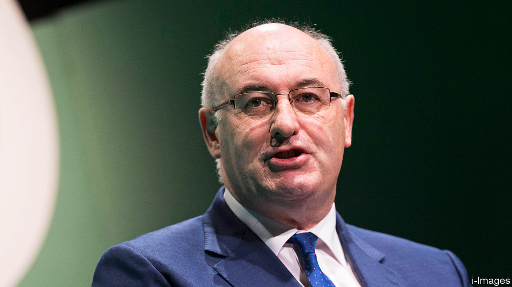
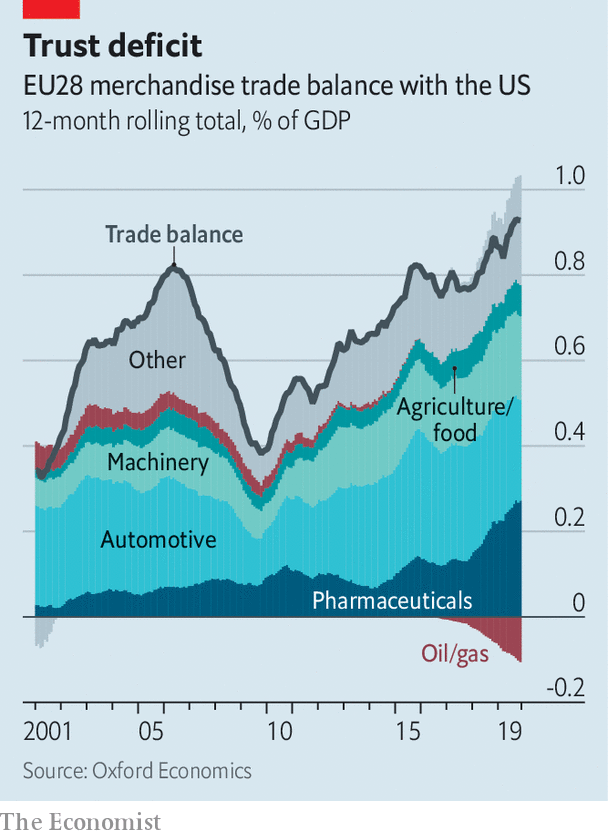

## EU Trade

# The European Union’s trade policy will involve some tough negotiations

> Is Phil Hogan the person for the job?

> Feb 27th 2020WASHINGTON, DC

IF THE TRUMP administration’s America is the bully of the global trading system, the European Union is the finger-wagging school prefect. Instead of threatening tariffs, its leaders have called for countries to play fairly. As a trade war has raged between America and China, the EU suggested a rules-based solution. When the Trump administration wrecked the system of solving disputes at the World Trade Organisation (WTO), the EU led the search for a fix. As the world’s biggest exporter of services and second only to China for goods, it has a sizeable stake in preserving order.

Enter Phil Hogan, the EU’s burly trade commissioner since December 2019. The EU is still a stickler for rules and the multilateralism that Mr Hogan says is “in our DNA”. But he wants to wield a bigger stick. “We have to stand up for our rights more assertively and aggressively, in my view,” he tells The Economist. By this he means defending the EU against unfair trading practices. The challenges range from concerns about China’s state-led system of capitalism to fears that the EU’s trading partners are not living up to their commitments.

Part of his brief involves continuing efforts to rescue the system by which the WTO solves disputes. Meanwhile he will have to manage the tense transatlantic relationship. If the job was not daunting enough, he will help negotiate what he hopes will be an “amicable” trade deal with Britain.

Mr Hogan’s reputation as a canny politician willing to make tough decisions—his nickname in Irish politics was “the enforcer”— suggests that he may be right for the job. On behalf of his home county of Kilkenny, where he entered Irish politics at the age of 22, he haggled effectively (for example, ensuring that the region’s salt depot was in Kilkenny, partly so that in case of ice the local roads would be salted first). He is “no flat tyre”, as one Leinster admirer puts it. Later he drew controversy when in 2011, as Ireland’s Minister for Environment, Community and Local Government, he was put in charge of introducing unpopular water charges. It damaged his reputation. But as a consolation prize, the Irish government backed him as the EU’s agriculture commissioner.

His experience over the following five years meant that he became intimately acquainted with the EU’s most sensitive spots. Alongside Cecilia Malmström, then the EU’s trade commissioner, he boasts of concluding no fewer than 15 trade agreements. According to some of the negotiators who were on the opposite side of the table, while he could be both charming and funny, his strategies to avoid giving concessions could be deeply frustrating. In some cases, he simply declined to show up.

The American government may roll its eyes at the talk of a tougher EU trade regime. Some in America could accuse the bloc of being too timid about using tariffs to get its own way with trading partners, and too weak to overcome the protectionist instincts of its member states. They ask why, if the EU is so concerned about the demise of the WTO’S dispute-settlement system, it ignored America’s complaints about it for so long? Where, they ask, was the EU while America was filing WTO disputes against China? Tough talk is cheap, results will require action.

Mr Hogan’s first priority is to add muscle to the EU’s defences. From May 1st he will oversee a new “chief trade-enforcement officer”, as well as new enforcement unit dedicated to making sure that existing trade deals are implemented properly. The European Commission is proposing new rules that would sharpen the EU’s teeth, including an amendment to enforcement regulations that would allow tariffs against other governments blocking the WTO’s dispute-settlement system. On the topic of the WTO’s appellate body, Mr Hogan acknowledges some of the American concerns, but adds that he would love to see detailed proposals for solutions to the problems from the Trump administration.

Whether he can maintain stable trade relations with America is another matter. He raised hackles in September after an interview in which he promised to teach Mr Trump “the error of his ways”. Then in a meeting in January he seems to have clashed with Robert Lighthizer, the United States Trade Representative. If he tries to bring more assertiveness into the EU’s side of the transatlantic relationship it could end badly. Stephen Vaughn, an ex-colleague of Mr Lighthizer, warns that attempts to play hardball “could backfire”.

The Americans want, above all, broad access to the EU’s agricultural market—more than the lobsters, scallops and nuts that are on offer. (Seafood technically counts as an industrial product.) But as Mr Hogan knows well from his previous job, anything much broader than dismantling a few non-tariff agricultural barriers is unpalatable to member states.

He remains upbeat about the transatlantic relationship. “I think that we’re in a better place now than we were some months ago,” he says. On February 14th a tariff announcement related to a dispute over aircraft subsidies was milder than expected. A reduction in car tariffs could be on the table, he adds, if member states agree. His challenge is not just to get trade partners to play by the rules. It is to get his own side on board, too. ■