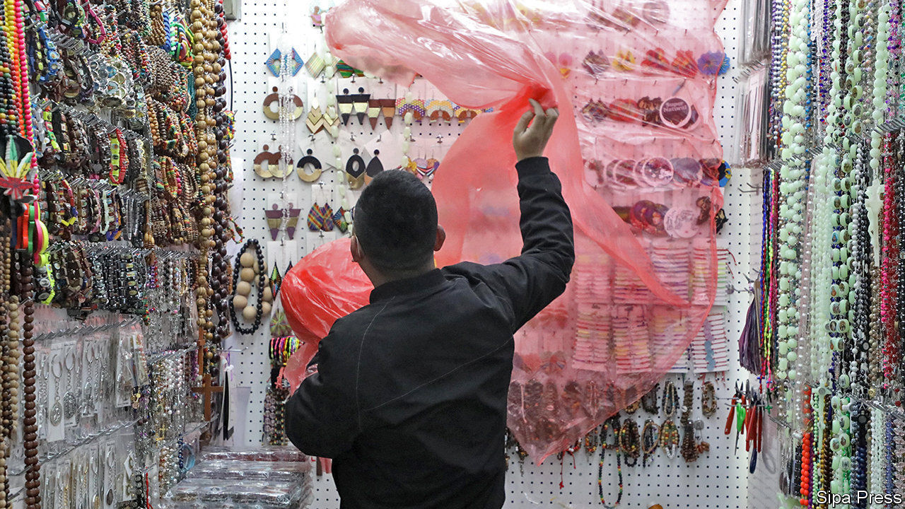
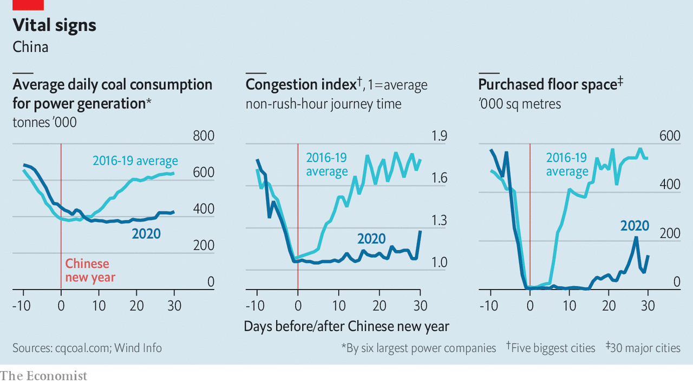

## Covid-19 and China’s economy

# With its epidemic slowing, China tries to get back to work

> Officials shift their focus to reviving growth. But that isn’t easy

> Feb 27th 2020YIWU

IF CHINA IS the world’s factory, Yiwu International Trade City is its showroom. It is the world’s biggest wholesale market, spacious enough to fit 770 football pitches, with stalls selling everything from leather purses to motorcycle mufflers. On February 24th, as is customary for its reopening after the lunar new year, performers held long fabric dragons aloft on poles and danced to the beat of drums, hoping to bring fortune to the 200,000 merchants and buyers who normally throng the market each day. But these are not normal times. The reopening was delayed by two weeks because of the covid-19 virus, the crowd was sparse and the dragon dancers, like everyone else, donned white face-masks for protection. The ceremony complete, business began. All those entering the market had to pass health checks and were told to be silent during meal breaks, lest they spread germs by talking.

The muted restart of the Yiwu market resembles that of the broader Chinese economy. The government has decided that the epidemic is under control to the point that much of the country can go back to work. That is far from simple. More than 100m migrant workers remain in their hometowns, and officials are trying hard to transport them to the factories and shops that need them. Yiwu has chartered trains and buses to bring in workers from around the country. It also wants to lure in buyers from around the world: it has offered to pay for their flights and accommodation if they arrive before February 29th.

The market is, little by little, getting busier. But merchants have a big challenge in fulfilling orders. Wang Meixiao, who sells plastic jewellery, says her factories do not yet have enough workers to operate. Many are unwilling to trek across the country only to endure 14-day quarantines at their destinations. “I tell my customers they just have to wait another couple of weeks, but that’s a guess,” she says.

Since the outbreak of the virus, economists and investors have tried to grasp the basics of epidemiology, analysing such matters as the potential incubation period of the disease. Recently, they have turned back to more familiar terrain, tracking the state of the economy. To gauge whether output is resuming, economists have been examining an array of daily figures, including coal consumption, traffic congestion and property sales. All have started to rise (see chart), but remain far below healthy levels. One gauge has been far more upbeat—unrealistically so. China’s stockmarket fell by more than 10% after the coronavirus spread in late January but has since recovered that ground, partly on a belief that the government will unleash a big stimulus to boost growth. So far, though, it has only offered targeted support: loan extensions, tax cuts and subsidised rents.

Yet China has unquestionably shifted its focus, as underlined on February 23rd when President Xi Jinping spoke via teleconference to 170,000 cadres around the country. In areas where the virus is no longer a big danger, it is time for companies to resume operations, he said. So along with reporting the number of new infections every day, officials now report on the number of reopened businesses. The province of Zhejiang, a manufacturing hub and home to Yiwu, leads the country, with 90% of its large industrial firms having restarted. But many of these are running at low capacities. “The government, enterprises, workers—everyone is making a gamble in restarting,” says Jason Wang, an executive with a company that sells winter coats.

Like factory managers around the country, Mr Wang is taking precautions. Workers have their temperatures monitored throughout the day. They are required to keep empty seats between them in the canteen. Inside the factory, they must always wear masks. But the pressure is intense. The government has told companies that if any of their workers become infected, they may be forced to shut.

All being well, many analysts think that China’s businesses will be back to full capacity by the end of March. Economists at big banks forecast that this resumption could allow first-quarter growth to reach about 4%, year on year. That would be the weakest since quarterly records began, but anything above zero will inevitably raise questions about the credibility of the data. The risks are also changing as the virus hits other countries. China now faces the prospect of much weaker global demand and the danger that the epidemic, controlled within its borders, re-enters from abroad.

Even if the world can slow the spread of the virus, Yiwu is testimony to some of the ways in which people far and wide will feel its economic effects. Agnes Taiwo, a businesswoman from Lagos, arrived in China just as the government started its fight against the epidemic. She had hoped to make a bulk purchase of children’s shoes and get back to Nigeria by early February. Nearly one month on, she has not been able to complete her order. And her return to Nigeria has been complicated because EgyptAir, the airline she flew on, has cancelled all flights to China. “This is serious,” she says. It is a sentiment that many others around the world are starting to share. ■