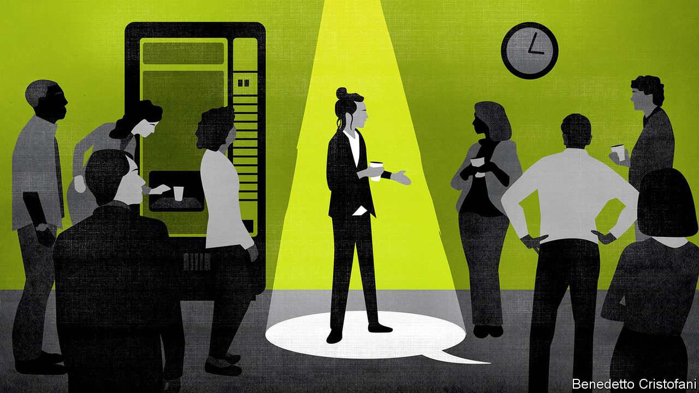
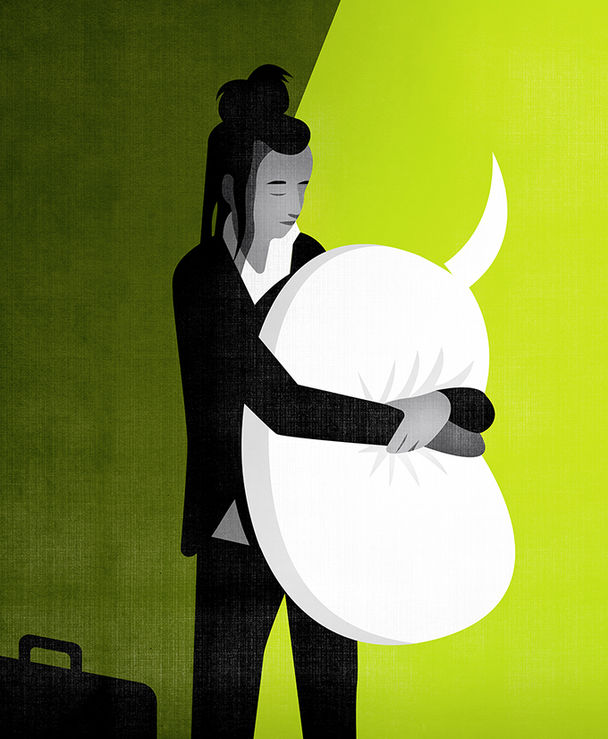

## None of your business

# Companies are increasingly worried about what their employees say

> The boundaries between people’s work and private lives are increasingly blurred

> Feb 27th 2020

LAST DECEMBER a British employment tribunal ruled that the Centre for Global Development, a think-tank, had acted legally when it did not renew Maya Forstater’s contract because she had tweeted that a person’s biological sex is immutable. Ms Forstater, a researcher, had tweeted several messages critical of the idea that natal males can become women. She did so from her personal account but listed her employer in her Twitter profile. After colleagues complained to the human-resources department about her conduct online, she was asked to add the disclaimer “views are my own”. She did so. According to her employer, co-workers objected to her posting a picture of herself at a protest with a banner that said “Woman, noun, adult human female”.

Trans-rights activists cheered, and women’s-rights and free-speech advocates were horrified, because a precedent had been set. In court, Ms Forstater had argued that her conviction that men cannot become women should be protected in the same way as a religious belief would be. The judge disagreed, ruling that her “gender-critical” views were “not worthy of respect in a democratic society,” and did not qualify for protection.

By contrast, another British tribunal ruled in January that ethical veganism did. Jordi Casamitjana was dismissed from the League Against Cruel Sports, an animal-welfare charity, after disclosing that its pension fund invested in companies involved in animal testing. Mr Casamitjana is appealing against his sacking. He says that he was fired because he is a vegan on ethical grounds. If he proved that to be the case, his firing would be discriminatory. His employer says he was fired for gross misconduct and that his beliefs were irrelevant.

A confluence of technological and cultural change has made such cases almost inevitable. Thanks to Twitter and other social networks, employees have many more opportunities to broadcast their opinions; off-colour comments that would once have been uttered in a bar now ricochet around the world. Companies that strive to demonstrate their progressive character are likely to find that troublesome.

Meanwhile, the nature of belief has changed. People in rich countries are less likely to say that they belong to a church. Even in America, which is more pious than most, the proportion of people who say they have no religious affiliation has climbed from just 6% in the early 1970s to 22%, according to the Pew Research Centre. Among millennials, who represent more than a third of the workforce, the proportion is twice as high. Yet the hole left by the decline of organised religion has been filled by a diversity of other beliefs, held just as fervently. Companies and courts must grapple with the question: how far should laws written to protect employees against discrimination on religious grounds be applied to those beliefs, too?

The case law on religious discrimination is well established. Legal judgments about job requirements often turn on the question of whether an employer could have made a reasonable adjustment to accommodate a person’s religious beliefs. A school in Denmark that fired a Jehovah’s Witness in 2018 who refused to dance around a Christmas tree was found guilty of unlawful discrimination because it could easily have accommodated such wishes. But in 1994 a Dutch casino was allowed to sack a Christian croupier who refused to take customers’ cash because doing so was an essential part of the job.

Many Western countries also ban discrimination on the basis of “belief”, though none defines the term clearly. Increasingly, non-religious workers want similar protections to those afforded to religious groups, says Peter Daly, an employment lawyer involved in the cases of both Ms Forstater and Mr Casamitjana. British courts are leading in this area.

The bar for beliefs to qualify for protection was lowered in 2006 when Britain removed the requirement for such beliefs to be “similar” to religious ones. Then, in 2009, a tribunal ruled that Tim Nicholson’s belief in man-made climate change was akin to a religious conviction and should enjoy the same protections.

Mr Nicholson had been head of sustainability at Grainger PLC, a property-investment firm, until he was made redundant. Grainger claimed this was a result of changing staffing needs. Mr Nicholson argued that his redundancy was the result of his environmental beliefs: he often urged executives to improve their green credentials. The firm’s lawyer claimed that Mr Nicholson’s views were opinions, as opposed to beliefs that enjoyed special protections. But the fact that his daily life was guided by his convictions, influencing how he travelled and lived, helped convince a judge that his was a belief worthy of protection, a decision that has been influential in much of Europe.

The ruling set five criteria for a protected belief. It must be genuinely held; be more than an opinion or viewpoint based on the present state of information available; be a weighty and substantial part of life; attain a certain level of cogency, seriousness, cohesion and importance; and be worthy of respect in a democratic society and compatible with human dignity and the rights of others. The last criterion was set explicitly narrowly to rule out particular noxious beliefs. White Supremacy has failed on that test.

Over the past decade European tribunals have concluded that various non-religious beliefs clear the bar. Anthroposophy, opposition to hunting, Darwinism, faith in the “higher purpose of public broadcast journalism” and ethical veganism have been ruled in. Being sympathetic to China, disliking asylum-seekers and the conviction that 9/11 and 7/7 were “false flag” operations have been ruled out. On vegetarianism and Marxism countries disagree.

It is illegal in most European countries, particularly former communist ones, and some American states, to fire someone for their political beliefs. Several Silicon Valley employees have used such laws in California to argue that they were fired for being conservatives. But most Americans enjoy no protection of their political beliefs at work. In 2004 a woman in Alabama was legally fired from a housing-insulation company for having a John Kerry bumper sticker on her car. In December a man playing Father Christmas at a mall in Georgia was replaced after photos emerged online of him wearing a pro-President Trump baseball cap while on duty (he claims it was a joke). Christopher Olmsted, an employment lawyer in California, expects political disputes on the workfloor to heat up as elections approach later this year.

Employers say they need to restrict the expression of certain views in order to create inclusive workplaces. Consider the sacking of James Damore, a Google engineer, in 2017 after he penned the “Google Memo”, which argued that women were biologically less suited to tech jobs. Diversity officers at many firms protested, arguing that firing someone with views that are different from the norm was the opposite of inclusivity. Human-resources and employment lawyers defended the dismissal as the only way to protect employees from hostility and the company from litigation—and bad press.

But firms are increasingly concerned about what their employees say and write outside the office. In 2018 a film director was fired by Disney for tweets in which he joked about rape, sent years before the company hired him. In 2019 a “greeter” for ASDA, a supermarket, was dismissed for Islamophobia after sharing a Billy Connolly video on Facebook (a comedian whose work is sold by ASDA). Both have since been reinstated, but only after hassle, and “all because their employers had a panic attack over what was happening on social media,” says Jodie Ginsberg, the outgoing CEO of Index on Censorship, a charity. Pascal Besselink, a Dutch employment lawyer, estimates that about one in ten on-the-spot firings in the Netherlands are now related to social media. Few have garnered much attention because companies tend to settle disputes quietly. Even when firms are in the right they prefer to stay out of the limelight, so will buy off fired employees in exchange for their silence.

The courts are puzzling their way through such cases. Last August the Australian High Court upheld a decision by the Department of Immigration to fire a public servant who had sent thousands of anonymous tweets critical of her employer. More complex are firings over posts that are unrelated to work but which are deemed to bring an employer into disrepute.

Employee activism can be particularly tricky. Amazon employees recently claimed to have been threatened with dismissal for criticising the firm’s climate policies to journalists. Google has been accused of trying to silence dissenting voices, including those that criticised the firm’s response to sexual harassment and its secretive work in China. The firm denies any claims of retaliation, which would be unlawful, but does not dispute that it has reduced the frequency and changed the scope of its “Thank God It’s Friday” town halls, once a celebration of free speech.

To forestall conflicts, firms are moving to spell out their expectations in codes of conduct and social-media policies. The level of detail varies. Intel simply asks employees to “use common sense”. General Motors’ 12-page social-media policy includes a reminder that “your online communications will not be excused merely because they occurred outside of work hours or off GM premises.” There are few limits to what an employer can demand in its terms of employment, says James Laddie, a barrister. But social-media use is now so widespread that extreme restrictions, such as blanket bans on Twitter, are no longer realistic. “It’s yet to be tested what view a tribunal would take on someone fired for refusing to abide by such a ban. They may well say ‘we don’t care what your T&C restricts’, it’s not fair to dismiss someone for speaking their mind.”

In the midst of all these prescriptions, Pam Jeffords of PwC wonders whether companies might more usefully replace demands for “respect” with requests for “civility” in employment conditions. “It’s not realistic to demand I respect someone who believes women don’t have a right to drive,” she says, “but it’s reasonable to ask me to be civil.”

The workplace is where most discrimination disputes emerge. It is where people are most likely to spend time with those with whom they fundamentally disagree. Most employers simply want a pragmatic approach to regulating speech at work that allows people to get on with their jobs while avoiding both the courts and the media. That is easier said than done. ■

## URL

https://www.economist.com/international/2020/02/27/companies-are-increasingly-worried-about-what-their-employees-say
