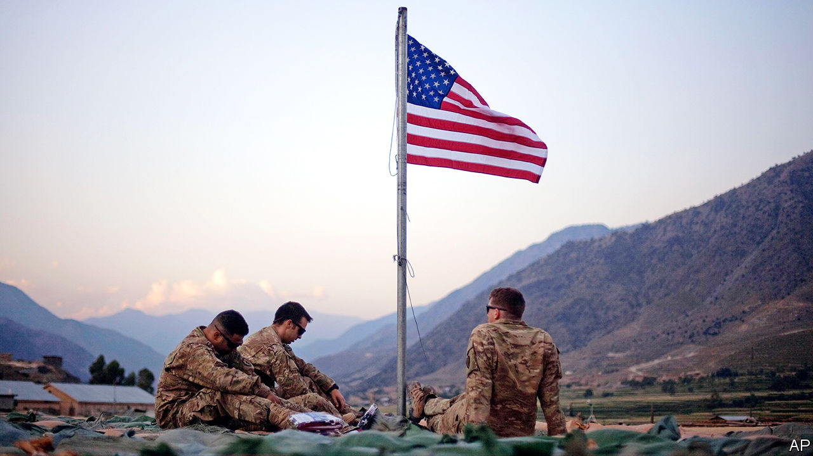

## The war in Afghanistan

# America and the Taliban have struck a deal

> Now for the hard part

> Feb 27th 2020

AFGHANISTAN HAS been at war for more than 40 years—longer than most of the world’s population has been alive. America and the insurgents of the Taliban have been battling for close to 19 years, making the conflict the longest America has ever fought. Some 2,500 American soldiers have died. The direct cost to American taxpayers is approaching $1trn. For Afghans, the toll is much higher. Roughly 3,500 civilians die every year, and their ravaged country is the poorest in Asia.

It can be only a good thing, therefore, that America and the Taliban plan to sign a peace agreement on Leap Day (February 29th), provided relative calm prevails until then. America will undertake to send home most of its 12,000 troops in Afghanistan. In exchange, the Taliban will promise not to grant sanctuary to foreign terror groups such as al-Qaeda, and to begin talks with Afghan politicians that will bring an end to the civil war (see [article](https://www.economist.com//asia/2020/02/27/america-and-the-taliban-prepare-to-sign-a-peace-deal)).

This arrangement is far from perfect, in lots of ways. America could not force the Taliban to end hostilities altogether before the signing of the deal. Either because central commanders cannot control their disparate fighters or because they are unwilling to, the best the insurgents would offer was a “significant” reduction in violence. In addition, nobody can be sure what will emerge from the inter-Afghan talks. Elements of the liberal democracy that America attempted to build in Afghanistan are bound to be dismantled. By making peace with the Taliban on such woolly terms, America is in effect conceding that it cannot win the war, and that the very group that sheltered Osama bin Laden and repressed Afghans with a brutal form of Islamic government should once again have a big say in how the country is run.

Such a humiliation will be worth it as long as bloodshed decreases and the lot of ordinary Afghans improves. That, in turn, depends on the seriousness and sincerity of all involved. Many fear that the Taliban are feigning interest in peace, and intend to seize control of the government by gun or guile as soon as the GIs are gone. Others fear that President Donald Trump doubts the Taliban’s trustworthiness, too, but is pushing on regardless so as to secure a foreign-policy “victory” to burnish his re-election campaign. The entire peace agreement, by this interpretation, is a figleaf to disguise an abject American surrender.

That would not just be the crowning humiliation for America; it would consign Afghanistan to even greater misery. The civil war would intensify, as regional powers sought to take advantage of America’s absence by funnelling arms to their Afghan allies. And the Taliban could revert to their old ways, barring girls from school, banning music, stoning adulterers and so on.

The peace agreement tries to guard against such a dismal outcome by stringing out America’s departure. The withdrawal will stop, America’s generals insist, if the Taliban appear to be taking them for a ride. America will keep warplanes in Afghanistan during the talks, to support government forces if the Taliban resume the offensive.

The deterrent has to be credible for this week’s agreement to have any value. Mr Trump’s last-minute disavowal of a previous version of the accord may have helped, by showing that he is not prepared to accept peace on any terms. But even on its way out, America will have to maintain an active role in Afghan politics to see the inter-Afghan talks to a fruitful end. At the moment, it is not clear who leads the government: two candidates have claimed the job of president after a disputed election. America will not only have to knock heads to get civilian politicians to present a vaguely united front, but also cajole them to give the Taliban concessions that they have been hoping to avoid.

The signing of the peace accord, in short, is more of a beginning than an end. It does at least put an end in sight. But America will have to stick to its guns if it is to have any hope of persuading the Taliban to lay down theirs. ■

## URL

https://www.economist.com/leaders/2020/02/27/america-and-the-taliban-have-struck-a-deal
