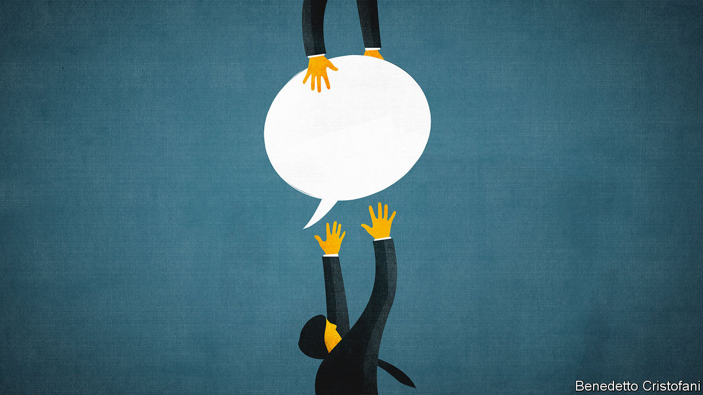

## Social media and employment

# The case for free speech at work

> Companies should be stopped from trying to silence their employees

> Feb 27th 2020

CAN YOU really lose your job for posting an opinion on Twitter, or even for clicking “like” on somebody else’s message? Surprising though it may be to employees who expect firms to indulge their odd working hours, their tastes in coffee and their pets, the answer is often yes. Pascal Besselink, an employment lawyer in the Netherlands, reckons that about one in ten abrupt sackings there is connected to behaviour on social media.

Controversial opinions were once expressed in bars after work, and went no further. Today Twitter and other social media broadcast employees’ thoughts; they also make it easy for anyone who is offended to put together a mob and retaliate against the poster and their employer. Jittery firms respond by sacking the offender. Some, like General Motors, have introduced conduct codes which police workers’ speech even when they are not at work.

A firm may judge its self-interest correctly when it punishes workers who speak out. America’s National Basketball Association probably lost hundreds of millions of dollars this season because of a Chinese blackout imposed after the general manager of the Houston Rockets tweeted in support of democracy in Hong Kong. Sacking him would have been costly, too—but not that costly.

Though it is not necessarily in companies’ interests to allow the free expression of opinion, it is clearly in society’s interest. Free speech, including by employees, is a cornerstone of democracy. At the moment workers are too easily gagged.

In countries such as America most employees have scant protection against punitive employers. In others, laws written to protect religious freedom are being extended to govern other beliefs and views. British judges have decided that ethical veganism deserves legal protection. A think-tank was ruled to have acted legally when it did not renew the contract of a researcher after she tweeted that biological sex is immutable (see [article](https://www.economist.com//international/2020/02/27/companies-are-increasingly-worried-about-what-their-employees-say)). This case-by-case evolution leaves employees and employers unsure which views are acceptable and where.

In laying down clearer rules, legislators should remember that offending and harassing are different. It is not reasonable for companies to try to prevent their employees from expressing displeasure at gay marriage, no matter how strongly others disagree—at least if that is not relevant to the job they do. But an employee who repeatedly says at work that gays are damned, even after being told to stop, has crossed the line into harassment. That should be grounds for dismissal.

There is also a difference between what people do at work and what they do outside. Speech is like a dress code. Just as companies can demand that their employees look the part while at work, they should be able to restrict what they say there, provided they are clear and fair about it. After people go home, though, they should be able to express their opinions freely, just as they are free to change into jeans and a T-shirt. A woman fired in 2004 by a housing firm for displaying a sticker backing John Kerry on her car was poorly treated. The situation is more complicated when it comes to public figures such as sports stars, who in effect sell their image as well as their labour.

Firms will lobby to preserve their freedoms. But robust laws against unfair dismissal that protect speech would help them stand up to complaints from angry mobs and the Chinese government. Politicians should hold their nerve. Many complain that their constituents have become so ideological and tribal that they have forgotten how to talk to those with opposing views. Geographical and technological spaces are increasingly segregated. That makes it all the more important that people encounter different views at work—and especially outside it.■