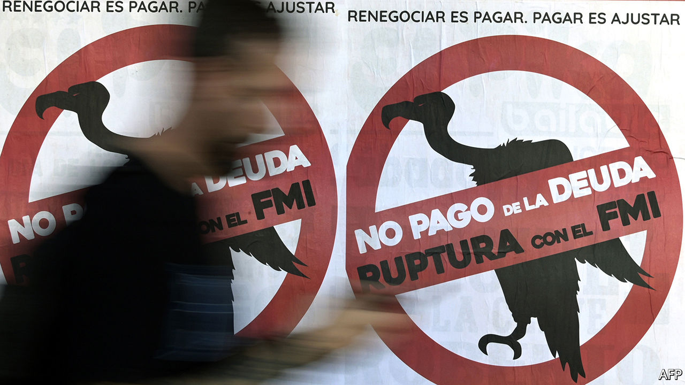

## Debt negotiations

# The IMF tells Argentina’s creditors some harsh truths

> The country’s debt is unsustainable, its creditors will take a hit, and the government needs a new IMF deal

> Feb 27th 2020

THEY MIGHT not admit it, but Argentina and the IMF have things in common. Both are under new management. President Alberto Fernández took office in December, two months after Kristalina Georgieva became head of the fund. Both leaders want to clean up the mess they inherited. Argentina has failed to prosper after decades of debt-binges. The IMF has repeatedly bailed it out. The most recent, botched, rescue in 2018 was the 21st time it has become entangled in the country. Now talks are under way to sort out Argentina’s finances once again. At stake are the prospects of 45m Argentines, a mountain of money and the credibility of Ms Georgieva’s mission to reinvent the IMF.

The IMF is Argentina’s biggest creditor, holding $44bn of the $100bn-odd wad of foreign-law debt that Argentina wants to renegotiate. Last week the fund made clear that the country’s debt is unsustainable. Borrowing is approaching 90% of GDP. The country is reeling from the plunge in the peso, shrivelling reserves and a bitter recession. The belt-tightening required to repay all the debts was neither “economically nor politically feasible”, the fund said.

The easy bit that follows from this—which both Argentina and the IMF agree on—is beating up private creditors, who over the years have been as credulous as voters and the IMF’s technocrats. In 2017, for example, they piled into newly issued 100-year Argentine sovereign bonds that are now worth only 43 cents on the dollar. The government is expected to make a formal proposal for a debt restructuring next month. Some creditors grumble that the IMF should share more of the pain and take a big write-down, too. But the fund’s job is to lend when others will not. It is therefore entitled to insist on being repaid even when others are not. If it succeeds, the restructuring should lead to reductions in debt principal and interest costs worth perhaps 10-20% of GDP

Argentina will still need a new IMF loan to help repay the old one. But it has ruled out entering the kind of special programme the IMF has traditionally reserved for countries that are chronically incapable of living within their means. In the past these programmes have involved long-term loans, but also bossy demands for austerity at home. Instead Argentina has been lobbying the fund and G7 finance ministers for a cuddlier approach that prioritises growth. This chimes with Ms Georgieva’s ambitions to remake the IMF: instead of being the hard-nosed enforcer of global finance, she wants it to do more to help poor countries grow in the long run.

The trouble is that plenty of Argentine governments, investors and IMF staffers have counted on growth to restore Argentina’s health only to be disappointed. The IMF should avoid imposing needless humiliation or suffering on Argentina but it must also avoid indulging any delusions that it will suddenly become a thriving tiger economy.

Ms Georgieva should take a twin-track approach. First, instead of making numerous detailed demands, the fund should merely set a few hard targets for the budget deficit and inflation and let the government work out how to achieve them: by growing faster if possible, and if not, then by belt-tightening. Second, the fund should provide candid advice. Inflation, which exceeds 50% a year, cannot be tamed only through price-controls and arm-twisting the labour unions. Argentina’s growth prospects would be improved if the government spent less on pensions, civil servants and energy subsidies and more on investment. Growth would benefit if taxation were friendlier to exports and labour laws were less inimical to hiring. If both Argentina and the IMF want to give growth a chance, they should favour ruthless truth-telling. Fingers crossed, it will be 22nd time lucky.■

## URL

https://www.economist.com/leaders/2020/02/27/the-imf-tells-argentinas-creditors-some-harsh-truths
