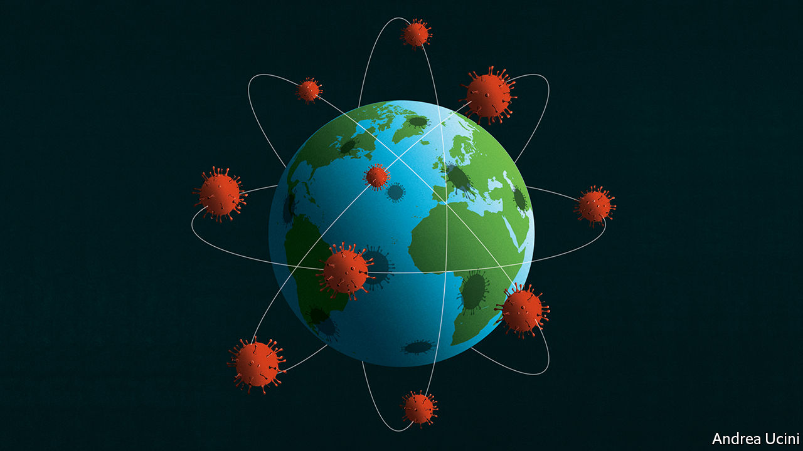

## The pandemic

# The virus is coming

> Governments have an enormous amount of work to do

> Feb 27th 2020

IN PUBLIC HEALTH, honesty is worth a lot more than hope. It has become clear in the past week that the new viral disease, covid-19, which struck China at the start of December will spread around the world. Many governments have been signalling that they will stop the disease. Instead, they need to start preparing people for the onslaught (see [article](https://www.economist.com//briefing/2020/02/29/covid-19-is-now-in-50-countries-and-things-will-get-worse)).

Officials will have to act when they do not have all the facts, because much about the virus is unknown. A broad guess is that 25-70% of the population of any infected country may catch the disease. China’s experience suggests that, of the cases that are detected, roughly 80% will be mild, 15% will need treatment in hospital and 5% will require intensive care. Experts say that the virus may be five to ten times as lethal as seasonal flu, which, with a fatality rate of 0.1%, kills 60,000 Americans in a bad year. Across the world, the death toll could be in the millions.

If the pandemic is like a very severe flu, models point to global economic growth being two percentage points lower over 12 months, at around 1%; if it is worse still, the world economy could shrink. As that prospect sank in during the week, the S&P 500 fell by 8% (see [article](https://www.economist.com//finance-and-economics/2020/02/27/markets-wake-up-with-a-jolt-to-the-implications-of-covid-19)).

Yet all those outcomes depend greatly on what governments choose to do, as China shows. Hubei province, the origin of the epidemic, has a population of 59m. It has seen more than 65,000 cases and a fatality rate of 2.9%. By contrast, the rest of China, which contains 1.3bn people, has suffered fewer than 13,000 cases with a fatality rate of just 0.4%. Chinese officials at first suppressed news of the disease, a grave error that allowed the virus to take hold. But even before it had spread much outside Hubei, they imposed the largest and most draconian quarantine in history. Factories shut, public transport stopped and people were ordered indoors. This raised awareness and changed behaviour. Without it, China would by now have registered many millions of cases and tens of thousands of deaths.

The World Health Organisation was this week full of praise for China’s approach. That does not, however, mean it is a model for the rest of the world. All quarantines carry a cost—not just in lost output, but also in the suffering of those locked away, some of whom forgo medical treatment for other conditions. It is still too soon to tell whether this price was worth the gains. As China seeks to revive its economy by relaxing the quarantine, it could well be hit by a second wave of infections. Given that uncertainty, few democracies would be willing to trample over individuals to the extent China has. And, as the chaotic epidemic in Iran shows, not all authoritarian governments are capable of it.

Yet even if many countries could not, or should not, exactly copy China, its experience holds three important lessons—to talk to the public, to slow the transmission of the disease and to prepare health systems for a spike in demand.

A good example of communication is America’s Centres for Disease Control, which issued a clear, unambiguous warning on February 25th. A bad one is Iran’s deputy health minister, who succumbed to the virus during a press conference designed to show that the government is on top of the epidemic.

Even well-meaning attempts to sugarcoat the truth are self-defeating, because they spread mistrust, rumours and, ultimately, fear. The signal that the disease must be stopped at any cost, or that it is too terrifying to talk about, frustrates efforts to prepare for the virus’s inevitable arrival. As governments dither, conspiracy theories coming out of Russia are already sowing doubt, perhaps to hinder and discredit the response of democracies.

The best time to inform people about the disease is before the epidemic. One message is that fatality is correlated with age. If you are over 80 or you have an underlying condition you are at high risk; if you are under 50 you are not. Now is the moment to persuade the future 80% of mild cases to stay at home and not rush to a hospital. People need to learn to wash their hands often and to avoid touching their face. Businesses need continuity plans, to let staff work from home and to ensure a stand-in can replace a vital employee who is ill or caring for a child or parent. The model is Singapore, which learned from SARS, another coronavirus, that clear, early communication limits panic.

China’s second lesson is that governments can slow the spread of the disease. Flattening the spike of the epidemic means that health systems are less overwhelmed, which saves lives. If, like flu, the virus turns out to be seasonal, some cases could be delayed until next winter, by which time doctors will understand better how to cope with it. By then, new vaccines and antiviral drugs may be available.

When countries have few cases, they can follow each one, tracing contacts and isolating them. But when the disease is spreading in the community, that becomes futile. Governments need to prepare for the moment when they will switch to social distancing, which may include cancelling public events, closing schools, staggering work hours and so on. Given the uncertainties, governments will have to choose how draconian they want to be. They should be guided by science. International travel bans look decisive, but they offer little protection because people find ways to move. They also signal that the problem is “them” infecting “us”, rather than limiting infections among “us”. Likewise, if the disease has spread widely, as in Italy and South Korea, “Wuhan-lite” quarantines of whole towns offer scant protection at a high cost.

The third lesson is to prepare health systems for what is to come. That entails painstaking logistical planning. Hospitals need supplies of gowns, masks, gloves, oxygen and drugs. They should already be conserving them. They will run short of equipment, including ventilators. They need a scheme for how to set aside wards and floors for covid-19 patients, for how to cope if staff fall ill, and for how to choose between patients if they are overwhelmed. By now, this work should have been done.

This virus has already exposed the strengths and weaknesses of China’s authoritarianism. It will test all the political systems with which it comes into contact, in both rich and developing countries. China has bought governments time to prepare for a pandemic. They should use it. ■

Read more:[Covid-19 is now in 50 countries, and things will get worse](https://www.economist.com//briefing/2020/02/29/covid-19-is-now-in-50-countries-and-things-will-get-worse) (February 27th)[To curb covid-19, China is using its high-tech surveillance tools](https://www.economist.com//china/2020/02/29/to-curb-covid-19-china-is-using-its-high-tech-surveillance-tools) (February 27th)[Covid-19 presents economic policymakers with a new sort of threat](https://www.economist.com//china/2020/02/29/to-curb-covid-19-china-is-using-its-high-tech-surveillance-tools) (February 20th)[How China’s coronavirus epidemic could hurt the world economy](https://www.economist.com//china/2020/02/29/to-curb-covid-19-china-is-using-its-high-tech-surveillance-tools) (February 13th)

## URL

https://www.economist.com/leaders/2020/02/27/the-virus-is-coming
