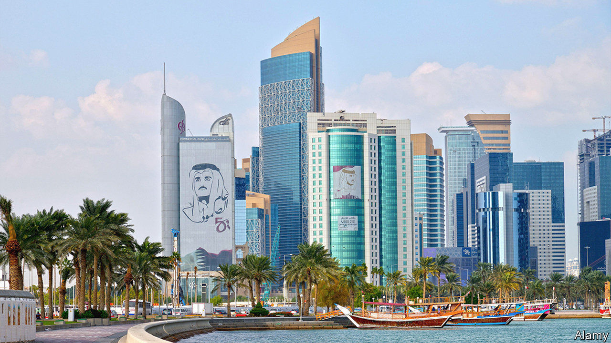

## On companies, gender, Qatar, war, Brexit, committees

# Letters to the editor

> A selection of correspondence

> Feb 29th 2020

Last year you asked, “[What are companies for?](https://www.economist.com//leaders/2019/08/22/what-companies-are-for)” (August 24th 2019) and concluded that they should stick to business-as-usual in the form of shareholder primacy. This month you repeated this message, telling chief executives to “forget trying to run the world” and focus on serving the long-term interests of their business owners (“[Meet the new boss](https://www.economist.com//leaders/2020/02/06/what-it-takes-to-be-a-ceo-in-the-2020s)”, February 8th). Your consistency is laudable. However, this position ignores the adverse impact of market failures and the shareholder-first model that has contributed so much to our social and environmental crises, not least the existential threat of climate change.

Fortunately a growing number of companies out there recognise that this threatens the viability and legitimacy of business. They know that their purpose needs to include creating the long-term social and environmental capital that underpins their shareholder returns, and that this is in their own immediate interests in attracting and motivating talent, driving innovation, building trust and increasing performance.

This is a crucial year in which world leaders will explore a new deal for nature at the Convention on Biodiversity in China, and seek agreement on reaching net zero carbon emissions by 2050. Unless business plays a key role in tackling the world’s greatest challenges, it will certainly discover the true meaning of “disruption” on a global scale.

DAME POLLY COURTICEDirectorInstitute for Sustainability LeadershipUniversity of Cambridge 

You suggest that today’s bosses must “be physically fit to withstand the brutal workload” (“[Take me to a leader](https://www.economist.com//briefing/2020/02/06/corporate-headhunters-are-more-powerful-than-ever)”, February 8th). This is a modern prejudice. Is there any evidence that fitter bosses are higher performing? Sergio Marchionne and Herb Kelleher were chain- smokers who transformed their industries (cars and airlines). Bill Gates possibly skips cross-fit. And Warren Buffett proudly claims to eat “like a six-year-old”. Being fit is good in itself, but there is no concrete conclusion that CEOs absolutely need to be highly athletic. Good looks are surely a powerful halo effect, but let’s not bar bread-eaters from the corporate suite just yet.

CONAL CAMPBELLCelbridge, Ireland

The [Free exchange](https://www.economist.com//finance-and-economics/2020/02/06/economists-discover-the-power-of-social-norms) on social norms was muddled (February 8th). Apparently gender earnings disparities persist but (and this seems to disturb you) they may partly reflect different preferences by men and women. But look, the column says, preferences too can be changed; they are “socially determined”.

Why should policymakers, never mind economists, want to change these preferences? What, exactly, is wrong with women tending to prefer children and home and men preferring work and career? Economists laud division of labour in other businesses, why not in the family also? Just what principle lies behind the idea that men and women should have identical preferences?

PROFESSOR JOHN STADDONDepartment of Psychology and NeuroscienceDuke UniversityDurham, North Carolina

Your article on Qatar did not reflect the reality of freedom of expression in the country and a law that has been amended to prevent the spread of false and malicious information (“[Tamim the gloriously tolerant](https://www.economist.com//middle-east-and-africa/2020/02/13/qatar-the-gulf-emirate-famed-for-openness-is-silencing-critics)”, February 15th). Similar legislation exists in many democratic countries. In France a law was introduced in 2018 to tackle the manipulation of information and its deliberate dissemination. As the target of sustained state-sponsored disinformation campaigns, “deep fakes” and cyberattacks, Qatar understands the dangers of information manipulation better than anyone. In line with the UN’s covenant on civil and political rights, to which Qatar is fully committed, this amendment was passed as a protection against major, co-ordinated hacking and disinformation operations trying to fracture the region. It is not open to abuse and will not limit expression, speech or reporting in or about Qatar.

No country has done more than Qatar to improve media freedom in the region. The debate on this amendment from within Qatar itself, including from local media and social-media users, demonstrates that individuals and platforms can criticise a law without consequence.

THAMER AL THANIDeputy directorGovernment Communications OfficeDoha, Qatar

There are a lot of 75th commemoration events marking the second world war. One incident less famous than Dresden (“[The inferno](https://www.economist.com//books-and-arts/2020/02/06/the-destruction-of-dresden-the-florence-of-the-elbe)”, February 8th) was commemorated in the Dutch village of Putten last year. In early October 1944, 600 men were sent to German work camps in retaliation for the killing of a German officer by the resistance. Few returned. I was only five at the time but I still have vivid memories of the episode. Lots of similar stories can be told about other villages in occupied Europe that have gone mostly unreported. A recent novel, “The Weeping Woman of Putten” by Alyce Bailey, tells the tale.

WALTER SCHUITTorrejón de Ardoz, Spain

The Economist repeats a myth that Brexit was about England turning in on itself, as if supporting membership of the EU is a sign of internationalism ([Bagehot](https://www.economist.com//britain/2020/01/30/brexit-and-english-nationalism), February 1st). The opposite is true. The EU created a system that favours other Europeans over everyone else. This is most obviously manifest in freedom of movement, which allows any EU citizen to move to any EU country, while at the same time erecting barriers against immigration from outside the EU. Hard-core Remainers, convinced of their own enlightened liberalism, refuse to acknowledge this gross injustice. Oddly enough, supposedly xenophobic and uneducated Brexiteers have no difficulty understanding the unfairness and outdated Eurocentric nature of EU policies.

NICOLAS GROFFMANReading, Berkshire

Bagehot described Mark Francois as the “Captain Mainwaring of the European Research Group of MPs”. Mr Francois is more like Private Walker in “Dad’s Army”, the black-marketeer in Mainwaring’s platoon. The propaganda espoused by Mr Francois and his fellow Brexiteers included assurances that leaving “won’t cost you much”, Walker’s favourite line when plying his trade.

JOHAN ENEGRENStockholm

The picture accompanying the news on Brexit in [The world this week](https://www.economist.com//the-world-this-week/2020/02/08/politics-this-week) (February 8th) showed a number of Brexit supporters waving Union Flags that were upside down. As this is a recognised way of signalling distress, are they perhaps reflecting the belief of many in the country that trouble lies ahead?

CHARLES MORTELMANLondon

Regarding [Bartleby](https://www.economist.com//business/2020/01/23/the-number-of-the-best)’s “The number of the best” (January 25th) I have always understood that the ideal size of a committee is an odd number less than three.

PETER WILSONKenilworth, Warwickshire