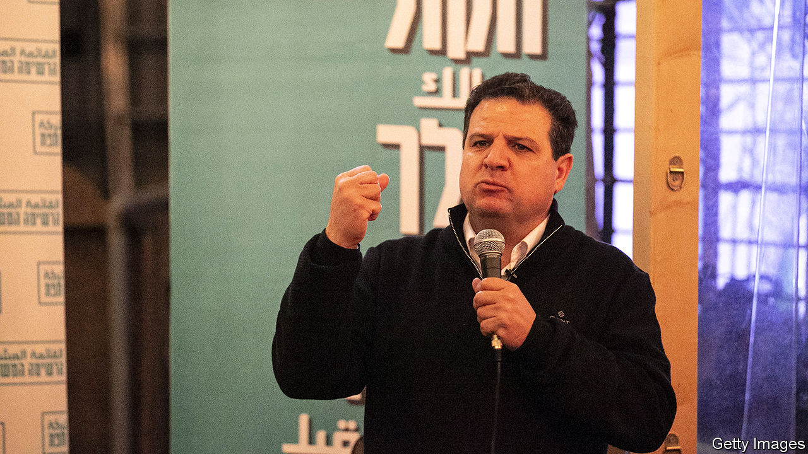

## In search of a one-party solution

# A growing number of Jews are voting for Arabs in Israel

> What many Israelis want is a party that spans the Jewish-Arab divide

> Feb 27th 2020KFAR SABA

THE AUDIENCE in Kfar Saba, a Jewish city near Tel Aviv, came from as far away as the Golan Heights in the north and Beersheva in the south. They crowded onto the terrace of a packed penthouse to hear a politician who promised to stop missiles from Gaza and counter hatred of Jews. With the crowd’s support, the politician continued, he could achieve peace between Israel and the Palestinians via a two-state solution. None of that would have been unusual, except that the politician was Ayman Odeh (pictured), a jovial lawyer who heads the Joint List, a bloc of Arab-Israeli parties.

After decades representing insular parties on the periphery of Israeli politics, Arab politicians have entered the mainstream. The Joint List is the country’s third largest bloc. It is courting the Jewish vote ahead of parliamentary elections on March 2nd. It has removed more pugnacious candidates and sees a place for itself in a centre-left government. Balad, the bloc’s most radical party, has put a Jew (of Iranian origin) on its list of candidates. The Joint List’s billboard campaign has an inclusive message. Posters in Yiddish promise ultra-orthodox Jews an end to conscription. Amharic ones vow to tackle police brutality against Ethiopians. “Let’s go together,” read the Hebrew ones.

The outreach seems to be working. In the election last September the Joint List increased its support in Jewish areas by 60% compared with the election in April, albeit from a very low base. Dahlia Scheindlin, a pollster, predicts it could increase again, perhaps giving the Joint List an extra seat (it currently has 13). Jews attending a packed hustings in Tel Aviv spoke of abandoning Meretz, a left-wing Zionist party that has pushed Arab candidates down its list. Right-wing fearmongering against the Arab “enemy within” is attracting Jewish sympathy. A settler in a skullcap said he feared he would be branded a traitor if his neighbours found out he was attending an event for the Joint List.

Mr Odeh says it is not so hard to imagine an Arab-Israeli prime minister. But his appeal has its limits. Two-thirds of Israeli Jews want to bar Arab parties from government. Over 40% oppose living next to an Arab, let alone voting for one. Yuppies flinch at the Joint List’s communist origins. Left-wing secular Jews are turned off by its Arab nationalist and Islamist cheerleaders. And the Joint List is bad at practising the equality it preaches. Just one of its 13 parliamentarians is Jewish. Still, the interest Mr Odeh is piquing indicates a growing demand for a party that truly spans Israel’s Jewish-Arab divide. Voters will have to wait a bit longer for that.