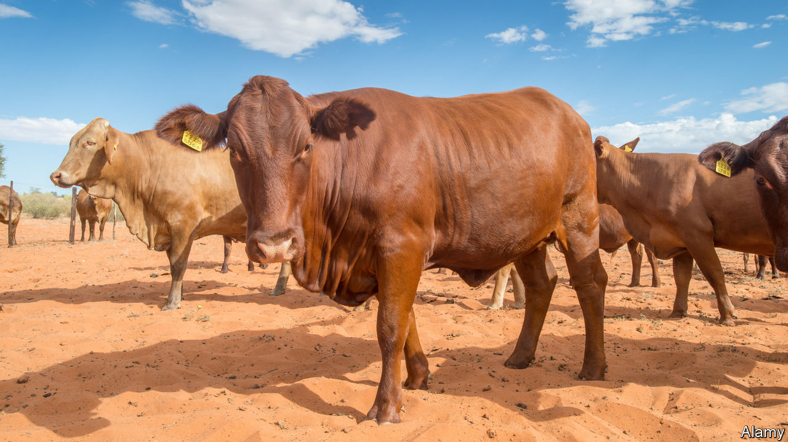

## Africa’s beef with America

# Why African farmers struggle to export to the United States

> Seemingly generous trade terms aren’t as helpful as they appear

> Feb 27th 2020

HUNGRY AMERICANS chomping into one of Philadelphia’s famous cheesesteaks may soon get a taste of Africa. Last week MeatCo, Namibia’s state-owned meat firm, shipped 25 tonnes of beef to Philadelphia. It was the first ever export of red meat from Africa to the United States. Namibian meat producers are delighted. America is the world’s second-biggest meat market; the average American wolfs down more than 100kg a year. Yet this is a rare success. Negotiations began 18 years ago.

The shipment will be duty-free under the Africa Growth and Opportunity Act (AGOA), which was introduced in 2000 to boost economic growth in Africa by stimulating exports to America. Yet 20 years later only about 1% of America’s imports come from sub-Saharan Africa, and much of that is oil. The fact that it took two decades to export a single piece of red meat helps explain why AGOA has had so little impact, and how it could be improved.

A few countries, including Lesotho and Mauritius, have been given a leg-up. Whereas most of America’s clothes imports from China are hit with a duty of about 20%, those from Africa under AGOA are duty-free. That has helped Lesotho boost its global exports of textiles and clothing from $143m in 2000 to $549m in 2017. But many African countries are better at growing things than making them. Agriculture accounts for 54% of employment in sub-Saharan Africa, compared with 11% for industry. Yet apart from a few commodities such as coffee, tea and cocoa, agricultural exports to America are still quite small. Why is that?

One barrier is safety standards. Compliance can be costly, sometimes entirely offsetting the benefits of lower tariffs under AGOA. And because there is no global standard for food safety, exporters often have to shell out to comply with different ones in Europe and America. Harmonisation of rules would help enormously.

AGOA was meant to open America’s food market to Africa. But while most agricultural products from Africa can enter tariff-free, the small print limits imports of much of what the continent grows. Some crops are still hit with import taxes. And even though the threat to American farmers is negligible, the United States imposes quotas on imports of African products including cotton, sugar, dairy products, peanuts and tobacco. Processed foods that contain milk, such as chocolate, get caught up in these too. Imports above the allocated quota are hit with steep tariffs—350% for tobacco. America allocates most of its quotas to long-standing trading partners. This year Namibia secured a quota for its debut shipment of beef. (Without that it would have been taxed at 26%.) Yet its quota of 860 tonnes is tiny, amounting to just 0.008% of American beef production.

For some products African producers are simply not competitive because of a lack of investment, poor roads and ports and their vast distance from rich markets. But African companies already export far more agricultural products to Europe than to America, suggesting that America’s quotas matter. With better access to markets, firms might then invest more in improving their competitiveness.

The European Union also has a preferential trade scheme for the poorest countries, called Everything But Arms. Unlike AGOA, it does not impose quotas. But it largely rules out products if they include too many bits and bobs made in wealthy countries. This is a problem for manufacturers, which may need to import cheap components if their finished products are to be competitive. Worse, these rules are “mind-bogglingly complex”, says Kimberly Elliott of the Centre for Global Development (CGD), a think-tank.

In Britain, too, trade with Africa is on the agenda. Boris Johnson, the prime minister, has declared that Uganda’s beef cattle “will have an honoured place on the tables of post-Brexit Britain” for the first time. If Mr Johnson is serious about accelerating imports from the poorest African countries, then he should set up a scheme that learns from others: more comprehensive than America’s, yet simpler than Europe’s.

In the long run, big emerging markets may be more important to Africa. The CGD reckons that poor countries would be able to export three times more if they were given unrestricted access to Brazil, China and India as well as the OECD, than if they were given full access to the OECD alone.

Still, little can be achieved unless African exporters take the bull by the horns and force their way into new markets. Once again, Namibia’s MeatCo is leading the charge. Last year it sent the first-ever shipment of African beef to China. ■