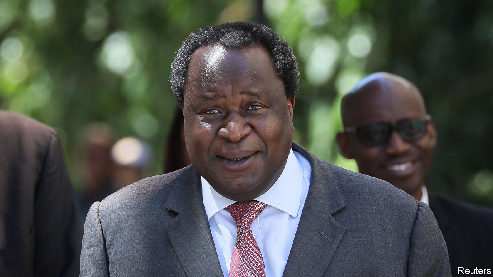
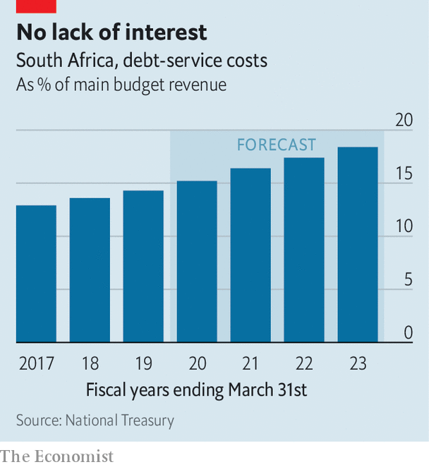

## Tito time

# Wise words are not enough to fix South Africa’s economy

> The reformist finance minister bumps up against political reality

> Feb 27th 2020JOHANNESBURG

TWO DAYS before he outlined South Africa’s budget, Tito Mboweni shared a Photoshopped picture of himself in a spacesuit. The caption read: “man on a mission”. It was characteristic skylarking by the finance minister, an ebullient reformer who spends much of his time warning colleagues in the ruling African National Congress (ANC) that unless the economy is overhauled the country faces ruin.

On February 26th political gravity brought Mr Mboweni down to earth. His budget was billed as the most important since the end of apartheid in 1994. South Africa’s public finances are in a sorry state, a result of sluggish growth and lavish state spending, especially on public-sector wages. Debt was just 27% of GDP in 2008. A decade later it was 57%, and is set to rise to 66% over the next year, warned the finance minister. But it is unlikely that his comrades were paying attention.

Mr Mboweni announced some sensible policies aimed at speeding growth, such as making it easier to start a business and giving more power to cartel-busters. He also set aside more money for the public prosecutor to go after corrupt officials.

Then there was Eskom, a state-owned electricity utility that epitomises South Africa’s struggles. Decades of mismanagement, outright theft, and contracts and jobs for pals have left it broke and unable to keep the lights on. About a third of its capacity is out of action because of breakdowns. Rolling blackouts that regularly shut factories, shops and mines are pushing the economy towards recession. Mr Mboweni promised to make it easier for independent firms to sell power into the national grid. Many have heard that before.

Most importantly, Mr Mboweni outlined his plan to reduce the country’s budget deficit—forecast to be almost 7% of GDP next year. Duties on some alcoholic drinks will increase. But most of the reduction in borrowing will be made by cutting spending by 261bn rand ($17.2bn) over the next three years. Savings on the wage bill are supposed to provide 160bn rand.

The hope for Mr Mboweni and President Cyril Ramaphosa is that these steps will be enough for South Africa to avoid a downgrade this year by Moody’s, the only one of the three main credit-rating agencies not to rate the country’s debt as “junk”.

The president and the finance minister must still get their proposals through a thicket of vested interests. COSATU, a federation of trade unions, warned before the budget that cuts to members’ pay would mean “war”. Meanwhile, powerful figures on the left of the ANC, such as Gwede Mantashe, the energy minister, are blocking efforts to reform Eskom.

Mr Ramaphosa is reluctant to pick a fight with the opponents of reform, partly because he fetishises consensus, but also because he has an eye on the ANC’s National General Council meeting in June. Two of his predecessors, Thabo Mbeki and Jacob Zuma, were “recalled” from office by the party before they had concluded their terms. Party insiders believe that the ANC’S rules would not allow opponents of the president to oust him at this year’s gathering. But they may try nonetheless.

Even if they do not try, South Africa remains in peril. Those in the ruling party face a clear choice: wise up and cut spending on their own or, in the not too distant future, do so under the thumb of the IMF. ■

## URL

https://www.economist.com/middle-east-and-africa/2020/02/27/wise-words-are-not-enough-to-fix-south-africas-economy
