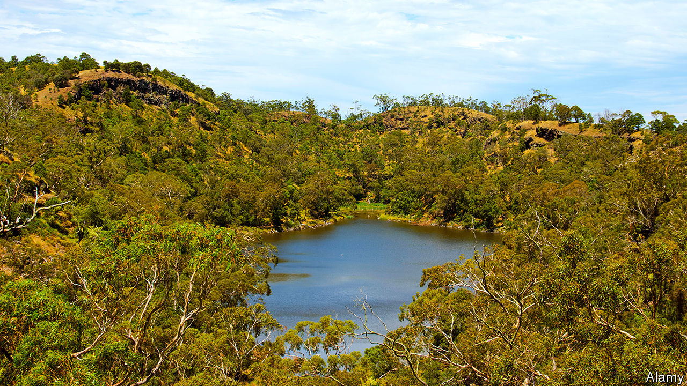

## Geomythology

# An Australian legend may be the world’s oldest datable story

> Geological evidence suggests it originated 37,000 years ago

> Feb 27th 2020

ORAL MYTHOLOGY has tremendous staying power. The Klamath, a group of Native Americans who live in Oregon, tell tales of an underworld god called Llao who fell in love with a mortal woman and grew furious when she refused his advances. He emerged from a mountain to cascade fire down onto her village, but was then attacked by Skell, a sky god who wished to protect human beings. Skell forced Llao back into the earth, and the mountain he had emerged from collapsed on top of him during his retreat. Terrible rains followed, and the hole left behind became a great lake.

An everyday story of deities the world over, then. Except that the mountain in question is Mount Mazama, a dormant volcano, and the body of water is now known as Crater Lake. Geological evidence shows that the eruption which created the lake happened 7,700 years ago. The story of Skell, Llao and the earthly maiden thus seems to be an interpretation of real events that has been passed on intact for almost eight millennia.

Now, however, that record looks set to be broken. For, in the Australian state of Victoria, another group of indigenous people, the Gunditjmara, also tell tales about a local lake-filled volcano. And evidence just published in Geology by Erin Matchan, a geochronologist at Melbourne University, suggests their tales are far older.

The volcano in question is Budj Bim, which is also the name of a central character in these myths. The tales speak of the land and trees dancing as ancestral beings came to life from deep within the ground. One of these beings, Budj Bim, spat liquid fire from between his teeth when he revealed himself.

As is the case with Mount Mazama, Budj Bim the volcano has erupted in a past that is geologically recent but ancient in terms of human history. Exactly how ancient has not, however, been known. Dr Matchan therefore set out to date this event precisely.

To do so she applied a method called argon dating to samples of Budj Bim’s rocks. Argon dating relies on the gradual decay of a radioactive isotope of potassium into non-radioactive argon. Because argon is a gas, which escapes easily from molten rock, the argon “clock” is reset whenever molten rock solidifies. It is therefore a reliable indicator of when lava was erupted.

Dr Matchan’s calculations showed that Budj Bim’s last eruption—which presumably marks the origin of legends about the eponymous being—was 37,000 years ago. That makes Budj Bim the being almost five times older than Skell and Llao, and thus the oldest known protagonist in human story telling.