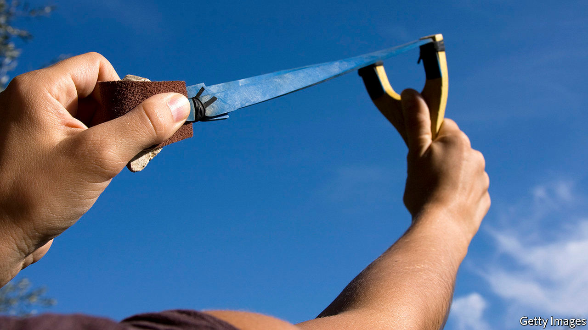

## Drones’ self defence

# As delivery drones multiply, they may need to protect themselves

> The Doppler effect will help them to do so

> Feb 27th 2020

INTERNET SHOPPING makes buying things easier, but has also led to the rise of a new kind of thief: the porch pirate. Porch pirates scour door steps for deliveries that have been made when a householder was out, and nab them. Sometimes, they will stalk delivery vans to do so. Residents of New York City, for example, lose an astonishing 90,000 parcels every day to porch pirates, according to a report in the New York Times.

Porch piracy is a problem that may be solved by the spread of parcel-delivering drones. Because each drone delivery involves a separate journey, rather than having to be fitted into a round, it will be easier for courier and customer to agree on when a drone should arrive than on the arrival time of a van. However Nirupam Roy and Nakul Garg, a pair of engineers at the University of Maryland, worry that drone deliveries are open to a different sort of piracy—hijacking. A drone in flight is easily upset. A well-aimed stone, baseball or similar missile is enough to bring it down, permitting its payload to be purloined. Nor need such stone-throwers have pecuniary motives. Vandalism, or irritation with the very presence of drones, might also provoke pot shots. High-flying drones, like those employed by the police for surveillance, will normally be out of range of such activity. But parcel drones will have to fly low, at least for part of their journeys. To counter this risk the pair therefore propose to build a lightweight, low-power self-defence mechanism which lets a drone sense a missile fast enough to get out of its way.

That is nowhere near as easy as it might sound. Drones are lean machines, provided with only enough battery strength, computing power and payload-carrying capacity to do the job they are designed for. Adding threat-detection measures, such as heavy, power-hungry radar antennae, or spinning lidar units, radar’s optical equivalent, would either reduce range or prevent lift-off in the first place. Dr Roy and Mr Garg think, however, that they have hit on a low-power, lightweight self-defence system suitable for small drones. Instead of employing light or radio waves to detect incoming threats, it harnesses sound waves and the Doppler effect.

The Doppler effect is the frequency shift heard as a source of sound approaches or recedes. It is, for example, the reason the pitch of a police siren changes as a patrol car passes in the street. To take advantage of it Dr Roy and Mr Garg plan to fit drones with diminutive loudspeakers, like those found in smartphones. These would broadcast an ultrasonic tone outward from the drone. Similarly tiny microphones would then listen for reflections from incoming objects. The Doppler shift of these reflections, run through a bit of on-board processing (but far less than that needed for radar or lidar) would give the bearing of the threat, and thus permit the drone to take evasive action.

To test the principle of what they call their DopplerDodge drone defence system, Dr Roy and Mr Garg have constructed a static version in their laboratory, and have been throwing objects of various sizes and shapes at it, as if it were a hovering drone. At the moment, it can detect these objects from distances of up to four metres away. That is pretty close, but would still give a drone a tenth of a second’s notice of an incoming missile. This would be sufficient for it to move itself out of the way. Tests on actual drones will take place shortly, and then, if all goes as planned, the two researchers will attempt to extend the system’s range to 30 metres—a reasonable approximation of a stone’s throw.■

## URL

https://www.economist.com/science-and-technology/2020/02/27/as-delivery-drones-multiply-they-may-need-to-protect-themselves
