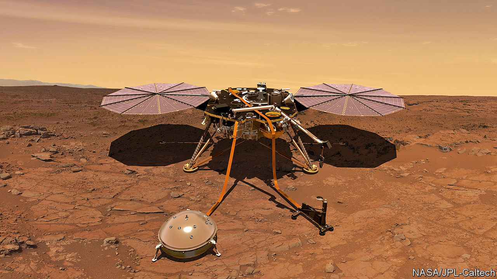

## Planetology

# The exploration of the Moon and Mars continues apace

> Two craft probe beneath these bodies’ surfaces

> Feb 27th 2020

THIS WEEK has seen the publication of results collected by probes to two heavenly bodies: Chang’e 4, a Chinese mission to the Moon, and InSight, an American mission to Mars. Chang’e 4 landed in January 2019; InSight arrived the previous November. The Chinese team, bowing to the realities of scientific publishing, have presented their results in Science Advances, an American journal. The Americans, however, have chosen Nature Geoscience, a British journal owned by German publishers.

Chang’e 4 is China’s second successful lunar lander, and the first from any country to touch down intact on the Moon’s far side—the part never visible from Earth. Its purpose, other than demonstrating China’s technological prowess, is to investigate the geology of Von Kármán crater in the Moon’s southern hemisphere. To that end it is fitted with a ground-penetrating radar which can peer many metres down.

This radar shows three distinct layers of rock, the top two each 12 metres thick and the lowest 16 metres thick. Below that, the signal is too fuzzy to see what is going on. The upper layer is composed of regolith—crushed rock that is the product of zillions of small meteorite impacts over the course of several billion years, and which covers most of the Moon’s surface. The other two, distinguishable by the coarseness of the grains within them, are probably discrete ejecta from separate nearby impacts early in the Moon’s history that were subsequently covered by the regolith.

InSight (pictured above as an artist’s impression) is intended to probe deeper than this. It is fitted with instruments designed to measure heat flow from Mars’s interior, any wobble in the planet’s axis of rotation (which would probably be caused by an iron core) and Marsquakes. The heat-flow instrument has so far been a washout. The “mole”, a device intended to dig into Mars’s surface, pulling this instrument with it, has refused to co-operate—to the point where the project’s directors are about to take the time-honoured step of hitting it with a hammer (or, rather, with the scoop on the probe’s robot arm) to persuade it to stay in the hole that it is supposed to be excavating. And the wobble detector, though working correctly, has insufficient data to report. So the release this week is mainly about the quakes.

InSight’s seismograph recorded 174 quakes between the craft’s landing and the end of September 2019. The strongest were between magnitudes three and four—just powerful enough, had they happened on Earth, for a human being to notice them. Quakes are a valuable source of information about a planet’s interior. A network of seismographs, as exists on Earth, allows their points of origin to be triangulated, their speed measured and their reflections from subsurface rock layers observed. From all this can be deduced those layers’ composition and depth. With but a single instrument, such deductions are trickier. InSight’s masters do, though, think that two of the quakes originated in Cerberus Fossae, a set of faults 1,600km from the landing site that are suspected of still being seismically active.■