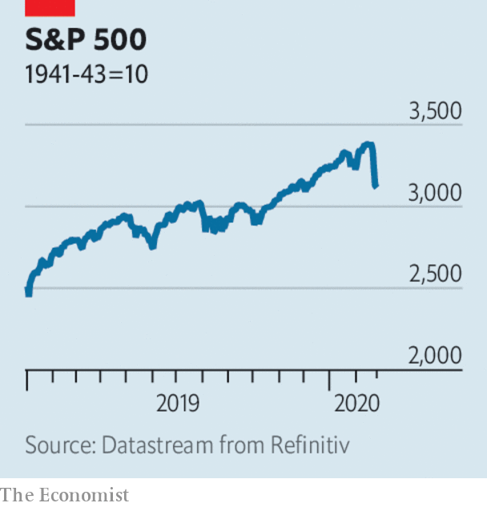

# Business this week

> Feb 29th 2020

Global markets had a turbulent week amid heightened concern about the economic impact of the coronavirus outbreak. The S&P 500 index dropped by 3.4% in a day, its worst daily performance in two years; over a week it was down by 8% from the record high it had recently attained. Stockmarkets in Europe and Japan also swooned. As investors piled into safe assets, the yield on the ten-year US Treasury bond closed at its lowest-ever point. The VIX index, a measure of stockmarket volatility, spiked to its highest level in two years. See [article](https://www.economist.com//finance-and-economics/2020/02/27/markets-wake-up-with-a-jolt-to-the-implications-of-covid-19).

Oil prices also fell sharply, as the coronavirus led forecasters to lower their projections for demand sharply. Brent crude traded below $53 a barrel, a big dip from the almost $70 it had reached at the start of the year. Curtailed travel because of the outbreak could cost the airline industry alone $29bn in lost revenue, according to one estimate.

A long list of companies warned about the impact of coronavirus on their business, including Microsoft, Anheuser-Busch InBev and Rio Tinto. The latter is a big provider of iron ore to China, where dozens of blast furnaces have been closed because of restrictions on movement.

Wells Fargo agreed to pay $3bn to settle with America’s Department of Justice and Securities and Exchange Commission over a mis-selling scandal. Between 2002 and 2016 thousands of employees at the bank who were under pressure to meet sales targets created millions of fake accounts for customers. The scandal dented the image of Wells Fargo, one of the few banks to emerge from the financial crisis with its reputation intact.

Mexico’s GDP shrank by 0.1% in 2019, the first full year in power for President Andrés Manuel López Obrador. Mr López Obrador came to office promising to turbocharge growth through a mixture of spending and investment, but last year was the economy’s worst performance in a decade. The central bank cut its forecast for growth this year. See [article](https://www.economist.com//the-americas/2020/02/27/mexico-needs-statecraft-yet-its-president-offers-theatre).

Sales from recorded music in America hit $11bn last year, the most in over a decade, though still some way short of the $14.6bn chalked up in 1999, when CDs ruled the charts. Four-fifths of music revenue now comes from streaming.

Although he has announced and then delayed his departure four times as Disney’s chief executive, Bob Iger took markets, and employees, by surprise when he stepped down from the job with immediate effect. After taking the reins in 2005 Mr Iger expanded Disney’s content catalogue by acquiring several film studios (culminating in 21st Century Fox last year), turning Disney into an entertainment behemoth. Mr Iger is staying on as executive chairman until 2021 to focus on the creative side of the business. Bob Chapek, the new CEO, fresh from running Disney’s theme parks, will report to Mr Iger. See [article](https://www.economist.com//business/2020/02/27/bob-iger-king-of-disneyland).

HP said it was “reaching out” to Xerox to explore whether a combination of the two companies would be in shareholders’ interests. But it also announced a $15bn share buy-back plan, almost half its market value, complicating the path for such a tie-up. Xerox has gone hostile in its $35bn takeover bid for the computer- and-printer maker.

In his annual letter to shareholders, Warren Buffett defended the investment strategy of Berkshire Hathaway, his holding company, which straddles insurance, stockmarket bets and industrial activities. Last year Berkshire’s share price recorded its worst performance set against the broader market in a decade. Still, it made a net profit of $81.4bn (mostly because of a change in accounting rules). Separately, Mr Buffett, a famous technophobe, revealed that he has started to use an iPhone, though only for calls. See [article](https://www.economist.com//business/2020/02/27/untangling-warren-buffetts-unique-firm).

A measure that would compel Apple to consider rights to freedom of expression in its dealings with China was backed by 40% of shareholders present at a meeting. A similar item had been voted on before but drew little support; investors today seem more eager to push companies to take up purpose-driven agendas.

Amazon opened its first Go supermarket, which has no cashiers, simply charging customers through an app for items they have taken from shelves fitted with sensors. The supermarket in Seattle builds on technology used in two dozen convenience stores that Amazon operates. Teething problems include accurately weighing fruit and vegetables. Shoppers must put a product back in its correct place if they do not want to be charged for it, a potential nightmare for those who have enough trouble dealing with self-checkout machines.

Volkswagen’s boss said he was looking to employ a young green activist who can push the board to take a more aggressive stance against climate change. Sounds like an ideal job for Greta Thunberg.

## URL

https://www.economist.com/the-world-this-week/2020/02/29/business-this-week
