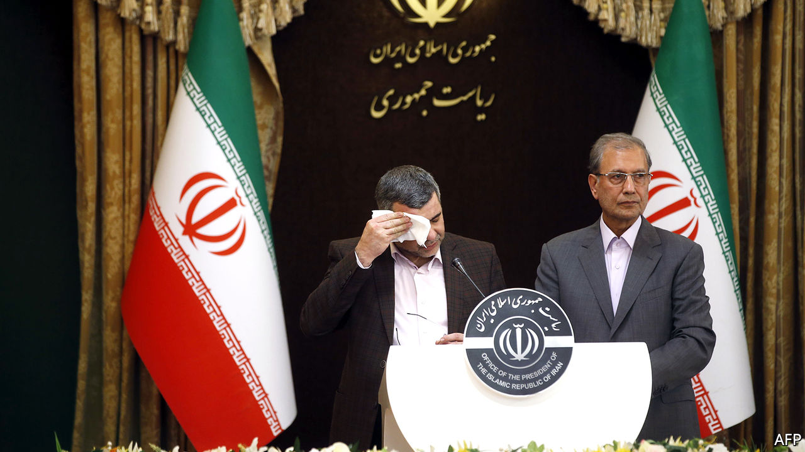
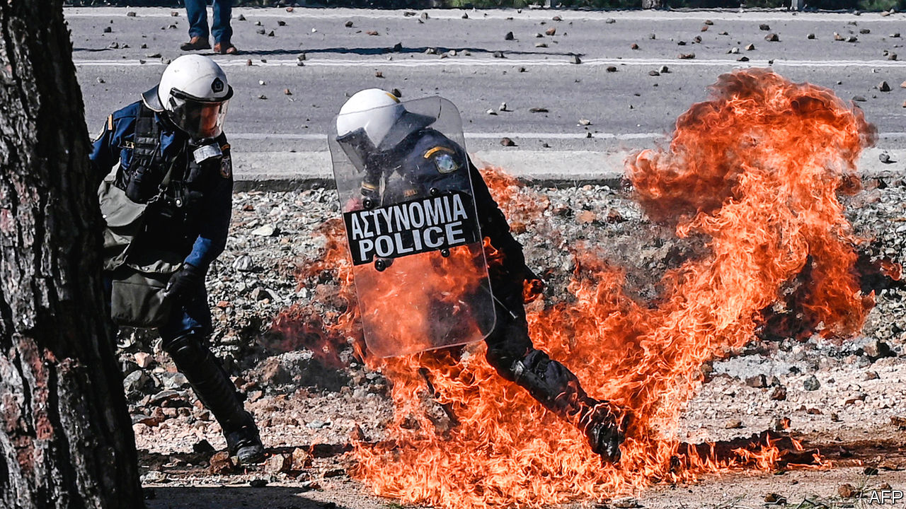

# Politics this week

> Feb 27th 2020

The WHO said that most new cases of covid-19, a novel type of coronavirus, are now being reported outside China. The number of cases surged in South Korea; Italy recorded hundreds of infections, more than in any country outside Asia; and there were worries that Iran was underreporting the spread of the epidemic within its borders. Iran’s deputy health minister tested positive for the disease. See [article](https://www.economist.com//leaders/2020/02/27/the-virus-is-coming).

China postponed the annual sessions of its rubber-stamp parliament because of concerns about the outbreak of covid-19. The meetings had been due to start in Beijing in March and involve thousands of delegates. Despite a fall in the daily numbers of new cases in China, Xi Jinping, the president, said the epidemic was “still grim and complex”.

A Chinese court sentenced Gui Minhai, the co-owner of a bookshop in Hong Kong that sold gossipy works about China’s leaders, to ten years in prison for “illegally providing intelligence overseas”. Mr Gui is a Swedish citizen who is also claimed by China as its national. His detention has fuelled widespread alarm in Hong Kong about the erosion of political freedoms.

Mahathir Mohamad resigned as prime minister of Malaysia, after his own party, Bersatu, decided to leave the ruling coalition. He remains in office as a caretaker. Anwar Ibrahim, his long-time rival and leader of Parti Keadilan Rakyat, the biggest party in the coalition, has put himself forward as a replacement. It is unclear whether either man has the support of most MPs. See [article](https://www.economist.com//asia/2020/02/27/a-botched-power-grab-leaves-malaysia-without-a-government).

The Afghan army, the insurgents of the Taliban and NATO forces all pledged to observe a week-long “reduction in violence” in Afghanistan’s civil war. If it holds until February 28th, America and the Taliban will sign a peace deal in Qatar on February 29th. See [article](https://www.economist.com//asia/2020/02/27/america-and-the-taliban-prepare-to-sign-a-peace-deal).

Thailand’s constitutional court disbanded Future Forward, the country’s third-biggest political party, and banned its leaders from politics. It is the eighth party the court has dissolved since 2006. See [article](https://www.economist.com//asia/2020/02/27/thailands-courts-ban-the-countrys-third-biggest-political-party).

Narendra Modi, the prime minister of India, summoned a crowd of hundreds of thousands to cheer for Donald Trump. But the American president’s visit was marred by communal riots in Delhi, which claimed 33 lives. See [article](https://www.economist.com//asia/2020/02/27/donald-trump-and-narendra-modi-hug-as-delhi-burns).

Taur Matan Ruak, the prime minister of East Timor, resigned after parliament voted down his budget. The president must now decide whether to name another prime minister or call elections.

Boris Johnson, Britain’s prime minister, announced a wide-ranging review of the country’s place in the world post-Brexit that seeks “innovative ways” to push overseas interests. Outside experts will be used to challenge “traditional Whitehall assumptions”, a nod to Dominic Cummings, Mr Johnson’s powerful special adviser, who has clashed with civil servants. Mr Cummings has criticised waste in the Ministry of Defence.

Sajid Javid, who resigned as Britain’s chancellor of the exchequer after a skirmish with Mr Cummings, attacked a move to align the Treasury more closely with thinking in the prime minister’s office. Mr Javid said that this was not in the national interest.

The race to be the next leader of Germany’s ruling Christian Democrats, and probable chancellor after Angela Merkel quits next year, now has only three runners. Armin Laschet, the premier of North Rhine-Westphalia, got a big boost when Jens Spahn, the up-and-coming federal health minister, said he would not contest the race, but would support him instead.

Residents of the Greek islands of Lesbos and Chios fought with riot police in an attempt to stop an expansion of detention camps to house more migrants arriving mostly from the Middle East via Turkey.

Hosni Mubarak, who ruled Egypt for three decades, died. The former despot was toppled during the Arab spring of 2011, amid protests over poverty and his repressive rule. He faced trial for corruption and murder, but mostly avoided punishment. Many Egyptians expressed nostalgia for Mr Mubarak, who ruled with a lighter touch than the current dictator, Abdel-Fattah al-Sisi. See [article](https://www.economist.com//middle-east-and-africa/2020/02/27/hosni-mubarak-ex-despot-of-egypt-died-on-february-25th-aged-91).

Hardliners won parliamentary elections in Iran, scooping three-quarters of the seats. The regime claimed a mandate for its confrontational stance towards America. But thousands of moderates and reformers were barred from running and, as a result, turnout was the lowest in a parliamentary election since the Islamic revolution in 1979. See [article](https://www.economist.com//middle-east-and-africa/2020/02/24/the-iranian-regime-risks-exacerbating-the-outbreak-of-covid-19).

Faure Gnassingbé, the president of Togo, won another term in an election marred by irregularities. Mr Gnassingbé has been in office since 2005, when he took over from his father, who had first seized power in 1967.

A strike by police in Ceará, in north-eastern Brazil, led to a sharp rise in the number of murders in the state. At least 170 people have died since police stopped work on February 19th in a row over pay. A senator, Cid Gomes, was shot as he drove a digger towards striking police. The government has sent in the army.

Protests by police in Haiti against poor working conditions led to battles between them and the army. At least one soldier died. The country’s Carnival celebration was cancelled.

Bolivia’s Supreme Electoral Tribunal barred Evo Morales, a former president, from running for a seat in the Senate in elections due in May. Mr Morales left office in November after Bolivians protested against his re-election.

Harvey Weinstein was found guilty of two of the charges brought against him in New York: of rape (by having sex with a woman against her will) and of forcing oral sex on a woman. He was acquitted of three charges, including the most serious. Scores of other women have accused him of sexual misconduct. See [article](https://www.economist.com//united-states/2020/02/27/harvey-weinsteins-conviction-is-less-significant-than-it-seems).

The latest Democratic debate produced the usual fireworks. It was the last to be held before the South Carolina primary and Super Tuesday, when Democrats in 14 states will vote on who they want to be their presidential candidate. Bernie Sanders remains the firm favourite following his decisive win in Nevada. See [article](https://www.economist.com//united-states/2020/02/29/the-primary-problem).

Meanwhile, it was reported that Russia is meddling in the primaries to get Mr Sanders elected, and is also stepping up plans to interfere in the general election to re-elect Donald Trump. So it is a win-win situation for the Kremlin if either Mr Sanders or Mr Trump is victorious in November. See [article](https://www.economist.com//leaders/2020/02/27/bernie-sanders-nominee).

## URL

https://www.economist.com/the-world-this-week/2020/02/27/politics-this-week
