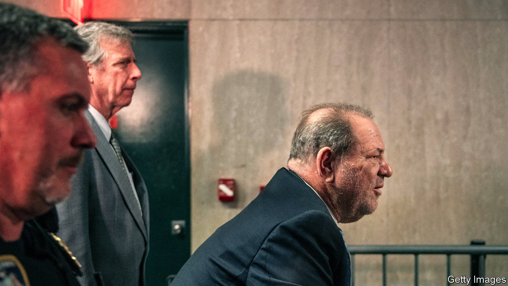

## Celebrity justice

# Harvey Weinstein’s conviction is less significant than it seems

> Celebrity trials change less than you might think

> Feb 27th 2020

HE IS NO longer an “alleged” rapist and his Zimmer frame can return to the props department. On February 24th a Manhattan jury convicted Harvey Weinstein of rape and of a criminal sex act, acquitting him of the most serious charges of predatory sexual assault. The former film producer, who inadvertently accelerated #MeToo, is now in a New York hospital awaiting sentencing on March 11th. He faces between five and 29 years in prison. For his victims, the #MeToo movement and the office of the Manhattan District Attorney (DA), this is a resounding victory. “This is the new landscape for survivors of sexual assault in America. This is a new day,” said the DA, Cyrus Vance junior. Maybe. But celebrity justice is subject to different rules.

Mr Weinstein’s lawyers need not worry about being out of work any time soon. Donna Rotunno, who says her client “took it like a man,” insists that he will appeal. There are grounds to do so, including the judge’s decision to allow extra witnesses to testify about previous “bad acts” and concern over whether Mr Weinstein could have a fair trial in a city at the heart of the #MeToo media storm. Feminist flash-mobs performed in front of the courthouse, celebrities gathered outside, there was a daily Weinstein podcast. His lawyer scolded the media’s influence but also used it, publishing an appeal to the jury in a Newsweek op-ed as they started deliberations.

The appeals process could easily take a year, which Mr Weinstein is unlikely to spend at liberty. In the meantime, he faces criminal charges in Los Angeles and a stream of civil suits by women who claim he abused them. The difference is that he now faces them as a convicted rapist.

It therefore seems unlikely that he will sit out his retirement comfortably. But perhaps the more salient question is what this will change. Bennett Capers, a Brooklyn law professor, doubts there is a much wider significance. “Many will undoubtedly see this as possibly signalling a new era where prosecutors believe victims and pursue sexual assault cases, even against the powerful,” he says. But “will the verdict help everyday victims” like hotel workers, or where there is a single accuser?

The Weinstein conviction is being presented as a watershed moment that will change the way police, prosecutors and juries deal with such cases. No longer will women who report rape late, or whose testimonies are incomplete or complicated, face scepticism, goes the theory. In fact, after an initial bump, reporting rates of sexual violence in America as low as they were before #MeToo struck. [Public attitudes to what constitutes sexual harassment have barely changed over that time](https://www.economist.com//graphic-detail/2020/02/20/despite-metoo-opinions-on-sexual-harassment-have-barely-budged), according to polls by YouGov for The Economist.

Celebrity justice is not normal justice. Even the most public trials have less lasting impact than the frenzied coverage might suggest. The fact that the Weinstein case even made it to trial is an anomaly in sex crimes. As with other big celebrity trials, such as those of Phil Spector, Michael Jackson, O.J. Simpson and Bill Cosby, a lot of public money was invested in the investigation that led to Mr Weinstein’s conviction. This was matched in investment by the media. No amount of vetting would have been able to put together a jury that would not be influenced by fame of the subject and of his accusers. Celebrity trials can create unrealistic expectations in future jurors’ minds. Mr Weinstein had dozens of glamorous, public accusers. Most victims are alone and unknown.

The next stop for the Weinstein media circus will probably be Los Angeles, the birthplace of celebrity justice. The local record of convicting celebrities is poor and scarred by the very public decision of a jury to acquit Mr Simpson of murdering his wife and her friend Ron Goldman. It will be tempting to fixate on whether the DA can do any better with Mr Weinstein. But just as Mr Simpson’s acquittal, though dramatic, was largely irrelevant for the handling of most murder trials, so Mr Weinstein’s conviction may not prove the seismic moment for cases of sexual assault that many people assume it to be.■