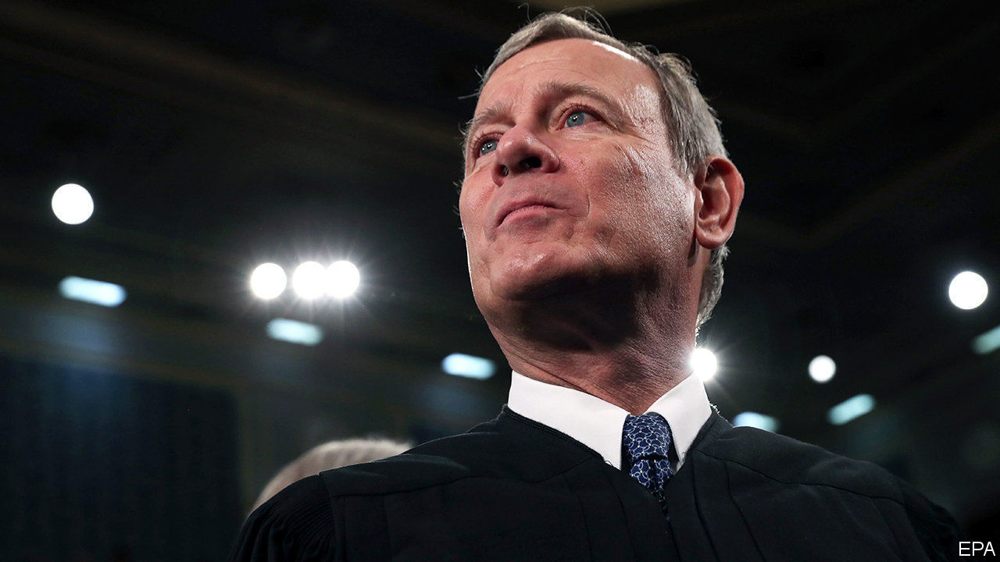

## Roberts rules

# The Supreme Court’s chief justice is poised to decide a clutch of controversies

> Presidential authority, abortion and Donald Trump’s tax returns are all coming before the court

> Feb 27th 2020NEW YORK

FOR YEARS after John Roberts was named chief justice by George W. Bush in 2005, he presided over the “Kennedy court”—a tribunal that swayed left or right depending on the views of his maverick colleague, Anthony Kennedy. But in October 2018, when Donald Trump replaced Mr Kennedy with the more conservative Brett Kavanaugh, Mr Roberts assumed the role of median justice—four colleagues to his right, four to his left. The chief became, in the most divisive cases, the tie-breaker.

He is breaking mostly to the right. Last June, Mr Roberts wrote 5-4 decisions on partisan gerrymandering (a win for conservatives) and the proposed citizenship question on the 2020 census (a victory for liberals). He has anchored a series of 5-4 votes allowing Mr Trump to implement hardline immigration policies. One such move on February 21st prompted Justice Sonia Sotomayor to charge her conservative colleagues with “erod[ing]” the court’s “fair and balanced decision-making process” by favouring “one litigant”—Mr Trump—“over all others”. The president responded on February 25th with the preposterous demand that Justices Sotomayor and Ruth Bader Ginsburg recuse themselves from all “Trump-related” matters.

This squabble is one that Mr Roberts, a zealous defender of the court’s impartiality and legitimacy, is desperate to avoid. Yet cultivating an image of non-partisanship will be tricky, because he is tackling a host of clashes on the most electric docket the Supreme Court has seen in recent memory. Already the justices have considered gun rights, a major church-state quandary, LGBT protections in the workplace and DACA, an Obama-era programme protecting unauthorised immigrants who were brought to America as children. While they work on decisions in those cases, still more controversies are on the way.

Two presidential priorities are on the docket next week. Seila Law v Consumer Financial Protection Bureau (CFPB)—could doom the federal agency established to protect consumers after the 2007-09 financial crisis. Congress set up the CFPB with a single director whom the president may replace only “for cause”—that is, for palpable misbehaviour. Seila Law asks if that structure is constitutional; the plaintiff, and the Trump administration, say it is not. The challengers contend that this “unduly inhibits the president’s ability to supervise the exercise of the executive power” under Article II of the constitution. With a conservative majority favouring a capacious conception of presidential power, the court is likely to agree. The CFPB’s future, and the president’s ability to sack directors of other agencies, hang in the balance.

Then the justices turn to one of the most explosive matters in American politics. In June Medical Services v Russo, the justices will review a decision that upheld a Louisiana law requiring abortion providers to have admitting privileges at a local hospital. Ostensibly reasonable, the rule is one of dozens of laws that states have enacted in recent years to shut down clinics while purporting to protect women. Russo is a reprise of a recent battle: the Supreme Court struck down an identical clinic regulation in Texas by a 5-3 vote in 2016. In that ruling, the court found that the requirement brought no plausible health benefits but, by shuttering clinics, imposed an “undue burden” on access to abortion. If the Louisiana law is upheld, plaintiffs say, only one abortion provider will remain in the state.

In a move aimed at undercutting Russo and future lawsuits, Louisiana is also asking the justices to reject the long-standing principle that clinics have standing to sue on their patients’ behalf. Melissa Murray, a law professor at New York University, thinks Chief Justice Roberts may resolve Russo by deciding that June Medical Services, the petitioner, lacks the legal right to sue. This “clean procedural exit ramp”, she says, may appeal to the chief as a way to duck a political firestorm in the midst of a presidential election. The impact of the shift may be profound, Ms Murray says, as it would stymie litigation to vindicate reproductive rights elsewhere. But, because few observers other than “lawyers and law professors” would grasp its significance, the court could deflect a public outcry.

The chief may be the swing vote again when the justices take up the question—at long last—of whether Mr Trump may keep his taxes and other financial records closed to New York prosecutors and members of the House of Representatives. The Manhattan district attorney says he needs years of Mr Trump’s financial documents for a grand-jury investigation into hush-money payments to the president’s alleged paramours. Congressional Democrats seek these and other papers to help them decide whether to tighten ethics rules. But in Trump v Mazars and Trump v Vance, Mr Trump’s lawyers are pushing back against the subpoenas. They claim Congress is overreaching and that the president has absolute immunity against any “criminal process”, including investigation, while in office. Questions involving the separation of powers are delicate. But Chief Justice Roberts cannot relish the prospect of covering for Mr Trump’s misbehaviour. ■