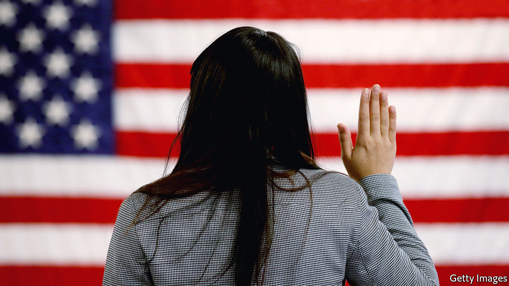

## The invisible wall

# The Trump administration doesn’t like high-skilled immigrants either

> The White House is quietly making life hard for them

> Feb 29th 2020WASHINGTON, DC

WHEN SURESH IYER, who designs trading technology for a large financial firm in New York, moved to America from Mumbai in 2013 he was not sure how long he would stay. But his career thrived, his wife moved to join him and soon they had a daughter. The family put down roots and decided they would like to settle permanently. But it is not easy. Mr Iyer—a pseudonym—is on an H1B visa, a temporary permit for highly-skilled workers. He and his wife qualify for green cards (and their daughter is an American citizen). But thanks to an annual cap on the number of cards available to Indian workers, they could be waiting decades to get them. Mr Iyer’s feels his life is on hold. “It is getting crazier and crazier,” he says.

Since long before his election in 2016 Donald Trump has attacked undocumented immigrants, whom he sees as criminals coming to sell drugs, commit crimes and steal jobs. His signature policy, to build a wall on the Mexican border, has been fitfully effected, though without the alligator moat he reportedly wanted. When Mr Trump first promised to construct the wall, he said it would have a “big beautiful door” to let in legal migrants. In fact, under his administration, legal migrants are finding themselves shut out too. It is not only those banned by the president’s more dramatic executive orders; families like Mr Iyer’s are being affected by the grinding of sand into the wheels of the immigration system. The American Immigration Lawyers Association (AILA), an industry group, calls this the president’s invisible wall.

Waiting times for almost all sorts of visas, permits and renewals have shot up. Applying for a green card while in the United States took six and a half months in 2016; it now takes almost a year. Work permits, typically issued to the spouses of certain foreign workers, which used to take two months to process, now take almost twice that on average. Overall the “adjudication rate”, or the share of applications processed in a given year, has fallen sharply, from 72% in 2015 to 56% last year. The number of visa forms outstanding is at its highest level ever, with 5.7m outstanding.

Is this gumming up of the system deliberate? It is hard to prove that, says Sarah Pierce, of the Migration Policy Institute, a think-tank. But several policies seem perfectly designed to lengthen queues. All employment-based green-card applicants must now have a face-to-face interview, which swallows up officials’ time. More and more applicants for work visas are being asked to provide supporting documents to show what their job will involve or prove their qualifications. Before Mr Trump took office, at most a fifth of workers were asked for extra evidence. In the final quarter of last year, three-fifths were.

And it is getting more expensive. Applying for a marriage-based green card, which costs $1,760 now, will rise to $2,750. Becoming a citizen will go from $640 to $1,170. Some people would even have to pay $50 to apply for asylum. Yet staffing is not increasing. In fact, as Greg Chen of AILA points out, some of the agency’s budget has even been directed towards Immigration and Customs Enforcement, the agency responsible for deportations.

When somebody was refused an extension to their visa in the past, they were usually trusted to leave the country (and most did). These days they are thrown straight into immigration courts for deportation, says Mr Chen. Many of these people probably qualified for a visa, and simply made a mistake in filling in their applications.

Some groups have been singled out. In April 2017 Mr Trump signed the “Buy American, Hire American” executive order. That tightened rules on the H1B visas, the one Mr Iyer uses, most of which go to Indian tech workers. Since Mr Trump’s executive order, denial rates have shot up, particularly at large Indian-owned consultancies. In 2016 Infosys, one such company which is the largest single recipient of H1Bs, was allowed 14,000 visas. Just 3% of applicants were rejected. By last year, the figure had fallen to just 3,200 and 36% of applicants were rejected. Consultancies are being told to provide evidence of exactly which clients their workers would be serving, for the three-year length of their visas. So much for that big beautiful door.■