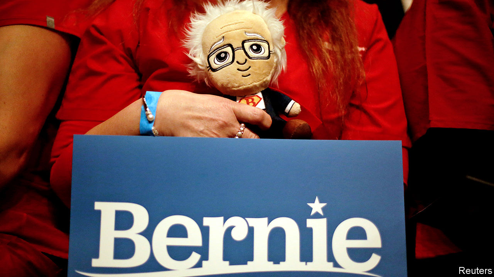
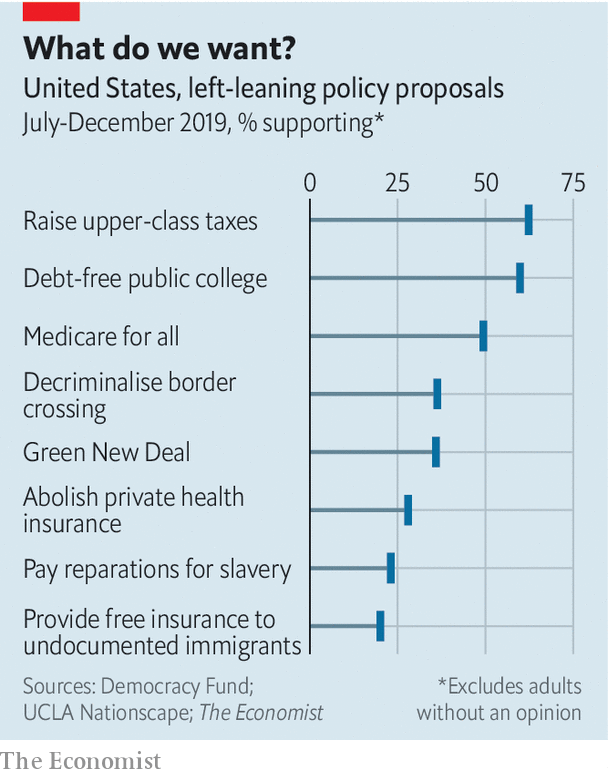
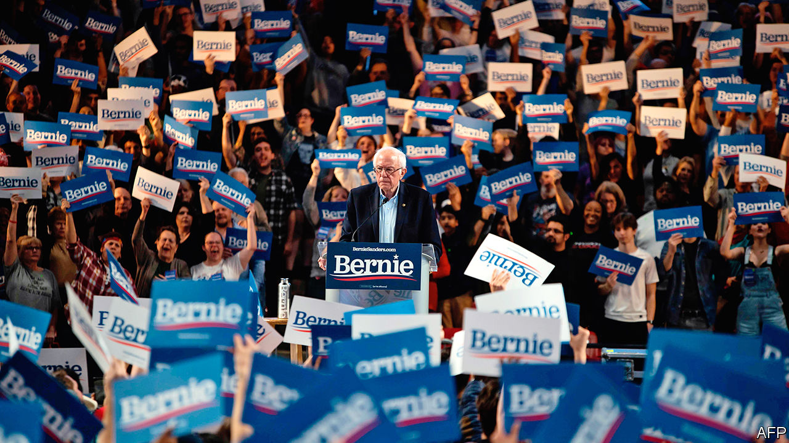

## That Berning feeling

# What does Bernie Sanders’s political revolution hope to accomplish?

> The senator for Vermont is a European social democrat—of a 1970s vintage

> Feb 29th 2020WASHINGTON, DC

AMBITIOUS, EXHILARATED and a little nervous, a freshly elected Democratic congressman was buzzing with the possibilities of his new office when he first encountered Bernie Sanders. “You do realise this place is a complete waste of time, don’t you?” growled the independent senator from Vermont, by way of welcome to Capitol Hill. And, to be fair to Mr Sanders—and to the millions of Americans who set such great store by his integrity and plain speaking—he could not have summed up his own legislative history better. Mr Sanders has grumbled persistently about real problems—a broken health-care system and inequitable college education above all—while rarely making any headway in fixing them. During 30 years in Congress he has been primary sponsor of just seven bills that became law, two of which concerned the renaming of post offices in Vermont. An uncharitable observer might consider this the record of a blowhard.

Mr Sanders has taken his preference for speechifying to the big time. With only momentary interruptions, he has spent five years campaigning to be president—ever since he decided to play spoiler to Hillary Clinton’s coronation. America’s most famous socialist is running for the presidency on more or less the same set of problems he has emphasised for all those many years (plus a more recent focus on climate change). Though his proffered solutions, in the form of fantastical reforms and vast spending pledges, look ruinously expensive and unlikely to pass Congress, a committed faction of Democratic voters like them enough to have made Mr Sanders the indisputable front-runner. A candidate could scarcely have hoped for better results in the all-important early-primary states. Betting markets give him a 60% chance of winning the nomination. If he does well on March 3rd, Super Tuesday, when 14 states vote and one-third of delegates will be allocated, he will be uncatchable.

That worries many Democrats. Mr Sanders is a 78-year-old self-described socialist pulling his party hard to the left in an election in which the centre is wide open. Among those who feel the Bern, Mr Sanders’s ideological consistency over his three decades in Washington is usually the first thing they mention. Jeremy Corbyn’s supporters had similar feelings about their candidate, before he led the Labour Party off a cliff in Britain’s most recent general election. In some ways, Mr Sanders’s proposals are more radical than Mr Corbyn’s were. If he got his way, all American residents, including undocumented immigrants, would receive free health care, child care and education at state universities. Workers would have a jobs guarantee, seats on corporate boards and receive 20% of the equity of large firms. Billionaire clout would be broken by a wealth tax.

There are two hurdles to achieving all this: a general-election contest against Mr Trump, and gaining control of Congress.

Like a Goliath company swallowing start-ups to preserve its dominance, Mr Sanders has embraced all the new progressive-sounding ideas that have recently emerged—borrowing heavily from the innovations of Elizabeth Warren in America and Mr Corbyn in Britain. From Ms Warren, he has taken on the idea of a wealth tax—though with higher rates set at 8% at the top—co-determination of corporate boards, and the creation of federal charters for big corporations. From Mr Corbyn, he has borrowed the idea of national rent control and the forcible expropriation of corporate wealth to workers (though he has doubled Mr Corbyn’s suggested 10%, to 20%). The Green New Deal, proposed by climate activists and espoused by Alexandria Ocasio-Cortez, a first-term representative, has found a welcome home in his agenda.

Promises are expensive. Our accounting shows Mr Sanders proposing $52trn in additional spending over a decade—although some plans, like a federal jobs-guarantee, are impossible to price. He has proposed some revenue-raisers: the wealth tax, and a significant rise in payroll taxes for the middle class. But these look likely to cover just $24trn of the cost. Even this estimate is rosy. It assumes that nationalising the generation of clean electricity, rather than costing money, will raise $6.4trn; $4.4trn from a wealth tax that the European experience shows the rich are good at avoiding; and $2.4trn from a financial-transactions tax (the Tax Policy Centre, a think-tank, estimates that the maximum possible revenue is one-quarter as much).

Perhaps the Green New Deal is not as grand as all that, and the 20m jobs he anticipates do not materialise. Taking his maths as given, however, Mr Sanders seems to be setting himself up for additional annual deficits of $2.8trn per year, or 13% of current GDP. Given that one of his senior economic advisers is Stephanie Kelton, a proponent of “modern monetary theory” whose forthcoming book is called “The Deficit Myth”, this may not be a concern.

All these plans would need assent from Congress, which looks highly unlikely at the moment. But though Congress can tie the hands of the president on domestic matters, foreign affairs are less circumscribed. Some Democrats bristle at the thought of Mr Sanders at the helm of the national-security apparatus. Like old-school leftists, Mr Sanders has appeared blind to the horrible things left-wing governments have done to their own citizens in the name of solidarity—a tendency that will be a gift to Republican makers of attack-ads if he becomes the nominee. In the 1980s he campaigned for the Socialist Workers Party, which sought “the abolition of capitalism.” Mr Sanders wrote praise to the Sandinistas in Nicaragua, and attended a rally there on a visit in 1985 featuring the chant, “Here, there, everywhere, the Yankee will die.”

More recently, Mr Sanders has pledged not to use America’s military might for regime change, either overtly or covertly. Nor would he use it to secure American oil supplies. He has promised to use force only with congressional approval. His scepticism of America’s global role echoes Donald Trump’s, and has led some to caricature him as a left-wing isolationist.

That is not quite right. On the stump and in campaign materials, Mr Sanders has called for a foreign policy centred on human rights, economic fairness, democracy, diplomacy and peace. For voters of a certain age, that rhetoric may conjure up echoes of Jimmy Carter’s human-rights-focused foreign policy. But some of his advisers say Mr Sanders’s foreign policy would be more like Barack Obama’s.

He shares Mr Obama’s belief in talking to America’s opponents, and said he will continue Mr Trump’s personal dialogues with Kim Jong-un, North Korea’s leader. He also wants to re-enter the nuclear deal with Iran. He would probably try to reset—to use an unlucky word—America’s relationships with Russia and China. Like his Democratic rivals, he has vowed to re-join the Paris Climate Agreement, and wants America to take a leading role in combating climate change. He does not share Mr Trump’s hostility towards NATO, and is unlikely to set out to further erode the country’s alliances. Mr Sanders has recently said that he would honour Article V commitments to NATO members, including for countries that do not meet their commitment to spend 2% of GDP on defence.

The president is also relatively unfettered in matters of trade policy. Like Mr Trump, Mr Sanders has been sceptical of America’s trade deals for decades. He seems never to have found one he liked. Not only did he vote against the deal that ultimately brought China into the World Trade Organisation (WTO), but he also voted for America to leave the WTO altogether. He has pledged to “immediately” renegotiate the recently signed USMCA and to “fundamentally rewrite all of our trade deals to deals to prevent the outsourcing of American jobs and raise wages.”

Mr Sanders is a more nuanced protectionist than Mr Trump. His criticisms of the USCMA include its omission of any references to climate change. Mr Sanders frames his attacks on past trade deals as reflecting his concern with labour, environmental and human-rights standards. Though he may be less erratic than Mr Trump and have purer intentions, his trade policies may not have better outcomes. Protection from foreign competition will make it easier for domestic companies to fatten their profit margins while providing worse services. If and when other governments retaliate by restricting their own markets, American workers will not be immune. His tenure in office might continue the country’s inward turn.

The presidency comes with other policy-making perks that Mr Sanders would wield: executive action gives considerable leeway in some domestic arenas. Some would be the standard stuff of Democratic administrations. Many of the Trump executive actions would be countermanded. Those that loosened environmental protections, attempted to destabilise health-insurance markets and tightened immigration restrictions would be the first to go. That might all be welcome. Mr Sanders has signalled he would also go further, banning the export of crude oil, legalising marijuana and allowing the import of prescription drugs. He would appoint heads of federal agencies from outside the Democratic mainstream. Taking a page from Ms Warren (who might occupy a post in a Sanders administration), he could appoint zealous enforcers for antitrust, consumer protection and labour-relations posts.

Mr Sanders’s supporters argue that this programme is not electoral suicide but strategic brilliance. Head-to-head polling against Mr Trump shows Mr Sanders ahead by 3.6 percentage points nationally. In pivotal states like Michigan and Wisconsin, which Ms Clinton narrowly lost, he looks ahead by slim margins of five and one points, respectively.

Mr Sanders, his supporters argue, would expand the electorate, bringing in new and disengaged voters. His showings in the first three states give no evidence of such a stampede to the polls. A recent paper by David Broockman and Joshua Kalla, political scientists at Berkeley and Yale respectively, found that Mr Sanders would fare worse against Mr Trump than a moderate Democrat would, in part because he drives wavering voters away. To make up for that loss, he would have to raise youth turnout by 11 percentage points. To put it another way, the proportional increase among young voters would need to be significantly larger than the Obama-inspired African-American voter bump in 2008—far above historically plausible levels.

So far Mr Sanders has dealt only with primaries and caucuses, where his fellow Democrats have treated him comparatively gently, refraining from criticising his character and preferring to disagree with his policy. Mr Trump will be less kind and restrained—and will amplify his attacks with $1bn-worth, or more, of negative advertising. Whether the monied Democratic donors that Mr Sanders so evidently detests would put up enough cash to counteract this onslaught of digital and television advertisement is an open question. The fact that Mr Sanders once seemed enamoured enough of the Soviet Union to honeymoon there, that he plans to ban fracking (vital to the economy of Pennsylvania, a swing state), or that he would like to eliminate private health insurance and raise taxes to pay for undocumented immigrants to get free coverage, all seem untapped veins for negative advertisements. Whereas Mr Trump’s liabilities are well-covered and relatively well-known, Mr Sanders’s may not yet be known by less attentive voters—meaning that his slim lead in national polls could slip away. Drawing the contours of the coming general-election contest is a necessarily speculative exercise, but for Democrats it does not inspire confidence.

The choice could not look starker. Should Mr Sanders win the nomination, November’s election will pit a right-wing nativist with authoritarian tendencies who wants to Keep America Great against a democratic socialist who wants to turn it into the Sweden of the 1970s. The horseshoe theory of politics holds that the extreme left and extreme right sometimes resemble one another more than might be thought. Mr Sanders does not share Mr Trump’s contempt for the rule of law, which is important. But they do share a populist dislike of elites. As Mr Trump was, Mr Sanders is deeply distrusted by party stalwarts. The contempt between that camp and Mr Sanders’s is mutual. A day before his Nevada triumph, he tweeted: “I’ve got news for the Republican establishment. I’ve got news for the Democratic establishment. They can’t stop us.”

A further worry among moderate Democrats is that a Sanders-led ticket could doom their plan to seize control of Congress—it already looks unlikely because of the combination of Senate seats that are up for election this year. In 2018 Democrats engineered a takeover of the House by running moderate candidates focused on kitchen-table issues such as health care—not promising Medicare for All, but preserving and expanding the ACA. That resulted in a 36-seat majority, including victories in 31 districts that Mr Trump won in 2016. One first-term Democrat believes that “the easiest way to hand most of [those seats] back is to put Bernie Sanders at the top of the ticket.” Matt Bennett of Third Way, a centrist Democratic think-tank, warns that Medicare for All and Mr Sanders’s intent to provide free health care to undocumented immigrants “take an advantage that Democrats have on health care and turn it into a liability.”

Socialism may play well in cities and on college campuses, but not in the suburbs, which are vital to the current House majority. Some have already started to speak out. Joe Cunningham, who in 2018 flipped a South Carolina congressional seat last won by a Democrat in 1978, said earlier this month that “South Carolinians don’t want socialism,” and said he would not support “Bernie’s proposals to raise taxes on almost everyone”. In the wake of favourable comments he made about Fidel Castro on February 23rd, virtually every elected Democrat in Florida, a perennially important state in presidential elections, distanced themselves from him. Mr Sanders has a history of fringe political views (though so does Mr Trump). The fact that he even now seems incapable of muting his admiration for Cuban social policies worries Democrats. It risks turning what should be a referendum on Mr Trump, which should be a winning argument, into one on socialism, which could well be a losing one.

The odds of Democrats winning the Senate, which are already long, could look even worse with a radical at the top of the ticket. Down-ballot Democrats could try to distance themselves, but Republicans will not let them. Martha McSally, a vulnerable incumbent Republican senator from Arizona trailing her Democratic challenger, Mark Kelly, in the polls, recently released an ad titled “Bernie Bro”, linking Mr Kelly to Mr Sanders’s unpopular policy to give free health care to undocumented immigrants. Doug Jones, the Democratic senator from Alabama, might find his chances of victory narrowed to zero. Against a candidate as unpopular as Mr Trump, Mr Sanders might still achieve victory—only to find that there are insufficient Democrats left on Capitol Hill to carry out his revolutionary marching orders.

Sandernistas often vacillate between the idea that their agenda is the one, true route to restoring the American dream and the idea that it is merely a maximalist opening bid in the bruising negotiations with Congress. Rather than Medicare for All, for example, they might end up with a government agency that could provide public health insurance, if they wanted it, to middle-class people who did not qualify for Medicare. Mr Obama got so little done, the story goes, because he compromised with himself, rather than playing hardball. “The worst-case scenario?” asked Ms Ocasio-Cortez, not usually known for her pragmatism, in an interview with the Huffington Post. “We compromise deeply [on Medicare for All] and we end up getting a public option [which means allowing people to buy government-run health insurance]. Is that a nightmare?” Asked about it, Mr Sanders did not yield, saying that Medicare for All was “already a compromise”.

“There will be absolutely no difference between what Bernie has been fighting for in the primaries, in the Senate and in the House and what he will be fighting for as the Democratic nominee, and more importantly in the White House,” wrote Warren Gunnels, a longtime adviser on economic policy to the senator. Mr Sanders’s idea for how he would achieve victory, given the hard political maths facing the Democrats, is not terribly convincing. He says that he would use the bully pulpit of the presidency to shame Republican senators into voting for the good of their constituents. That is naivety befitting a novice, not a 30-year legislator. Mitch McConnell, the Republican majority leader in the Senate, has proved himself happy to halt all lawmaking for years, if necessary. The Sanders revolution would not shake his resolve.

The likeliest outcome for a Sanders presidency would therefore be a slew of ambitious legislative plans all gleefully thwarted by Mr McConnell. Should his political revolution take him inside the gates of the White House, it is likely to stop there. Perhaps after four years of this, Mr Sanders would kvetch to his successor that it, like Congress, is a lousy place to work.■

Dig deeper:Sign up and listen to Checks and Balance, our new [newsletter](https://www.economist.com//checksandbalance/) and [podcast](https://www.economist.com//podcasts/2020/04/24/checks-and-balance-our-weekly-podcast-on-american-politics) on American politics

## URL

https://www.economist.com/united-states/2020/02/29/what-does-bernie-sanderss-political-revolution-hope-to-accomplish
