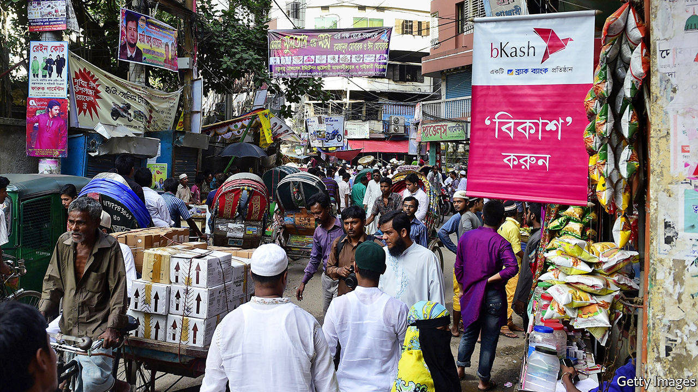

## Rules are made to be broken

# A new mobile-money firm in Bangladesh is benefiting from special treatment

> Its connections to the government may help

> Mar 5th 2020DHAKA

THE FABRIC shops are far more eye-catching, but the business that attracts the most customers in Islampur market, Bangladesh’s biggest textile bazaar, is a drab hole in the wall. A long queue of young men, all clutching mobile phones, wait patiently to hand the shopkeeper faded notes to top up their bKash accounts.

Since mobile money took off in Bangladesh nearly a decade ago, bKash has dominated the industry. It has done so well that the company’s name has become a verb, notes Biru Paksha Paul, a former chief economist of Bangladesh Bank, the central bank: “‘I’ll bKash you some money,’ the kids say, instead of transfer.” When Mr Paul first heard that a new firm, Nagad, was entering the business, he was pleased: “Some healthy competition at last.” Alas, Nagad’s success is a sign of just the opposite.

Mobile money is a big business in Bangladesh. Three-quarters of Bangladeshis have a mobile phone, but less than half have a bank account. Migrants from rural areas to the cities are eager to send remittances back to their villages, many of which lack banks, says Mamun Rashid of PWC, a consultancy. Even in the capital, Dhaka, he notes, “The traffic is so bad, sending money using a phone makes much more sense.”

In 2019 more than $51bn of transactions were made via mobiles, up from $27bn in 2016. Almost 60% goes through bKash, which is owned by BRAC bank, a local financial institution, and several grand foreign investors, including the World Bank’s private-sector arm; an affiliate of Alibaba, a giant Chinese e-commerce firm; and the Bill & Melinda Gates Foundation, an enormous American charity. It has more than 30m customers.

But Nagad is catching up fast. Since Sheikh Hasina Wajed, the prime minister, attended its launch a year ago, its turnover has risen rapidly, to 1bn taka ($11.8m) a day, about a seventh of bKash’s total. It has also amassed lots more customers than bKash on paper—60m—although many of these are signed up automatically, thanks to a deal with a mobile-network operator, Robi.

Tanvir Mishuk, Nagad’s managing director, cites three reasons for the firm’s success. First, it has simplified the cumbersome and expensive paper-based registration and anti-money-laundering checks used by other mobile-money firms. Second, it charges 1.45% of each transfer, compared with bKash’s 1.85%. Third, Nagad is a joint venture between Mr Mishuk’s company, Third Wave Technologies Limited (TWTL), and the post office. This arrangement is beneficial for both firms, he argues. Thanks to Nagad, he says, the post office’s “balance-sheet is looking better”. TWTL, meanwhile, can capitalise on the post office’s big network of branches and familiarity to rural Bangladeshis.

The rewards Nagad reaps from its close relationship with the government, however, go much further. Unlike other mobile-money services, Nagad is not regulated by the central bank and therefore ignores many of the regulations that bind its competitors. The limit on daily transactions for a Nagad account, for instance, is 250,000 taka. The central bank limits its rivals to 30,000 taka. This has helped Nagad attract higher-spending customers, especially business-owners, and thus bring in more revenue with fewer transactions.

Nagad’s deal with Robi also bypasses the central bank’s “know your customer” rules, intended to curb money-laundering. All of Robi’s customers are automatically registered with Nagad, without providing any paperwork beyond that needed to take out a mobile subscription. By the same token, Nagad does not have to provide daily settlement data to the central bank.

Mr Mishuk argues that the central bank does not need to oversee Nagad because the post office, which owns a 51% stake, already has a banking arm. The central bank disagrees. In a series of letters and inter-governmental meetings since the beginning of last year, it, along with the ministry of finance and the anti-corruption commission, have called for Nagad to be brought under central-bank control, arguing that neither the regulations on mobile money nor the laws governing the post office allow a service like Nagad to be run without normal supervision. Nagad’s current status, officials have argued, provides opportunities for money-laundering, corruption and unfair competition. So far, these protests have been ignored.

“Why should one private company enjoy different rules than the others?” asks Mr Paul. The answer may lie in its ownership. Mr Mishuk says his fellow shareholders are businessmen in engineering and telecoms. But in 2017, according to documents seen by The Economist, Kazi Monirul Kabir, a telecoms magnate, transferred his stake in TWTL to Razee Mohammad Fakhrul and Nahim Razzaq, both members of parliament, and Rezwana Nur, the wife of the prime minister’s deputy press secretary, Ashraful Alam Khokon. Five months later, the partnership with the post office was signed.

Mr Razzaq was the only one of the three to respond to The Economist’s questions about their ties to the company, saying he was no longer a shareholder. Neither he nor Mr Fakhrul declared any shares in TWTL when they took their seats in parliament last year. Mr Mishuk says they were all once shareholders, but are not any more, although he cannot remember when they sold their shares. He also says that he has some other partners in the business, via a company in Singapore, although he cannot disclose who they are.

The government of Bangladesh has a habit of doling out favours to the well-connected. State-owned banks are rotting because of out-of-control lending to favoured businessmen, who are seldom inclined or obliged to pay back loans, says Michael Puli, an analyst covering Bangladesh at Standard & Poor’s, a rating agency. Members of parliament from the ruling Awami League party have also recently urged the central bank to hand out licences for new banks to friends and relatives.

The Bangladesh Nationalist Party (BNP), in government from 2001 to 2006, was no more virtuous, Mr Paul says. Citycell, the country’s first mobile-phone company, whose largest stakeholder was a BNP lawmaker called Morshed Khan, thrived on the back of skewed government policies in the early 2000s. But his company’s fortunes waned with his party’s.

Nagad’s fortunes look set to rise. It does not face “the conventional impediments” of working with the public sector because it is fulfilling the government’s vision of “digital Bangladesh”, says Mr Mishuk. The key to making such a public-private partnership work, he explains, is “transparency”: “We make sure there is no shady request, there is no shady manipulation.” ■