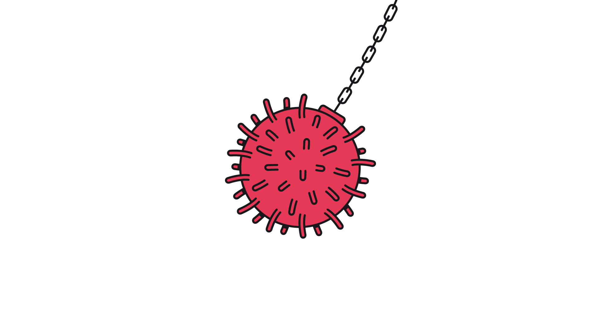

## Banyan

# Japan may have to cancel the Olympics

> Covid-19 could scupper Prime Minister Abe Shinzo’s pet project

> Mar 7th 2020

IF BANYAN HAD to choose one country in which to ride out a pandemic, it would surely be Japan. Early 19th-century woodblock prints of bathing testify to Japan’s old and admirable cult of cleanliness. Modern Japanese have for years been quick to don a face mask at the first sniffle, out of consideration for others. And the population responds swiftly to public messaging.

Hygiene measures advocated against covid-19 since mid-January emphasise frequent washing of hands. This has surely helped slow the spread of the coronavirus, especially given that of Japan’s 1,035 covid-19 cases and 12 deaths, most are associated with a cruise ship held for weeks off Yokohoma. One striking and positive side-effect is already apparent: unlike in Europe or America, doctors report sharp falls in cases of ordinary flu, not only compared with previous years but also with the first part of the winter. Given that 3,300 deaths were attributed to flu in Japan in 2018, the good hygiene inculcated in recent months may well have saved far more lives than covid-19 has claimed.

For all that, social strains have shown in recent days. In Tokyo scuffles have broken out in queues for facemasks outside pharmacies. Panic-buying of toilet paper has left shelves bare. A photograph of toilet rolls in a public lavatory chained to their dispenser with a bicycle lock has done the rounds. While hardly “Lord of the Flies”, it is all highly unusual in such a well-behaved country.

Blame a squall of doubt over the government of the usually assertive prime minister, Abe Shinzo. His problems seem, precisely, to have begun with the cruise ship, the Diamond Princess. When cases of covid-19, contracted overseas, became clear among the 3,700 people aboard, measures to isolate them failed badly. The vessel was, as one passenger put it, a floating petri dish, as the number of infected soared to over 700, with seven deaths. Extraordinarily, crew were eventually let ashore from the infected vessel, and Japanese passengers allowed to return home on public transport, with no further quarantine measures.

When it comes to bumbling crisis management, Japan has form. After the Kobe earthquake in 1995, yakuza (gangsters) set up soup kitchens, so slow was government help to arrive. Bureaucratic disarray ruled in the Diamond Princess’s handling, too. European ambassadors with nationals aboard complained they did not know who in the government to call. Fans wondered whether Mr Abe, invisible during the crisis, had lost his touch. His hitherto unassailable poll ratings fell sharply.

To contain the damage to his reputation as well as the coronavirus, on February 27th Mr Abe took the initiative, telling all schools to close until April. Preparing for the worst, he rushed through legislation this week allowing a state of emergency to be declared. And he unveiled an emergency spending package.

The assertive Abe, then, is back. So much so that questions are growing about what expert advice, if any, he drew on for his schools decision. New social stresses will surely emerge, not least for working mothers (it never seems to be fathers) who must now drum up weeks of day-time childcare. “The government does not grasp what it’s like to raise children,” one mother complains.

The government claims that Japan will return to normal in April. That seems implausible. A state visit by China’s president, Xi Jinping, which was supposed to put the two countries’ listing relationship on an even keel, has already been postponed. There is little political cost to Mr Abe—after all, nationalists who backed his rise to power had been grumbling about his hosting the Chinese dictator.

Much more rides on the Olympic Games in Tokyo this summer. Mr Abe intends them to foster the patriotism whose absence among ordinary Japanese he laments. He wants the games to make Japan seem open, global and even multicultural. And, though vastly over budget, they are to crown the prime minister’s seven-year rule.

To cancel the games would generate not only disappointment among ordinary Japanese but anger at the wasted expense they have already had to bear. But a pandemic would take the decision out of his hands—not least, says Nakano Koichi of Sophia University, because the Olympic village would be “a cruise ship on land”. Bet on a postponement of the games at the very least, and on a long delay before the prime minister’s popularity shines again.

## URL

https://www.economist.com/asia/2020/03/07/japan-may-have-to-cancel-the-olympics
